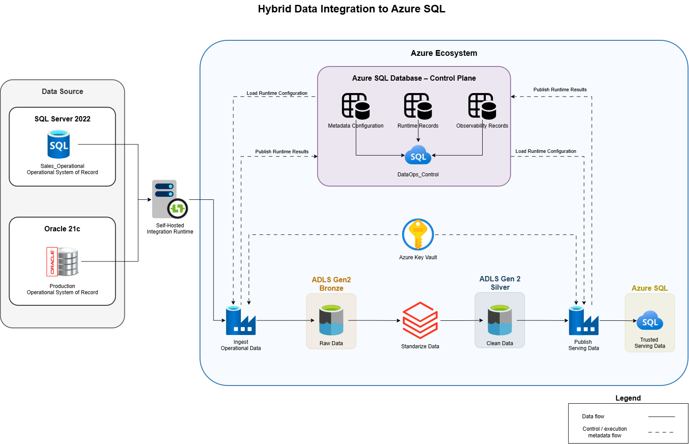

# Hybrid Data Integration to Azure SQL

## Overview

This project presents a hybrid data integration solution for consolidating data from on-premises Oracle and SQL Server systems into a centralized Azure SQL Database, using ADLS Gen2 and Azure Databricks as staging and standardization layers.

Azure Data Factory orchestrates ingestion and publishing, Azure Data Lake Storage Gen2 provides the cloud data layers, Azure Databricks performs data standardization and cleansing, and Azure SQL Database provides a trusted relational serving layer.

The solution follows a metadata-driven approach using `DataOps_Control` for configuration, execution tracking, observability, and rerun control.

## Project Scope

| Area | In Scope |
|---|---|
| Source platforms | Oracle 21c and SQL Server 2022 |
| Connectivity | Self-hosted Integration Runtime |
| Orchestration | Azure Data Factory |
| Landing layer | ADLS Gen2 Bronze |
| Processing | Azure Databricks with PySpark |
| Trusted layer | ADLS Gen2 Silver |
| Serving layer | Azure SQL Database |
| Storage format | Delta |
| Control framework | `DataOps_Control` |
| Secrets | Azure Key Vault |
| Load patterns | Full and incremental ingestion |

## Out of Scope

| Area | Reason |
|---|---|
| Source-system replacement | Existing on-premises operational systems remain systems of record |
| Reporting and BI | The project ends at the trusted serving layer |
| Gold analytical layer | Analytical modeling is outside the current project scope |
| Application development | Consumer applications are not implemented |
| Production infrastructure | Detailed networking, sizing, HA, and disaster recovery are addressed separately from the high-level solution |

## High-Level Architecture

## Technologies

| Category | Technology |
|---|---|
| Source systems | Oracle 21c, SQL Server 2022 |
| Cloud orchestration | Azure Data Factory |
| Hybrid connectivity | Self-hosted Integration Runtime |
| Cloud storage | Azure Data Lake Storage Gen2 |
| Storage format | Delta |
| Data processing | Azure Databricks / PySpark |
| Serving platform | Azure SQL Database |
| Secrets management | Azure Key Vault |
| Control layer | `DataOps_Control` |

## Project Dependencies

This project depends on a supporting portfolio project that provides execution control capabilities

| Dependency | Purpose | Repository |
|---|---|---|
| `DataOps_Control` | Provides the metadata-driven execution control, validation, reconciliation, logging, and rerun control database used by integration pipelines. | [Metadata-Driven Control Framework for Data Engineering Projects](https://github.com/WilderJoseth/data-engineering-projects/tree/main/on_premise/DataOps_Control) |

## Project Status

| Area | Status |
|---|---|
| Project framing | Done |
| High-level architecture | Done |
| Detailed documentation | Planned |
| Azure Data Factory implementation | Planned |
| Databricks transformation implementation | Planned |
| Azure SQL serving layer | Planned |
| Validation and reconciliation implementation | Planned |
| Security implementation | Planned |
| End-to-end testing | Planned |
