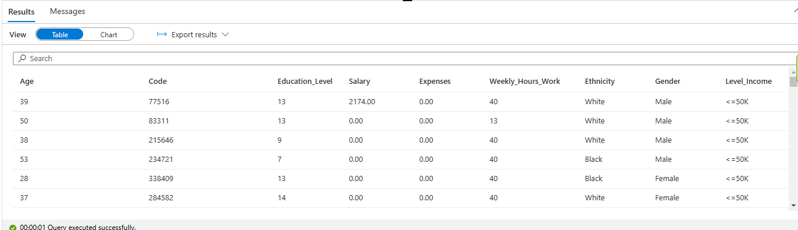

# Adult income - Azure Synapse serveless SQL pool

## 1. Introduction

The purpose of this exercise is to explore Azure Synapse serveless SQL pool capabilities to create a SQL database schema in order to query data file using SQL instructions.

**Goal**: create a SQL database abstraction to query data from files using SQL instructions over a start schema.

**Steps**:

    1. Load data into a data lake.
    2. Create database and tables.
    3. Transform data to be suitable for tables.
    4. Query data from tables.

**Why serveless SQL pool option?**:

    * Read data right from data lake.
    * Built-in resources (serverless). No additional clusters needed.
    * Good for data exploration and transformation.

## 2. Data

The data comes from the UC Irvine Machine Learning Repository and it is structured, with predictable features and target variable defined.

Structure of the data:

* **Features**:
  * age (Numeric)
  * workclass (Categorical)
  * fnlwgt (Numeric)
  * education (Categorical)
  * education-num (Numeric)
  * marital-status (Categorical)
  * occupation (Categorical)
  * relationship (Categorical)
  * race (Categorical)
  * sex (Categorical)
  * capital-gain (Numeric)
  * capital-loss (Numeric)
  * hours-per-week (Numeric)
  * native-country (Categorical)
* **Target variable**:
  * income (Categorical): >50K or <=50K.

Link: <https://www.kaggle.com/datasets/wenruliu/adult-income-dataset>

## 3. Project

### 3.1. Create Azure Synapse workspace

Upload file to blob storage.


Verify data in data lake.


First glance of the data.

```SQL
Use Master;
GO;

SELECT TOP 100 *
FROM
OPENROWSET( -- Read data as tabular format
    -- Data location to read everthing (*) in AdultIncome.
    BULK 'https://datalakemnvqcd2.dfs.core.windows.net/files/AdultIncome/*',

    -- Format
    FORMAT = 'CSV',

    -- This version has better performance, but supports less file formats
    PARSER_VERSION='2.0'
) AS [result];
GO;
```


Query data with user-defined columns.

```SQL
Use Master;
GO;

SELECT TOP 100 *
FROM
OPENROWSET( -- Read data as tabular format
    -- Data location to read everthing (*) in AdultIncome.
    BULK 'https://datalakemnvqcd2.dfs.core.windows.net/files/AdultIncome/*',

    -- Format
    FORMAT = 'CSV',

    -- This version has better performance, but supports less file formats
    PARSER_VERSION='2.0'
)
WITH ( -- Define columns based on their positions starting since 1
    Age INT 1,
    Code VARCHAR(10) COLLATE Latin1_General_100_BIN2_UTF8 3,
    Education_Level INT 5,
    Salary DECIMAL(12, 2) 11,
    Expenses DECIMAL(12, 2) 12,
    Weekly_Hours_Work INT 13,
    Ethnicity VARCHAR(50) COLLATE Latin1_General_100_BIN2_UTF8 9,
    Gender VARCHAR(10) COLLATE Latin1_General_100_BIN2_UTF8 10,
    Level_Income VARCHAR(10) COLLATE Latin1_General_100_BIN2_UTF8 15
) AS [result];
GO;
```



### 3.2. Create SQL database schema

```SQL
-- Create database schema
CREATE DATABASE AdultIncome
    COLLATE Latin1_General_100_BIN2_UTF8;
GO;

-- Activate AdultIncome database
Use AdultIncome;
GO;

-- Create data source which it is going to be used to specify where the data is
-- Encapsulates a connection to a file system location
CREATE EXTERNAL DATA SOURCE AdultIncome_Data WITH (
    LOCATION = 'https://datalakea5vpqbu.dfs.core.windows.net/files/'
);
GO;

-- Create format for table files
CREATE EXTERNAL FILE FORMAT ParquetFormat
    WITH (
            FORMAT_TYPE = PARQUET,
            DATA_COMPRESSION = 'org.apache.hadoop.io.compress.SnappyCodec'
        );
GO;
```


### 3.3. Create tables schema

Creating Ethnicities table.

```SQL
USE AdultIncome;
GO;

-- Create table
CREATE EXTERNAL TABLE dbo.Ethnicities
WITH (
    LOCATION = 'AdultIncome/ethnicities/', -- Where to store copy of the data
    DATA_SOURCE = AdultIncome_Data,
    FILE_FORMAT = ParquetFormat
)
AS
-- Query data
SELECT
    ROW_NUMBER() OVER(ORDER BY Name) AS Id,
    Name
FROM (
    SELECT DISTINCT TRIM(Name) AS Name
    FROM
        OPENROWSET(
            BULK 'AdultIncome/*',
            DATA_SOURCE = 'AdultIncome_Data',
            FORMAT = 'CSV',
            PARSER_VERSION = '2.0'
        ) 
        WITH (
            Id INT,
            Name VARCHAR(50) COLLATE Latin1_General_100_BIN2_UTF8 9
        ) AS result
) AS result;
GO;
```

Creating Genders table.

```SQL
USE AdultIncome;
GO;

CREATE EXTERNAL TABLE dbo.Genders
WITH (
    LOCATION = 'AdultIncome/genders/',
    DATA_SOURCE = AdultIncome_Data,
    FILE_FORMAT = ParquetFormat
)
AS
SELECT
    ROW_NUMBER() OVER(ORDER BY Name) AS Id,
    Name
FROM (
    SELECT DISTINCT TRIM(Name) AS Name
    FROM
        OPENROWSET(
            BULK 'AdultIncome/*',
            DATA_SOURCE = 'AdultIncome_Data',
            FORMAT = 'CSV',
            PARSER_VERSION = '2.0'
        )
        WITH (
            Id INT,
            Name VARCHAR(10) COLLATE Latin1_General_100_BIN2_UTF8 10
        ) AS result
) AS result;
GO;
```

Creating People table.

```SQL
USE AdultIncome;
GO;

CREATE EXTERNAL TABLE dbo.People
WITH (
    LOCATION = 'AdultIncome/people/',
    DATA_SOURCE = AdultIncome_Data,
    FILE_FORMAT = ParquetFormat
)
AS
SELECT
    ROW_NUMBER() OVER(ORDER BY Code) AS Id,
    Age,
    Code,
    Education_Level,
    Salary,
    Expenses,
    Weekly_Hours_Work,
    IIF(TRIM(Level_Income) = '<=50K', 'Low', 'High') AS Level_Income,
    IIF(TRIM(Ethnicity) = 'Amer-Indian-Eskimo', 1, 
            IIF(TRIM(Ethnicity) = 'Asian-Pac-Islander', 2, 
                IIF(TRIM(Ethnicity) = 'Black', 3,
                    IIF(TRIM(Ethnicity) = 'Other', 4,
                        IIF(TRIM(Ethnicity) = 'White', 5, 6)
                        )
                    )
                )
        ) AS Id_Ethnicity,
    IIF(TRIM(Gender) = 'Female', 1, IIF(TRIM(Gender) = 'Male', 2, 3)) AS Id_Gender
FROM
    OPENROWSET(
        BULK 'AdultIncome/*',
        DATA_SOURCE = 'AdultIncome_Data',
        FORMAT = 'CSV',
        PARSER_VERSION = '2.0'
    )
    WITH (
        Age INT 1,
        Code VARCHAR(10) COLLATE Latin1_General_100_BIN2_UTF8 3,
        Education_Level INT 5,
        Salary DECIMAL(12, 2) 11,
        Expenses DECIMAL(12, 2) 12,
        Weekly_Hours_Work INT 13,
        Ethnicity VARCHAR(50) COLLATE Latin1_General_100_BIN2_UTF8 9,
        Gender VARCHAR(10) COLLATE Latin1_General_100_BIN2_UTF8 10,
        Level_Income VARCHAR(10) COLLATE Latin1_General_100_BIN2_UTF8 15
    ) AS result;
GO;
```

List of directories which correspond to each table.


### 3.4. Query data

```SQL
USE AdultIncome;
GO;

CREATE PROCEDURE dbo.usp_GetPeopleInformation
AS
BEGIN
    SELECT
        p.Age,
        p.Code,
        p.Education_Level,
        p.Salary,
        p.Expenses,
        p.Weekly_Hours_Work,
        p.Level_Income,
        g.Name AS Gender,
        e.Name AS Ethnicity
    FROM People p
    JOIN Genders g ON g.Id = p.Id_Gender
    JOIN Ethnicities e ON e.Id = p.Id_Ethnicity;
END
GO;

EXEC dbo.usp_GetPeopleInformation;
```

Results.


