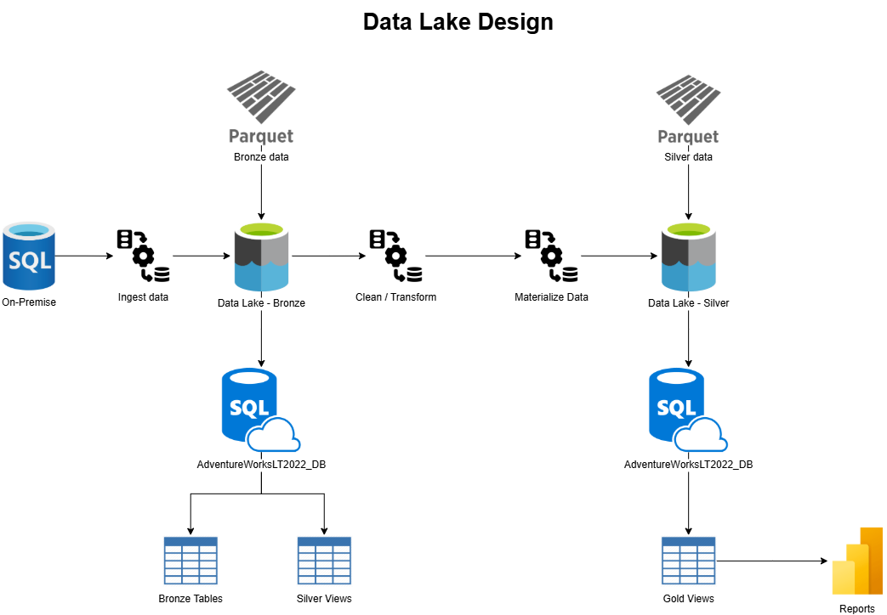
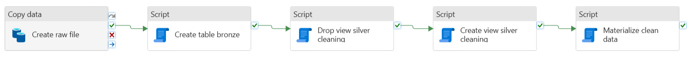
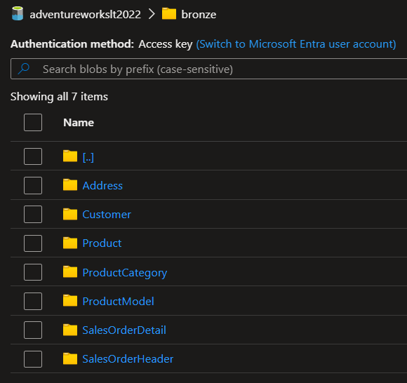
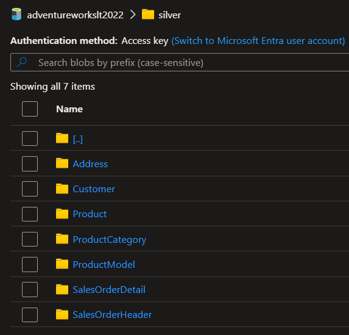
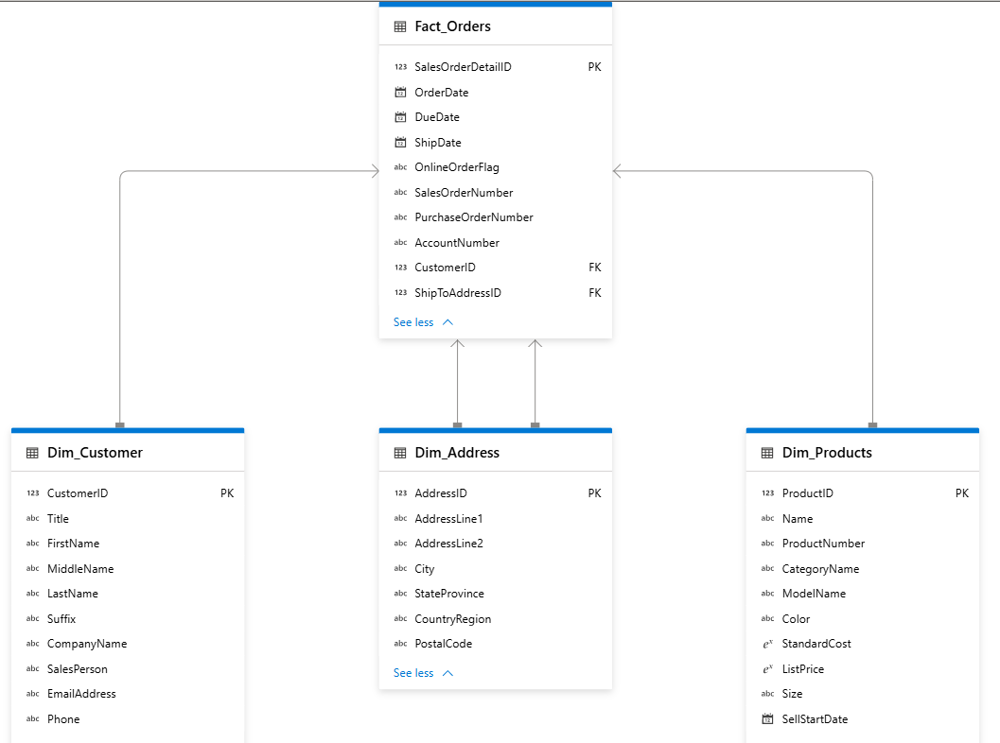

# Data exploration using Serverless SQL endpoint

The goal of this project was to build a **data lakehouse structure** on Azure using **Serverless SQL Pool** for exploration, transformation, and reporting.

Pipelines work under an initial load approach. So each time they run, everything is loaded again.

Technologies:

* MSSQL On-Premise
* Pipelines
* Azure Data Lake Gen2
* Azure Synapse Serverless SQL Pool
* Power BI

## 1. Data Lake Design

The data was organized following a **medallion architecture**:

| Layer | Description | Example Path |
|--------|--------------|--------------|
| **Bronze** | Raw data in parquet files | `/adventureworkslt2022/bronze/Product/*.parquet` |
| **Silver** | Clean and standardized data using Synapse **views** | `/adventureworkslt2022/bronze/Product/*.parquet` |
| **Gold** | Final tables stored as **Parquet** files | `/adventureworkslt2022/silver/Product/*.parquet` |



## 2. Workflow

Using pipelines, the data was extracted from on-premise, stored in cloud and applied transformations.

In general, the pipeline has the following steps:

1. Delete previous file, in order to start from scratch.
2. Copy data from on-premise to cloud using self-hosted integration runtime.
3. Create external bronze tables.
4. Create silver views.
5. Materialize clean data.
6. Create gold tables for data warehousing.



### 2.1. Create database

A layer database was created in order to perform sql operations over serverless pool by pipelines. 

```sql
CREATE DATABASE AdventureWorksLT2022_DB
    COLLATE Latin1_General_100_BIN2_UTF8;
GO;

------------------ Start create schemas ------------------
-- Schema for raw data
CREATE SCHEMA bronze;
GO;

-- Schema for cleaning, transforming and enriching data
CREATE SCHEMA silver;
GO;

-- Schema for curated data and data warehousing exploration
CREATE SCHEMA gold;
GO;
------------------ End create schemas ------------------

------------------ Start external data object ------------------
CREATE EXTERNAL DATA SOURCE bronze_data WITH (
    LOCATION = 'https://datalakexxxxxx.dfs.core.windows.net/adventureworkslt2022/bronze/'
);
GO;

CREATE EXTERNAL DATA SOURCE silver_data WITH (
    LOCATION = 'https://datalakexxxxxx.dfs.core.windows.net/adventureworkslt2022/silver/'
);
GO;

CREATE EXTERNAL DATA SOURCE gold_data WITH (
    LOCATION = 'https://datalakexxxxxx.dfs.core.windows.net/adventureworkslt2022/gold/'
);
GO;
------------------ End external data object ------------------

------------------ Start external file format object ------------------
-- Format for curated data
CREATE EXTERNAL FILE FORMAT ParquetFormat
    WITH (
            FORMAT_TYPE = PARQUET,
            DATA_COMPRESSION = 'org.apache.hadoop.io.compress.SnappyCodec'
        );
GO;
------------------ End external file format object ------------------
```

### 2.2. Copy data

The on-premise source has the following tables:

* SalesLT.Address
* SalesLT.Customer
* SalesLT.CustomerAddress
* SalesLT.Product
* SalesLT.ProductCategory
* SalesLT.ProductDescription
* SalesLT.ProductModel
* SalesLT.ProductModelProductDescription
* SalesLT.SalesOrderDetail
* SalesLT.SalesOrderHeader

Each table is copied into a parquet file without any transformation (bronze layer).



### 2.3. Create external Tables - Bronze Layer

Each external table points directly to each parquet file, which is located in Azure Data Lake.

```sql
-- Example
IF (SELECT OBJECT_ID('bronze.ProductCategory', 'U')) IS NOT NULL
    DROP EXTERNAL TABLE bronze.ProductCategory;

CREATE EXTERNAL TABLE bronze.ProductCategory
(
    ProductCategoryID INT,
    ParentProductCategoryID INT,
    Name NVARCHAR(50),
    rowguid UNIQUEIDENTIFIER,
    ModifiedDate DATETIME
)
WITH
(
    DATA_SOURCE = bronze_data,
    LOCATION = 'ProductCategory/*.parquet',
    FILE_FORMAT = ParquetFormat
);
```

### 2.4. Data Cleaning and Transformation - Stage Layer

Views to clean and standardize the data.

Steps:

1. Replaced missing values.
    * Numeric columns were filled with '0'.
    * Date columns were filled with '1900-01-01 00:00:00.000'.
    * String columns were filled with ''.
2. Trimmed spaces from string columns.
3. Transform money columns to decimal.
4. Columns "rowguid" and "ModifiedDate" are removed.

Special cases:

| Table | Column | Action | Reason |
|--------|--------------|--------------|--------------|
| **Customer** | NameStyle | Remove | Does not provide useful information |
| **Customer** | PasswordHash | Remove | Does not provide useful information |
| **Customer** | PasswordSalt | Remove | Does not provide useful information |
| **Product** | Color | Fill with N/A | Unknown category |
| **Product** | Size | Fill with N/A | Unknown category |
| **Product** | Weight | Remove | Does not provide useful information |
| **Product** | DiscontinuedDate | Remove | No information at all |
| **Product** | ThumbNailPhoto | Remove | Does not provide useful information |
| **Product** | ThumbnailPhotoFileName | Remove | Does not provide useful information |
| **ProductCategory** | ParentProductCategoryID | Remove | Does not provide useful information |
| **ProductModel** | CatalogDescription | Remove | Does not provide useful information |
| **SalesOrderHeader** | RevisionNumber | Remove | Does not provide useful information |
| **SalesOrderHeader** | Status | Remove | Does not provide useful information |
| **SalesOrderHeader** | OnlineOrderFlag | Replace with YES/NO | Easier to read |
| **SalesOrderHeader** | Comment | Remove | No information at all |

**Note:** tables CustomerAddress, ProductDescription and ProductModelProductDescription were not included in silver layer.

```sql
-- Example
DROP VIEW IF EXISTS silver.vw_ProductCategory_Clean;

CREATE VIEW silver.vw_ProductCategory_Clean
AS
SELECT
	ProductCategoryID,
	ISNULL(ParentProductCategoryID, 0) AS ParentProductCategoryID,
	UPPER(TRIM(Name)) AS Name
FROM bronze.ProductCategory;
```

### 2.5. Curated data - Silver Layer

The data was materialized into parquet files.

```sql
-- Example
IF (SELECT OBJECT_ID('silver.ProductCategory', 'U')) IS NOT NULL
    DROP EXTERNAL TABLE silver.ProductCategory;

CREATE EXTERNAL TABLE silver.ProductCategory
    WITH (
        LOCATION = 'ProductCategory/',
        DATA_SOURCE = silver_data,
        FILE_FORMAT = ParquetFormat
    )
AS
SELECT
	ProductCategoryID,
	ParentProductCategoryID,
	Name
FROM silver.vw_ProductCategory_Clean;
```



### 2.6. Create table for start schema - Gold Layer

For analysis, denormalization was applied.

```sql
-- Example
IF (SELECT OBJECT_ID('gold.Fact_Orders', 'U')) IS NOT NULL
    DROP EXTERNAL TABLE gold.Fact_Orders;

CREATE EXTERNAL TABLE gold.Fact_Orders
    WITH (
        LOCATION = 'Fact_Orders/',
        DATA_SOURCE = gold_data,
        FILE_FORMAT = ParquetFormat
    )
AS
SELECT
    d.SalesOrderDetailID,
    h.OrderDate,
    h.DueDate,
    h.ShipDate,
    h.OnlineOrderFlag,
    h.SalesOrderNumber,
    h.PurchaseOrderNumber,
    h.AccountNumber,
    h.CustomerID,
    h.ShipToAddressID,
    h.BillToAddressID,
    h.ShipMethod,
    h.CreditCardApprovalCode,
    d.OrderQty,
    d.ProductID,
    d.UnitPrice,
    d.UnitPriceDiscount,
    d.LineTotal,
    h.SubTotal,
    h.TaxAmt,
    h.Freight,
    h.TotalDue
FROM silver.SalesOrderDetail d
INNER JOIN silver.SalesOrderHeader h ON h.SalesOrderID = d.SalesOrderID;
```

### 2.7. Lake Database

In terms of reporting, a lake database layer was created.


