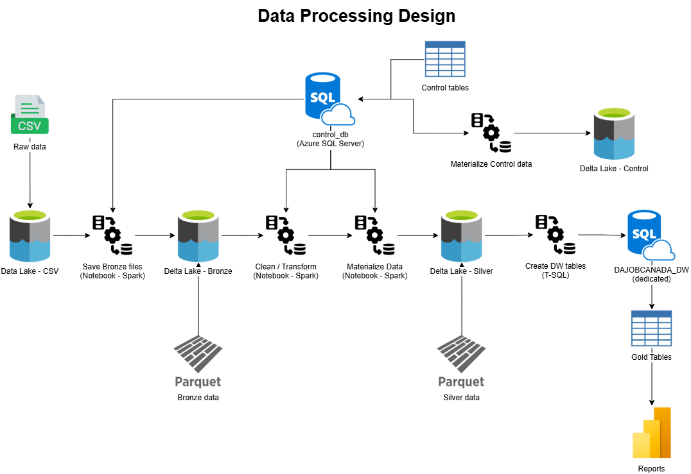
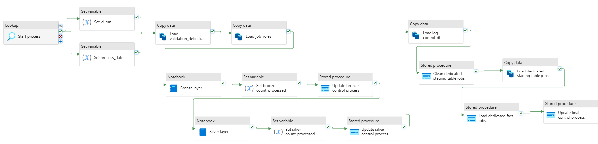
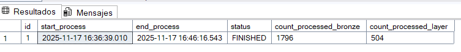
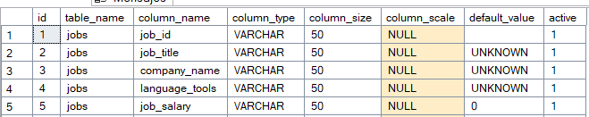
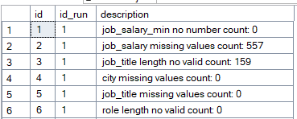
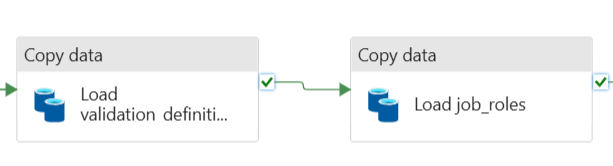
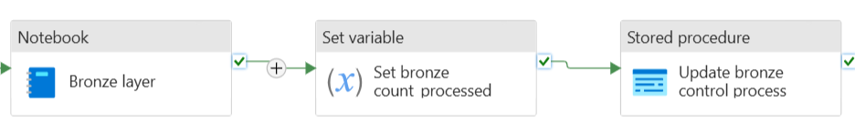
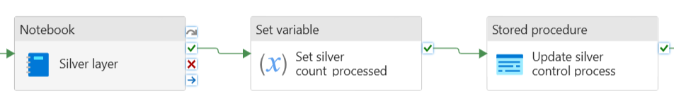

# Data processing using spark and dedicated pool

The goal of this project was to build a data lakehouse structure on Azure using Serverless Spark Pool for exploration, transformation, and reporting. Additionality, the curated data was loaded into dedicated data warehouse base. Finally, an Azure SQL Database was added to implement some level of control in data transformation.

## Data Analyst Job Roles in Canada

Technologies:

* Azure Data Lake Gen2
	* For storage.
* Apache Spark
	* For data cleaning and transformation.
* Azure Synapse Dedicated SQL Pool
	* For data warehouse.
* Azure SQL Database
	* For data control.
* Pipelines
	* For orchestation.

Link data: <https://www.kaggle.com/datasets/amanbhattarai695/data-analyst-job-roles-in-canada/data?select=Raw_Dataset.csv>

## 1. Data Processing Design

The data was organized following a **medallion architecture**:

| Layer | Description | Example Path |
|--------|--------------|--------------|
| **Raw** | Original CSV files | `/dajobcanada/raw/*.csv` |
| **Bronze** | Raw files in delta format | `/dajobcanada/bronze/jobs/process_date=yyyy-MM-dd/*.parquet` |
| **Silver** | Cleaned and standardized data using spark notebooks | `/dajobcanada/silver/jobs/process_date=yyyy-MM-dd/*.parquet` |
| **Gold** | Dedicated server where gold tables live | |
| **control_db** | Azure SQL Server in parquet format | `/dajobcanada/control_db/log_validation/*.parquet` |



## 2. Workflow

Using pipelines, the data was extracted from cloud storage, stored in cloud and applied transformations.

In general, the pipeline has the following steps:

1. Start process in Azure SQL Database.
1. Load control tables from Azure SQL Database into Lakehouse.
2. Perform bronze process.
3. Perform silver process.
4. Load staging tables (dedicated pool).
5. Load production tables (dedicated pool).



### 2.1. Create control database - Azure SQL Server

It was create a database "control_db", which helps to add some dynamic control over data process. This control has the following procedures:

Table "dajobcanada_db.control" helps to know when the process started and finished, as well as, the number of rows processed by each layer. Finally, the id helps to identify the data process by each run.



Table "dajobcanada_db.validation_definition" helps to know the structure of the table which stores production data. Additionally, helps to know what data integrity validation should be applied, for example: maximum column size and deafult values to tackle missing values.



Table "dajobcanada_db.job_roles" helps to know to fill missing values in salary columns based on role and level.


Table "dajobcanada_db.log_validation" helps to know the total of cases which do not pass validation, for example: total missing by column.



These tables are loaded into Lakehouse as parquet files in order to be read by notebooks using dataframes.



Objects:

```sql
CREATE DATABASE control_db;

CREATE SCHEMA dajobcanada_db;

---------------------------------- tables ----------------------------------
CREATE TABLE dajobcanada_db.control (
	id smallint IDENTITY NOT NULL,
	start_process datetime NOT NULL,
	end_process datetime NULL,
	status varchar(20) NOT NULL,
	count_processed_bronze int NULL,
	count_processed_layer int NULL,

	CONSTRAINT pk_dajobcanada_db_control PRIMARY KEY(id)
);

CREATE TABLE dajobcanada_db.validation_definition (
	id SMALLINT IDENTITY NOT NULL,
	table_name VARCHAR(30) NOT NULL,
	column_name VARCHAR(30) NOT NULL,
	column_type VARCHAR(20) NOT NULL,
	column_size INT NOT NULl,
	column_scale INT NULl,
	default_value VARCHAR(20) NOT NULL,
	active BIT NOT NULL,

	CONSTRAINT pk_dajobcanada_db_validation_definition PRIMARY KEY(id)
);

CREATE TABLE dajobcanada_db.job_roles (
	id SMALLINT IDENTITY NOT NULL,
	level VARCHAR(15) NOT NULL,
	role VARCHAR(15) NOT NULL,
	job_salary_min_base DECIMAL(15, 2) NOT NULL,
	job_salary_max_base DECIMAL(15, 2) NOT NULl,

	CONSTRAINT pk_dajobcanada_db_job_roles PRIMARY KEY(id)
);

CREATE TABLE dajobcanada_db.log_validation (
	id SMALLINT IDENTITY NOT NULL,
	id_run SMALLINT NOT NULL,
	description VARCHAR(100) NOT NULL,

	CONSTRAINT pk_dajobcanada_db_log_validation PRIMARY KEY(id),
	CONSTRAINT fk_dajobcanada_db_log_validation_id_run FOREIGN KEY (id_run) REFERENCES dajobcanada_db.validation_definition(Id)
);
---------------------------------- tables ----------------------------------

CREATE PROCEDURE dajobcanada_db.usp_start_process
AS
BEGIN
SET NOCOUNT ON

	INSERT INTO dajobcanada_db.control (start_process, status)
	VALUES (GETDATE(), 'STARTED')

	SELECT id AS id_run, FORMAT(start_process, 'yyyy-MM-dd hh:mm:ss') process_date FROM dajobcanada_db.control
	WHERE id = SCOPE_IDENTITY()

SET NOCOUNT OFF
END;

CREATE PROCEDURE dajobcanada_db.usp_update_process
	@id SMALLINT,
	@status_number SMALLINT,
	@count_processed INT
AS
BEGIN
SET NOCOUNT ON

	IF @status_number = 1
	BEGIN
		UPDATE dajobcanada_db.control SET status = 'BRONZE', count_processed_bronze = @count_processed
		WHERE id = @id
	END
	ELSE IF @status_number = 2
	BEGIN
		UPDATE dajobcanada_db.control SET status = 'SILVER', count_processed_layer = @count_processed
		WHERE id = @id
	END
	ELSE
	BEGIN
		UPDATE dajobcanada_db.control SET status = 'FINISHED', end_process = GETDATE()
		WHERE id = @id
	END

SET NOCOUNT OFF
END;

CREATE PROCEDURE dajobcanada_db.usp_get_validations
AS
BEGIN
	SELECT column_name,	column_type, column_size, column_scale, default_value
	FROM dajobcanada_db.validation_definition
	WHERE active = 1
END;

CREATE PROCEDURE dajobcanada_db.usp_get_job_roles
AS
BEGIN
	SELECT level, role, job_salary_min_base, job_salary_max_base
	FROM dajobcanada_db.job_roles
END;
---------------------------------- procedures ----------------------------------
```

Data:

```sql
---------------------------------- dajobcanada_db.validation_definition ----------------------------------
INSERT INTO dajobcanada_db.validation_definition (table_name, column_name, column_type, column_size, default_value, active)
VALUES ('jobs', 'job_id', 'VARCHAR', 50, '', 1)

INSERT INTO dajobcanada_db.validation_definition (table_name, column_name, column_type, column_size, default_value, active)
VALUES ('jobs', 'job_title', 'VARCHAR', 50, 'UNKNOWN', 1)

INSERT INTO dajobcanada_db.validation_definition (table_name, column_name, column_type, column_size, default_value, active)
VALUES ('jobs', 'company_name', 'VARCHAR', 50, 'UNKNOWN', 1)

INSERT INTO dajobcanada_db.validation_definition (table_name, column_name, column_type, column_size, default_value, active)
VALUES ('jobs', 'language_tools', 'VARCHAR', 50, 'UNKNOWN', 1)

INSERT INTO dajobcanada_db.validation_definition (table_name, column_name, column_type, column_size, default_value, active)
VALUES ('jobs', 'job_salary', 'VARCHAR', 50, '0', 1)

INSERT INTO dajobcanada_db.validation_definition (table_name, column_name, column_type, column_size, default_value, active)
VALUES ('jobs', 'city', 'VARCHAR', 50, 'UNKNOWN', 1)

INSERT INTO dajobcanada_db.validation_definition (table_name, column_name, column_type, column_size, default_value, active)
VALUES ('jobs', 'province', 'VARCHAR', 50, 'UNKNOWN', 1)

INSERT INTO dajobcanada_db.validation_definition (table_name, column_name, column_type, column_size, default_value, active)
VALUES ('jobs', 'job_link', 'VARCHAR', 200, 'UNKNOWN', 1)

INSERT INTO dajobcanada_db.validation_definition (table_name, column_name, column_type, column_size, column_scale, default_value, active)
VALUES ('jobs', 'job_salary_min', 'DECIMAL', 15, 2, '0', 1)

INSERT INTO dajobcanada_db.validation_definition (table_name, column_name, column_type, column_size, column_scale, default_value, active)
VALUES ('jobs', 'job_salary_max', 'DECIMAL', 15, 2, '0', 1)

INSERT INTO dajobcanada_db.validation_definition (table_name, column_name, column_type, column_size, default_value, active)
VALUES ('jobs', 'job_salary_type', 'CHAR', 1, 'O', 1)

INSERT INTO dajobcanada_db.validation_definition (table_name, column_name, column_type, column_size, default_value, active)
VALUES ('jobs', 'level', 'VARCHAR', 15, 'JUNIOR', 1)

INSERT INTO dajobcanada_db.validation_definition (table_name, column_name, column_type, column_size, default_value, active)
VALUES ('jobs', 'role', 'VARCHAR', 15, 'HYBRID', 1)
---------------------------------- dajobcanada_db.validation_definition ----------------------------------

---------------------------------- dajobcanada_db.job_roles ----------------------------------
INSERT INTO dajobcanada_db.job_roles (level, role, job_salary_min_base, job_salary_max_base)
VALUES ('SENIOR', 'ANALYST', 18.00, 54.80)

INSERT INTO dajobcanada_db.job_roles (level, role, job_salary_min_base, job_salary_max_base)
VALUES ('SENIOR', 'DEVELOPER', 40.00, 70.80)

INSERT INTO dajobcanada_db.job_roles (level, role, job_salary_min_base, job_salary_max_base)
VALUES ('SENIOR', 'ENGINEER', 65.00, 85.80)

INSERT INTO dajobcanada_db.job_roles (level, role, job_salary_min_base, job_salary_max_base)
VALUES ('SENIOR', 'HYBRID', 55.00, 65.00)

INSERT INTO dajobcanada_db.job_roles (level, role, job_salary_min_base, job_salary_max_base)
VALUES ('LEAD', 'ANALYST', 18.00, 32.80)

INSERT INTO dajobcanada_db.job_roles (level, role, job_salary_min_base, job_salary_max_base)
VALUES ('LEAD', 'DEVELOPER', 40.00, 50.80)

INSERT INTO dajobcanada_db.job_roles (level, role, job_salary_min_base, job_salary_max_base)
VALUES ('LEAD', 'ENGINEER', 55.00, 65.80)

INSERT INTO dajobcanada_db.job_roles (level, role, job_salary_min_base, job_salary_max_base)
VALUES ('LEAD', 'HYBRID', 50.00, 60.00)

INSERT INTO dajobcanada_db.job_roles (level, role, job_salary_min_base, job_salary_max_base)
VALUES ('SPECIALIST', 'ANALYST', 32.00, 35.00)

INSERT INTO dajobcanada_db.job_roles (level, role, job_salary_min_base, job_salary_max_base)
VALUES ('SPECIALIST', 'DEVELOPER', 42.00, 50.00)

INSERT INTO dajobcanada_db.job_roles (level, role, job_salary_min_base, job_salary_max_base)
VALUES ('SPECIALIST', 'ENGINEER', 52.00, 60.80)

INSERT INTO dajobcanada_db.job_roles (level, role, job_salary_min_base, job_salary_max_base)
VALUES ('SPECIALIST', 'HYBRID', 50.00, 55.00)

INSERT INTO dajobcanada_db.job_roles (level, role, job_salary_min_base, job_salary_max_base)
VALUES ('JUNIOR', 'ANALYST', 43.00, 51.00)

INSERT INTO dajobcanada_db.job_roles (level, role, job_salary_min_base, job_salary_max_base)
VALUES ('JUNIOR', 'DEVELOPER', 65.00, 75.00)

INSERT INTO dajobcanada_db.job_roles (level, role, job_salary_min_base, job_salary_max_base)
VALUES ('JUNIOR', 'ENGINEER', 85.00, 95.80)

INSERT INTO dajobcanada_db.job_roles (level, role, job_salary_min_base, job_salary_max_base)
VALUES ('JUNIOR', 'HYBRID', 50.00, 100.00)
---------------------------------- dajobcanada_db.job_roles ----------------------------------
```

### 2.2. Bronze Layer

The bronze-layer process was carried out by a notebook using spark pool, and its goal was to create a delta table with raw data applying minimal transformation as renaming column in order to make easier the silver-layer process. The data is partitioned by process date.

When the process is done, its results are sent back to Azure SQL Database.



### 2.3. Silver Layer

The silver-layer process was carried out by a notebook using spark pool, and its goal was to clean data. The data is partitioned by process date.

When the process is done, its results are sent back to Azure SQL Database.



### 2.4. Staging process - Dedicated Pool

The staging process load curated data from silver process into Dedicated database. Each time the process is executed, the data in this table is removed to keep only data process by current date. There is a "copy activity" to do so.

```sql
CREATE SCHEMA DAJOBCANADA_DB;

IF (SELECT OBJECT_ID('DAJOBCANADA_DB.Stage_jobs', 'U')) IS NOT NULL
    DROP TABLE DAJOBCANADA_DB.Stage_jobs;

CREATE TABLE DAJOBCANADA_DB.Stage_jobs
(
    job_id VARCHAR(50) NOT NULL,
    job_title VARCHAR(50) NOT NULL,
    company_name VARCHAR(50) NOT NULL,
    language_tools VARCHAR(50) NOT NULL,
    city VARCHAR(50) NOT NULL,
    province VARCHAR(50) NOT NULL,
    job_link VARCHAR(200) NOT NULL,
    level VARCHAR(15) NOT NULL,
    role VARCHAR(15) NOT NULL,
    job_salary_min DECIMAL(15, 2) NOT NULL,
    job_salary_max DECIMAL(15, 2) NOT NULL,
    job_salary_type CHAR(1) NOT NULL,
    run_id SMALLINT NOT NULL
)
WITH
(
    DISTRIBUTION = ROUND_ROBIN,
    CLUSTERED COLUMNSTORE INDEX
);

CREATE PROCEDURE DAJOBCANADA_DB.usp_clean_staging_tables
AS
BEGIN
    TRUNCATE TABLE DAJOBCANADA_DB.Stage_jobs;
END;
```

### 2.5. Production process - Dedicated Pool

The production process load final data from staging table to production tables. Only data by current process is loaded, which is defined by date and id (dajobcanada_db.control).

```sql
IF (SELECT OBJECT_ID('DAJOBCANADA_DB.Fact_Jobs', 'U')) IS NOT NULL
    DROP TABLE DAJOBCANADA_DB.Fact_Jobs;

CREATE TABLE DAJOBCANADA_DB.Fact_Jobs
(
    job_id VARCHAR(50) NOT NULL,
    job_title VARCHAR(50) NOT NULL,
    company_name VARCHAR(50) NOT NULL,
    language_tools VARCHAR(50) NOT NULL,
    city VARCHAR(50) NOT NULL,
    province VARCHAR(50) NOT NULL,
    level VARCHAR(15) NOT NULL,
    role VARCHAR(15) NOT NULL,
    job_salary_min DECIMAL(15, 2) NOT NULL,
    job_salary_max DECIMAL(15, 2) NOT NULL,
    job_salary_type CHAR(1) NOT NULL
)
WITH
(
    DISTRIBUTION = HASH(role),
    CLUSTERED COLUMNSTORE INDEX
);

CREATE PROCEDURE DAJOBCANADA_DB.usp_load_Fact_Jobs
    @run_id SMALLINT
AS
BEGIN
    INSERT INTO DAJOBCANADA_DB.Fact_Jobs (
        job_id,
        job_title,
        company_name,
        language_tools,
        city,
        province,
        level,
        role,
        job_salary_min,
        job_salary_max,
        job_salary_type
    )
    SELECT
        job_id,
        job_title,
        company_name,
        language_tools,
        city,
        province,
        level,
        role,
        job_salary_min,
        job_salary_max,
        job_salary_type
    FROM DAJOBCANADA_DB.Stage_jobs
    WHERE run_id = @run_id;
END;
```

## 3. Limitations

This project has the following limitations:

* There is no a process to remove or move raw data, this must be done manually.
* The bronze process waits for a fixed structure (columns and names).
* There is no a validation about if a file exists or no.
* Even though, the production tables only receive data from current process which has gone through all validations, intermediate folders could keep wrong data from failed process.
* Control files are not removed after process completation.
