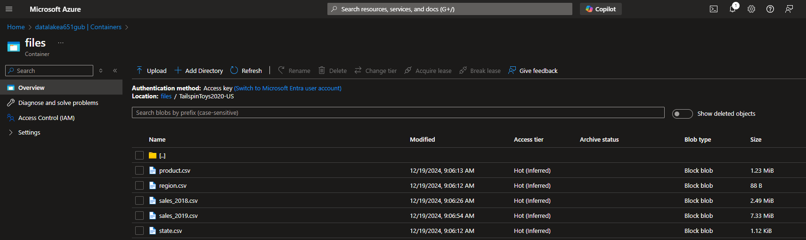
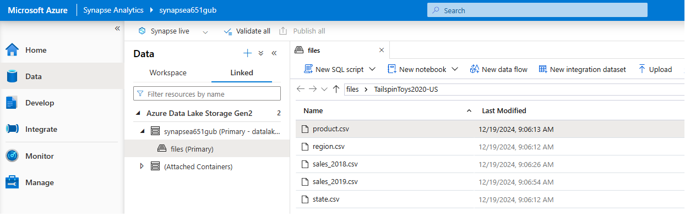

# TailspinToys2020-US - Azure Synapse dedicated SQL pool

## 1. Introduction

The purpose of this exercise is to explore Azure Synapse dedicated SQL pool capabilities to create a SQL database in order to store and query data for datawarehouse.

**Goal**: create a SQL database to store data from files and query it using SQL instructions.

**Steps**:

    1. Load data into a data lake.
    2. Create database and tables.
    3. Transform data to be suitable for tables.
    4. Query data from tables.

## 2. Data

The data comes from TailspinToys2020-US database sample.

## 3. Project

### 3.1. Create Azure Synapse workspace

Upload file to blob storage.



Verify data in datalake.



### 3.2. Create tables

#### 3.2.1. Staging tables

These tables are going to be used as temporal tables.

```SQL
CREATE TABLE dbo.StageRegion
(
    RegionID INT NOT NULL,
    RegionName NVARCHAR(50) NOT NULL
)
WITH
(
    DISTRIBUTION = ROUND_ROBIN,
    CLUSTERED COLUMNSTORE INDEX
);
```

```SQL
CREATE TABLE dbo.StageState
(
    StateID INT NOT NULL,
    StateCode NVARCHAR(2) NOT NULL,
    StateName NVARCHAR(50) NOT NULL,
    TimeZone NVARCHAR(10) NOT NULL,
    RegionId INT NULL
)
WITH
(
    DISTRIBUTION = ROUND_ROBIN,
    CLUSTERED COLUMNSTORE INDEX
);
```

```SQL
CREATE TABLE dbo.StageProduct
(
    ProductID INT NOT NULL,
    ProductSKU NVARCHAR(50) NOT NULL,
    ProductName NVARCHAR(50) NOT NULL,
    ProductCategory NVARCHAR(50) NOT NULL,
    ItemGroup NVARCHAR(50) NOT NULL,
    KitType NCHAR(3) NOT NULL,
    Channels TINYINT NOT NULL,
    Demographic NVARCHAR(50) NOT NULL,
    RetailPrice MONEY NOT NULL
)
WITH
(
    DISTRIBUTION = ROUND_ROBIN,
    CLUSTERED COLUMNSTORE INDEX
);
```

```SQL
CREATE TABLE dbo.StageSales
(
    OrderNumber NCHAR(10) NOT NULL,
    OrderDate DATE NOT NULL,
    ShipDate DATE NULL,
    CustomerStateID INT NOT NULL,
    ProductID INT NOT NULL,
    Quantity INT NOT NULL,
    UnitPrice DECIMAL(9, 2) NOT NULL,
    DiscountAmount DECIMAL(9, 2) NOT NULL,
    PromotionCode NVARCHAR(20) NULL
)
WITH
(
    DISTRIBUTION = ROUND_ROBIN,
    CLUSTERED COLUMNSTORE INDEX
);
```

#### 3.2.2. Dimension tables

```SQL
CREATE TABLE dbo.DimRegion
(
    RegionKey INT IDENTITY NOT NULL,
    RegionID INT NOT NULL,
    RegionName NVARCHAR(50) NOT NULL
)
WITH
(
    DISTRIBUTION = REPLICATE,
    CLUSTERED COLUMNSTORE INDEX
);
```

```SQL
CREATE TABLE dbo.DimState
(
    StateKey INT IDENTITY NOT NULL,
    StateID INT NOT NULL,
    StateCode NVARCHAR(2) NOT NULL,
    StateName NVARCHAR(50) NOT NULL,
    TimeZone NVARCHAR(10) NOT NULL,
    RegionID INT NULL
)
WITH
(
    DISTRIBUTION = REPLICATE,
    CLUSTERED COLUMNSTORE INDEX
);
```

```SQL
CREATE TABLE dbo.DimProduct
(
    ProductKey INT IDENTITY NOT NULL,
    ProductID INT NOT NULL,
    ProductSKU NVARCHAR(50) NOT NULL,
    ProductName NVARCHAR(50) NOT NULL,
    ProductCategory NVARCHAR(50) NOT NULL,
    ItemGroup NVARCHAR(50) NOT NULL,
    KitType NCHAR(3) NOT NULL,
    Channels TINYINT NOT NULL,
    Demographic NVARCHAR(50) NOT NULL,
    RetailPrice MONEY NOT NULL
)
WITH
(
    DISTRIBUTION = REPLICATE,
    CLUSTERED COLUMNSTORE INDEX
);
```

```SQL
CREATE TABLE dbo.DimDate
( 
    DateKey INT IDENTITY NOT NULL,
    DateOrderAltKey DATE NOT NULL,
    DayOrderOfMonth INT NOT NULL,
    DayOrderOfWeek INT NOT NULL,
    DayOrderName NVARCHAR(15) NOT NULL,
    MonthOrderOfYear INT NOT NULL,
    MonthOrderName NVARCHAR(15) NOT NULL,
    OrderQuarter INT NOT NULL,
    OrderYear INT NOT NULL,
    DayShipOfMonth INT NULL,
    DayShipOfWeek INT NULL,
    DayShipName NVARCHAR(15) NULL,
    MonthShipOfYear INT NULL,
    MonthShipName NVARCHAR(15) NULL,
    ShipQuarter INT NULL,
    ShipYear INT NULL
)
WITH
(
    DISTRIBUTION = REPLICATE,
    CLUSTERED COLUMNSTORE INDEX
);
```

#### 3.2.3. Fact tables

```SQL
CREATE TABLE dbo.FactSales
(
    OrderKey INT IDENTITY NOT NULL,
    OrderNumber NCHAR(10) NOT NULL,
    OrderDate DATE NOT NULL,
    ShipDate DATE NULL,
    CustomerStateID INT NOT NULL,
    ProductID INT NOT NULL,
    Quantity INT NOT NULL,
    UnitPrice DECIMAL(9, 2) NOT NULL,
    DiscountAmount DECIMAL(9, 2) NOT NULL,
    PromotionCode NVARCHAR(20) NULL,
    ProductKey INT NOT NULL
)
WITH
(
    DISTRIBUTION = HASH(OrderNumber),
    CLUSTERED COLUMNSTORE INDEX
);
```

### 3.3. Load data

For the purpose of this exercise I am going to load data using `COPY INTO` instruction to table. 

In addition to that, the procedure to load data is the following:

    1. Read data from files and store it into to staging tables.
    2. Load data into dimension tables from staging tables.
    3. Load data into fact tables from staging and dimension tables.

### 3.3.1. Staging tables

```SQL
COPY INTO dbo.StageRegion
    (RegionID, RegionName)
FROM 'https://datalakea651gub.dfs.core.windows.net/files/TailspinToys2020-US/region.csv'
WITH
(
    FILE_TYPE = 'CSV',
    MAXERRORS = 0,
    IDENTITY_INSERT = 'OFF',
    FIRSTROW = 1 -- There is no header row
);
```

```SQL
COPY INTO dbo.StageState
    (StateID, StateCode, StateName, TimeZone, RegionId)
FROM 'https://datalakea651gub.dfs.core.windows.net/files/TailspinToys2020-US/state.csv'
WITH
(
    FILE_TYPE = 'CSV',
    MAXERRORS = 0,
    IDENTITY_INSERT = 'OFF',
    FIRSTROW = 1 -- There is no header row
);
```

```SQL
COPY INTO dbo.StageProduct
    (ProductID, ProductSKU, ProductName, ProductCategory, ItemGroup, KitType, Channels, Demographic, RetailPrice)
FROM 'https://datalakea651gub.dfs.core.windows.net/files/TailspinToys2020-US/product.csv'
WITH
(
    FILE_TYPE = 'CSV',
    MAXERRORS = 0,
    IDENTITY_INSERT = 'OFF',
    FIRSTROW = 1 -- There is no header row
);
```

```SQL
COPY INTO dbo.StageSales
    (OrderNumber, OrderDate, ShipDate, CustomerStateID, ProductID, Quantity, UnitPrice, DiscountAmount, PromotionCode)
FROM 'https://datalakea651gub.dfs.core.windows.net/files/TailspinToys2020-US/sales_2018.csv'
WITH
(
    FILE_TYPE = 'CSV',
    MAXERRORS = 0,
    IDENTITY_INSERT = 'OFF',
    FIRSTROW = 1 -- There is no header row
);
```

### 3.3.2. Dimension tables

```SQL
INSERT INTO dbo.DimRegion (
    RegionID,
    RegionName
)
SELECT
    RegionID,
    RegionName
FROM dbo.StageRegion;
```

```SQL
INSERT INTO dbo.DimState (
    StateID,
    StateCode,
    StateName,
    TimeZone,
    RegionId,
    RegionKey
)
SELECT
    s.StateID,
    s.StateCode,
    s.StateName,
    s.TimeZone,
    s.RegionId,
    r.RegionKey
FROM dbo.StageState s
JOIN dbo.DimRegion r ON r.RegionID = s.RegionID;
```

```SQL
INSERT INTO dbo.DimProduct (
    ProductID,
    ProductSKU,
    ProductName,
    ProductCategory,
    ItemGroup,
    KitType,
    Channels,
    Demographic,
    RetailPrice
)
SELECT
    ProductID,
    ProductSKU,
    ProductName,
    ProductCategory,
    ItemGroup,
    KitType,
    Channels,
    Demographic,
    RetailPrice
FROM dbo.StageProduct;
```

```SQL
INSERT INTO dbo.DimDate(
    DateOrderAltKey,
    DayOrderOfMonth,
    DayOrderOfWeek,
    DayOrderName,
    MonthOrderOfYear,
    MonthOrderName,
    OrderQuarter,
    OrderYear,
    DayShipOfMonth,
    DayShipOfWeek,
    DayShipName,
    MonthShipOfYear,
    MonthShipName,
    ShipQuarter,
    ShipYear
)
SELECT DISTINCT
    OrderDate,
    DATEPART(DAY, OrderDate) AS DayOrderOfMonth,
    DATEPART(WEEKDAY, OrderDate) AS DayOrderOfWeek,
    CASE DATEPART(WEEKDAY, OrderDate)
        WHEN 1 THEN 'Sunday'
        WHEN 2 THEN 'Monday'
        WHEN 3 THEN 'Tuesday'
        WHEN 4 THEN 'Wednesday'
        WHEN 5 THEN 'Thursday'
        WHEN 6 THEN 'Friday'
        WHEN 7 THEN 'Saturday'
    END AS DayOrderName,
    MONTH(OrderDate) AS MonthOrderOfYear,
    CASE DATEPART(MONTH, OrderDate)
        WHEN 1 THEN 'January'
        WHEN 2 THEN 'February'
        WHEN 3 THEN 'March'
        WHEN 4 THEN 'April'
        WHEN 5 THEN 'May'
        WHEN 6 THEN 'June'
        WHEN 7 THEN 'July'
        WHEN 8 THEN 'August'
        WHEN 9 THEN 'September'
        WHEN 10 THEN 'October'
        WHEN 11 THEN 'November'
        WHEN 12 THEN 'December'
    END AS MonthOrderName,
    DATEPART(QUARTER, OrderDate) AS OrderQuarter,
    YEAR(OrderDate) AS OrderYear,
    DATEPART(DAY, ShipDate) AS DayShipOfMonth,
    DATEPART(WEEKDAY, ShipDate) AS DayShipOfWeek,
    CASE DATEPART(WEEKDAY, ShipDate)
        WHEN 1 THEN 'Sunday'
        WHEN 2 THEN 'Monday'
        WHEN 3 THEN 'Tuesday'
        WHEN 4 THEN 'Wednesday'
        WHEN 5 THEN 'Thursday'
        WHEN 6 THEN 'Friday'
        WHEN 7 THEN 'Saturday'
    END AS DayShipName,
    MONTH(ShipDate) AS MonthShipOfYear,
    CASE DATEPART(MONTH, ShipDate)
        WHEN 1 THEN 'January'
        WHEN 2 THEN 'February'
        WHEN 3 THEN 'March'
        WHEN 4 THEN 'April'
        WHEN 5 THEN 'May'
        WHEN 6 THEN 'June'
        WHEN 7 THEN 'July'
        WHEN 8 THEN 'August'
        WHEN 9 THEN 'September'
        WHEN 10 THEN 'October'
        WHEN 11 THEN 'November'
        WHEN 12 THEN 'December'
    END AS MonthShipName,
    DATEPART(QUARTER, ShipDate) AS ShipQuarter,
    YEAR(ShipDate) AS ShipYear
FROM dbo.StageSales;
```

### 3.3.3. Fact tables

First data loading.

```SQL
INSERT INTO dbo.FactSales (
    OrderNumber,
    OrderDate,
    ShipDate,
    CustomerStateID,
    ProductID,
    Quantity,
    UnitPrice,
    DiscountAmount,
    PromotionCode,
    ProductKey
)
SELECT
    s.OrderNumber,
    s.OrderDate,
    s.ShipDate,
    s.CustomerStateID,
    s.ProductID,
    s.Quantity,
    s.UnitPrice,
    s.DiscountAmount,
    s.PromotionCode,
    p.ProductKey
FROM dbo.StageSales s
JOIN dbo.DimProduct p ON p.ProductID = s.ProductID;
```

```SQL
SELECT
    f.OrderNumber,
    f.OrderDate,
    d.DayOrderName,
    d.MonthOrderName,
    d.OrderQuarter,
    d.OrderYear,
    f.ShipDate,
    d.DayShipName,
    d.MonthShipName,
    d.ShipQuarter,
    d.ShipYear,
    f.CustomerStateID,
    p.ProductName,
    f.Quantity,
    f.UnitPrice,
    f.DiscountAmount,
    f.PromotionCode
FROM dbo.FactSales f
JOIN dbo.DimProduct p ON p.ProductKey = f.ProductKey
JOIN dbo.DimDate d ON d.DateOrderAltKey = f.OrderDate;
```

Load new data into dbo.FactSales

```SQL
-- Remove data from previous loads
TRUNCATE TABLE dbo.StageSales;
GO;

-- Load data into dbo.StageSales with new data
COPY INTO dbo.StageSales
    (OrderNumber, OrderDate, ShipDate, CustomerStateID, ProductID, Quantity, UnitPrice, DiscountAmount, PromotionCode)
FROM 'https://datalakea651gub.dfs.core.windows.net/files/TailspinToys2020-US/sales_2019.csv'
WITH
(
    FILE_TYPE = 'CSV',
    MAXERRORS = 0,
    IDENTITY_INSERT = 'OFF',
    FIRSTROW = 1 -- There is no header row
);
GO;

-- Load data into dbo.FactSales with new data
INSERT INTO dbo.FactSales (
    OrderNumber,
    OrderDate,
    ShipDate,
    CustomerStateID,
    ProductID,
    Quantity,
    UnitPrice,
    DiscountAmount,
    PromotionCode,
    ProductKey
)
SELECT
    s.OrderNumber,
    s.OrderDate,
    s.ShipDate,
    s.CustomerStateID,
    s.ProductID,
    s.Quantity,
    s.UnitPrice,
    s.DiscountAmount,
    s.PromotionCode,
    p.ProductKey
FROM dbo.StageSales s
JOIN dbo.DimProduct p ON p.ProductID = s.ProductID;
GO;

-- Load dbo.DimDate with new data
INSERT INTO dbo.DimDate(
    DateOrderAltKey,
    DayOrderOfMonth,
    DayOrderOfWeek,
    DayOrderName,
    MonthOrderOfYear,
    MonthOrderName,
    OrderQuarter,
    OrderYear,
    DayShipOfMonth,
    DayShipOfWeek,
    DayShipName,
    MonthShipOfYear,
    MonthShipName,
    ShipQuarter,
    ShipYear
)
SELECT DISTINCT
    OrderDate,
    DATEPART(DAY, OrderDate) AS DayOrderOfMonth,
    DATEPART(WEEKDAY, OrderDate) AS DayOrderOfWeek,
    CASE DATEPART(WEEKDAY, OrderDate)
        WHEN 1 THEN 'Sunday'
        WHEN 2 THEN 'Monday'
        WHEN 3 THEN 'Tuesday'
        WHEN 4 THEN 'Wednesday'
        WHEN 5 THEN 'Thursday'
        WHEN 6 THEN 'Friday'
        WHEN 7 THEN 'Saturday'
    END AS DayOrderName,
    MONTH(OrderDate) AS MonthOrderOfYear,
    CASE DATEPART(MONTH, OrderDate)
        WHEN 1 THEN 'January'
        WHEN 2 THEN 'February'
        WHEN 3 THEN 'March'
        WHEN 4 THEN 'April'
        WHEN 5 THEN 'May'
        WHEN 6 THEN 'June'
        WHEN 7 THEN 'July'
        WHEN 8 THEN 'August'
        WHEN 9 THEN 'September'
        WHEN 10 THEN 'October'
        WHEN 11 THEN 'November'
        WHEN 12 THEN 'December'
    END AS MonthOrderName,
    DATEPART(QUARTER, OrderDate) AS OrderQuarter,
    YEAR(OrderDate) AS OrderYear,
    DATEPART(DAY, ShipDate) AS DayShipOfMonth,
    DATEPART(WEEKDAY, ShipDate) AS DayShipOfWeek,
    CASE DATEPART(WEEKDAY, ShipDate)
        WHEN 1 THEN 'Sunday'
        WHEN 2 THEN 'Monday'
        WHEN 3 THEN 'Tuesday'
        WHEN 4 THEN 'Wednesday'
        WHEN 5 THEN 'Thursday'
        WHEN 6 THEN 'Friday'
        WHEN 7 THEN 'Saturday'
    END AS DayShipName,
    MONTH(ShipDate) AS MonthShipOfYear,
    CASE DATEPART(MONTH, ShipDate)
        WHEN 1 THEN 'January'
        WHEN 2 THEN 'February'
        WHEN 3 THEN 'March'
        WHEN 4 THEN 'April'
        WHEN 5 THEN 'May'
        WHEN 6 THEN 'June'
        WHEN 7 THEN 'July'
        WHEN 8 THEN 'August'
        WHEN 9 THEN 'September'
        WHEN 10 THEN 'October'
        WHEN 11 THEN 'November'
        WHEN 12 THEN 'December'
    END AS MonthShipName,
    DATEPART(QUARTER, ShipDate) AS ShipQuarter,
    YEAR(ShipDate) AS ShipYear
FROM dbo.StageSales;

-- Read data
SELECT
    f.OrderNumber,
    f.OrderDate,
    d.DayOrderName,
    d.MonthOrderName,
    d.OrderQuarter,
    d.OrderYear,
    f.ShipDate,
    d.DayShipName,
    d.MonthShipName,
    d.ShipQuarter,
    d.ShipYear,
    f.CustomerStateID,
    p.ProductName,
    f.Quantity,
    f.UnitPrice,
    f.DiscountAmount,
    f.PromotionCode
FROM dbo.FactSales f
JOIN dbo.DimProduct p ON p.ProductKey = f.ProductKey
JOIN dbo.DimDate d ON d.DateOrderAltKey = f.OrderDate
WHERE d.OrderYear = 2019;
```
