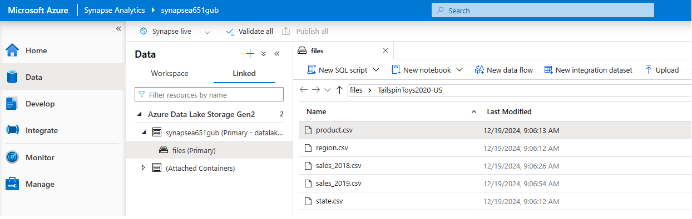

# TailspinToys2020-US - Azure Synapse dedicated SQL pool - Pipelines

## 1. Introduction

The purpose of this exercise is to explore Azure Synapse dedicated SQL pool capabilities to create a SQL database in order to store and query data for datawarehouse using pipelines integration.

**Goal**: create a SQL database to store data from files and query it using SQL instructions.

**Steps**:

    1. Load data into a data lake.
    2. Create database and tables.
    3. Create store procedures for data transformation.
    4. Create pipelines.
    5. Query data from tables.

## 2. Data

The data comes from TailspinToys2020-US database sample.

## 3. Project

### 3.1. Create Azure Synapse workspace

Upload file to blob storage.


Verify data in datalake.



### 3.2. Create database objects

#### 3.2.1. Staging tables

These tables are going to be used as temporal tables.

```SQL
CREATE TABLE dbo.StageProduct
(
    ProductID INT NOT NULL,
    ProductSKU NVARCHAR(50) NOT NULL,
    ProductName NVARCHAR(50) NOT NULL,
    ProductCategory NVARCHAR(50) NOT NULL,
    ItemGroup NVARCHAR(50) NOT NULL,
    KitType NCHAR(3) NOT NULL,
    Channels TINYINT NOT NULL,
    Demographic NVARCHAR(50) NOT NULL,
    RetailPrice MONEY NOT NULL
)
WITH
(
    DISTRIBUTION = ROUND_ROBIN,
    CLUSTERED COLUMNSTORE INDEX
);
```

```SQL
CREATE TABLE dbo.StageSales
(
    OrderNumber NCHAR(10) NOT NULL,
    OrderDate DATE NOT NULL,
    ShipDate DATE NULL,
    CustomerStateID INT NOT NULL,
    ProductID INT NOT NULL,
    Quantity INT NOT NULL,
    UnitPrice DECIMAL(9, 2) NOT NULL,
    DiscountAmount DECIMAL(9, 2) NOT NULL,
    PromotionCode NVARCHAR(20) NULL
)
WITH
(
    DISTRIBUTION = ROUND_ROBIN,
    CLUSTERED COLUMNSTORE INDEX
);
```

#### 3.2.2. Dimension tables

```SQL
CREATE TABLE dbo.DimProduct
(
    ProductKey INT IDENTITY NOT NULL,
    ProductID INT NOT NULL,
    ProductSKU NVARCHAR(50) NOT NULL,
    ProductName NVARCHAR(50) NOT NULL,
    ProductCategory NVARCHAR(50) NOT NULL,
    ItemGroup NVARCHAR(50) NOT NULL,
    KitType NCHAR(3) NOT NULL,
    Channels TINYINT NOT NULL,
    Demographic NVARCHAR(50) NOT NULL,
    RetailPrice MONEY NOT NULL
)
WITH
(
    DISTRIBUTION = REPLICATE,
    CLUSTERED COLUMNSTORE INDEX
);
```

```SQL
CREATE TABLE dbo.DimDate
( 
    DateKey INT IDENTITY NOT NULL,
    DateOrderAltKey DATE NOT NULL,
    DayOrderOfMonth INT NOT NULL,
    DayOrderOfWeek INT NOT NULL,
    DayOrderName NVARCHAR(15) NOT NULL,
    MonthOrderOfYear INT NOT NULL,
    MonthOrderName NVARCHAR(15) NOT NULL,
    OrderQuarter INT NOT NULL,
    OrderYear INT NOT NULL,
    DayShipOfMonth INT NULL,
    DayShipOfWeek INT NULL,
    DayShipName NVARCHAR(15) NULL,
    MonthShipOfYear INT NULL,
    MonthShipName NVARCHAR(15) NULL,
    ShipQuarter INT NULL,
    ShipYear INT NULL
)
WITH
(
    DISTRIBUTION = REPLICATE,
    CLUSTERED COLUMNSTORE INDEX
);
```

#### 3.2.3. Fact tables

```SQL
CREATE TABLE dbo.FactSales
(
    OrderKey INT IDENTITY NOT NULL,
    OrderNumber NCHAR(10) NOT NULL,
    OrderDate DATE NOT NULL,
    ShipDate DATE NULL,
    CustomerStateID INT NOT NULL,
    ProductID INT NOT NULL,
    Quantity INT NOT NULL,
    UnitPrice DECIMAL(9, 2) NOT NULL,
    DiscountAmount DECIMAL(9, 2) NOT NULL,
    PromotionCode NVARCHAR(20) NULL,
    ProductKey INT NOT NULL,
    IsCurrent BIT NOT NULL,
    CreationDate DATETIME NOT NULL
)
WITH
(
    DISTRIBUTION = HASH(OrderNumber),
    CLUSTERED COLUMNSTORE INDEX
);
```

#### 3.2.4. Create store procedures

```SQL
CREATE PROCEDURE dbo.usp_upsert_DimProduct
AS
BEGIN
    /*
        This stored procedure load data into dbo.DimProduct. The column ProductID (business id) is going to be used
        to determine if a row exists or not. In case if it exists, this row is treated as new, otherwise as an update.
    */

    -- New Products
    INSERT INTO dbo.DimProduct (
        ProductID,
        ProductSKU,
        ProductName,
        ProductCategory,
        ItemGroup,
        KitType,
        Channels,
        Demographic,
        RetailPrice
    )
    SELECT
        s.ProductID,
        s.ProductSKU,
        s.ProductName,
        s.ProductCategory,
        s.ItemGroup,
        s.KitType,
        s.Channels,
        s.Demographic,
        s.RetailPrice
    FROM dbo.StageProduct AS s
    WHERE NOT EXISTS
        (SELECT 1 FROM dbo.DimProduct AS d
        WHERE d.ProductID = s.ProductID)

    -- Type 1 updates
    UPDATE d SET 
        d.ProductSKU = s.ProductSKU,
        d.ProductName = s.ProductName,
        d.ProductCategory = s.ProductCategory,
        d.ItemGroup = s.ItemGroup,
        d.KitType = s.KitType,
        d.Channels = s.Channels,
        d.Demographic = s.Demographic,
        d.RetailPrice = s.RetailPrice
    FROM dbo.DimProduct AS d
    JOIN dbo.StageProduct AS s ON s.ProductID = d.ProductID;

END
GO;
```

```SQL
CREATE PROCEDURE dbo.usp_upsert_DimDate
AS
BEGIN
    /*
        This stored procedure load data into dbo.DimDate. The column DateOrderAltKey (business id) is going to be used
        to determine if a row exists or not.
        To calculate 
    */

    -- Remove rows that are already existed
    DELETE d
    FROM dbo.DimDate d
    WHERE EXISTS (SELECT 1 FROM dbo.StageSales s WHERE s.OrderDate = d.DateOrderAltKey)

    -- Load rows
    INSERT INTO dbo.DimDate(
        DateOrderAltKey,
        DayOrderOfMonth,
        DayOrderOfWeek,
        DayOrderName,
        MonthOrderOfYear,
        MonthOrderName,
        OrderQuarter,
        OrderYear,
        DayShipOfMonth,
        DayShipOfWeek,
        DayShipName,
        MonthShipOfYear,
        MonthShipName,
        ShipQuarter,
        ShipYear
    )
    SELECT DISTINCT
        OrderDate,
        DATEPART(DAY, OrderDate) AS DayOrderOfMonth,
        DATEPART(WEEKDAY, OrderDate) AS DayOrderOfWeek,
        CASE DATEPART(WEEKDAY, OrderDate)
            WHEN 1 THEN 'Sunday'
            WHEN 2 THEN 'Monday'
            WHEN 3 THEN 'Tuesday'
            WHEN 4 THEN 'Wednesday'
            WHEN 5 THEN 'Thursday'
            WHEN 6 THEN 'Friday'
            WHEN 7 THEN 'Saturday'
        END AS DayOrderName,
        MONTH(OrderDate) AS MonthOrderOfYear,
        CASE DATEPART(MONTH, OrderDate)
            WHEN 1 THEN 'January'
            WHEN 2 THEN 'February'
            WHEN 3 THEN 'March'
            WHEN 4 THEN 'April'
            WHEN 5 THEN 'May'
            WHEN 6 THEN 'June'
            WHEN 7 THEN 'July'
            WHEN 8 THEN 'August'
            WHEN 9 THEN 'September'
            WHEN 10 THEN 'October'
            WHEN 11 THEN 'November'
            WHEN 12 THEN 'December'
        END AS MonthOrderName,
        DATEPART(QUARTER, OrderDate) AS OrderQuarter,
        YEAR(OrderDate) AS OrderYear,
        DATEPART(DAY, ShipDate) AS DayShipOfMonth,
        DATEPART(WEEKDAY, ShipDate) AS DayShipOfWeek,
        CASE DATEPART(WEEKDAY, ShipDate)
            WHEN 1 THEN 'Sunday'
            WHEN 2 THEN 'Monday'
            WHEN 3 THEN 'Tuesday'
            WHEN 4 THEN 'Wednesday'
            WHEN 5 THEN 'Thursday'
            WHEN 6 THEN 'Friday'
            WHEN 7 THEN 'Saturday'
        END AS DayShipName,
        MONTH(ShipDate) AS MonthShipOfYear,
        CASE DATEPART(MONTH, ShipDate)
            WHEN 1 THEN 'January'
            WHEN 2 THEN 'February'
            WHEN 3 THEN 'March'
            WHEN 4 THEN 'April'
            WHEN 5 THEN 'May'
            WHEN 6 THEN 'June'
            WHEN 7 THEN 'July'
            WHEN 8 THEN 'August'
            WHEN 9 THEN 'September'
            WHEN 10 THEN 'October'
            WHEN 11 THEN 'November'
            WHEN 12 THEN 'December'
        END AS MonthShipName,
        DATEPART(QUARTER, ShipDate) AS ShipQuarter,
        YEAR(ShipDate) AS ShipYear
    FROM dbo.StageSales;

END
GO;
```

```SQL
CREATE PROCEDURE dbo.usp_insert_FactSales
AS
BEGIN

    INSERT INTO dbo.FactSales (
        OrderNumber,
        OrderDate,
        ShipDate,
        CustomerStateID,
        ProductID,
        Quantity,
        UnitPrice,
        DiscountAmount,
        PromotionCode,
        ProductKey,
        IsCurrent,
        CreationDate
    )
    SELECT
        s.OrderNumber,
        s.OrderDate,
        s.ShipDate,
        s.CustomerStateID,
        s.ProductID,
        s.Quantity,
        s.UnitPrice,
        s.DiscountAmount,
        s.PromotionCode,
        p.ProductKey,
        1 AS IsCurrent,
        GETDATE() AS CreationDate
    FROM dbo.StageSales s
    JOIN dbo.DimProduct p ON p.ProductID = s.ProductID;

END
GO;
```

```SQL
CREATE PROCEDURE dbo.usp_deactivate_OldFactSales
AS
BEGIN
    /*
        Deactivate rows that coincide with current data loading.
    */

    UPDATE s
        SET s.IsCurrent = 0
    FROM dbo.FactSales s
    JOIN dbo.StageSales ss ON ss.OrderDate = s.OrderDate
    WHERE s.IsCurrent = 1;

END
GO;
```

### 3.3. Create pipelines

The pipelines were created based on the following configurations:

* **Read text files**: Azure Data Lake Storage Gen2 linked service.
* **Read sql tables**: Azure Synapse Analytics linked service.
  * All staging tables are been truncated before loading.

#### 3.3.1. Create load dimension tables pipeline

The pipeline loads staging and dimension tables like product, sales and date.


In case of dbo.StageProduct, the datasource is a text file where not all columns are taken. Only valid columns are loaded into table.


In case of dbo.StageSales, the datasource is a text file where columns are loaded into table.


To load data into dimension tables, the pipeline calls the following stored procedures: `dbo.usp_upsert_DimProduct` and `dbo.usp_upsert_DimDate`.

#### 3.3.2. Create load fact tables pipeline

The pipeline loads fact tables. The logic to load data is in the following store procedure: `dbo.usp_insert_FactSales`. In addition to that, there is a store procedure called `dbo.usp_deactivate_OldFactSales`, which deactivate old rows based on OrderDate.


#### 3.3.3. Orchestrate pipelines

The pipeline calles "Load dimension tables" and "Load fact tables" pipelines.


