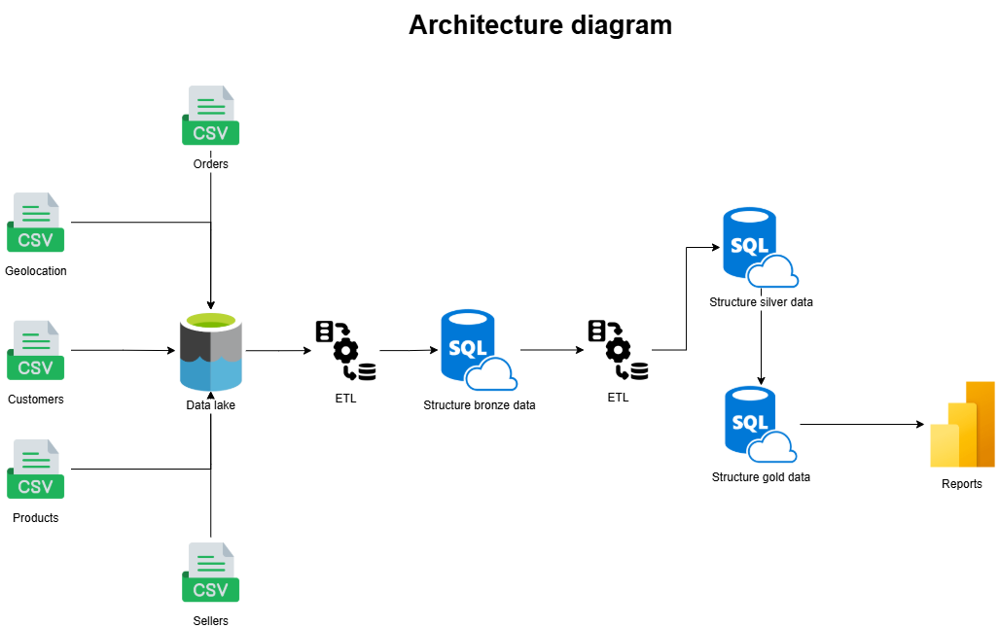

# Brazilian E-Commerce Public Dataset by Olist

The goal of this project is to prepare e-commerce data for analysing.

Technologies:

* Azure Data Lake Gen2
* Azure Synapse Serverless SQL Pool
* Power BI

Link data: https://www.kaggle.com/datasets/olistbr/brazilian-ecommerce?resource=download

