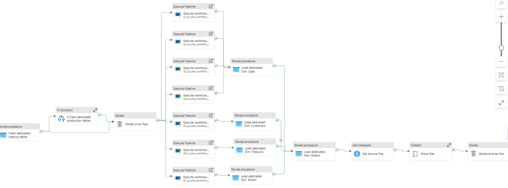

# Data exploration using Serverless and Dedicated SQL endpoint

The goal of this project was to build a **data lakehouse structure** on Azure using **Serverless SQL Pool** for exploration, transformation, and reporting.
Additionality, the curated data was loaded into dedicated data warehouse base.

Technologies:

* Azure Data Lake Gen2
	* For storage.
* Azure Synapse Serverless SQL Pool
	* For data cleaning and transformation.
* Azure Synapse Dedicated SQL Pool
	* For data warehouse.
* Pipelines
	* For orchestation.

Link data: <https://www.kaggle.com/datasets/olistbr/brazilian-ecommerce?resource=download>

## 1. Data Processing Design

The data was organized following a **medallion architecture**:

| Layer | Description | Example Path |
|--------|--------------|--------------|
| **Bronze** | Original CSV files | `/olist/bronze/*products*.csv` | |
| **Silver** | Cleaned and standardized data using Synapse **views** | `/olist/silver/products/*.parquet` |
| **Gold** | Dedicated server where gold tables live | |
| **Archive** | Copy of CSV files | `/olist/archive/*products*.csv` |


## 2. Workflow

Using pipelines, the data was extracted from cloud storage, stored in cloud and applied transformations.

In general, the pipeline has the following steps:

1. Truncate managed tables (dedicated pool).
1. Truncate production tables (dedicated pool) if an initial load was executed, otherwise this step is ignored.
2. Delete silver files.
3. Run cleaning data pipelines (each entity).
	* Create external bronze tables.
	* Create silver views.
	* Materialize silver clean data.
4. Load managed tables (dedicated pool).
5. Move bronze files to archive folder.

Main pipeline.



Cleaning process.


### 2.1. Create database

A layer database was created in order to perform sql operations over serverless pool by pipelines.

```sql
CREATE DATABASE Olist_DB
    COLLATE Latin1_General_100_BIN2_UTF8
GO;

USE Olist_DB
GO;

CREATE SCHEMA bronze
GO;

CREATE SCHEMA silver
GO;


CREATE EXTERNAL DATA SOURCE bronze_data WITH (
    LOCATION = 'https://datalakexxxxxx.dfs.core.windows.net/olist/bronze/'
);
GO;

CREATE EXTERNAL DATA SOURCE silver_data WITH (
    LOCATION = 'https://datalakexxxxxx.dfs.core.windows.net/olist/silver/'
);
GO;

CREATE EXTERNAL FILE FORMAT CsvFormat
    WITH (
        FORMAT_TYPE = DELIMITEDTEXT,
        FORMAT_OPTIONS(
            FIELD_TERMINATOR = ',',
            STRING_DELIMITER = '"',
            FIRST_ROW = 2
        )
    );
GO;

CREATE EXTERNAL FILE FORMAT ParquetFormat
    WITH (
            FORMAT_TYPE = PARQUET,
            DATA_COMPRESSION = 'org.apache.hadoop.io.compress.SnappyCodec'
        );
GO;
```

### 2.2. Create external Tables - Bronze Layer

Each external table points directly to each CSV file, which is located in Azure Data Lake.

```sql
-- Example
IF (SELECT OBJECT_ID('bronze.products', 'U')) IS NOT NULL
	DROP EXTERNAL TABLE bronze.products;

CREATE EXTERNAL TABLE bronze.products
(
	product_id VARCHAR(50),
	product_category_name NVARCHAR(50),
	product_name_lenght VARCHAR(10),
	product_description_lenght VARCHAR(10),
	product_photos_qty VARCHAR(10),
	product_weight_g VARCHAR(10),
	product_length_cm VARCHAR(10),
	product_height_cm VARCHAR(10),
	product_width_cm VARCHAR(10)
)
WITH
(
	DATA_SOURCE = bronze_data,
	LOCATION = '*products*.csv',
	FILE_FORMAT = CsvFormat
);
```

### 2.3. Data Cleaning and Transformation - Stage Layer

Created views to clean and standardize the data.

Steps:

1. Replaced missing values.
    * Numeric columns were filled with '0'.
    * Date columns were filled with '1900-01-01 00:00:00.000'.
    * String columns were filled with '' or 'UNKNOWN'.
2. Trimmed spaces from string columns.
3. Removed duplicated values.
4. Validated data integrity.

```sql
-- Example
-- Cleaning
DROP VIEW IF EXISTS silver.vw_order_items_clean;

CREATE VIEW silver.vw_order_items_clean
AS
SELECT
	order_id,
	order_item_id,
	ISNULL(product_id, 'UNKNOWN') AS product_id,
	ISNULL(seller_id, 'UNKNOWN') AS seller_id,
	ISNULL(shipping_limit_date, '1900-01-01 00:00:00.000') AS shipping_limit_date,
	ISNULL(price, '0') AS price,
	ISNULL(freight_value, '0') AS freight_value
FROM bronze.order_items
WHERE order_id IS NOT NULL
AND order_item_id IS NOT NULL;

-- Validate data integrity
DROP VIEW IF EXISTS silver.vw_order_items_final;

CREATE VIEW silver.vw_order_items_final
AS
SELECT DISTINCT
    order_id,
    CAST(order_item_id AS INT) AS order_item_id,
    product_id,
    seller_id,
    CAST(shipping_limit_date AS DATE) AS shipping_limit_date,
    CAST(price AS DECIMAL(10, 2)) AS price,
    CAST(freight_value AS DECIMAL(10, 2)) AS freight_value
FROM silver.vw_order_items_clean
WHERE TRY_CAST(order_item_id AS INT) IS NOT NULL
AND TRY_CAST(shipping_limit_date AS DATE) IS NOT NULL
AND TRY_CAST(price AS DECIMAL(10, 2)) IS NOT NULL
AND TRY_CAST(freight_value AS DECIMAL(10, 2)) IS NOT NULL;
```

### 2.4. Curated data - Silver Layer

The data was materialized into Parquet files.

```sql
IF (SELECT OBJECT_ID('silver.order_items', 'U')) IS NOT NULL
	DROP EXTERNAL TABLE silver.order_items;

CREATE EXTERNAL TABLE silver.order_items
	WITH (
		LOCATION = 'order_items/',
		DATA_SOURCE = silver_data,
		FILE_FORMAT = ParquetFormat
	)
AS
SELECT
	order_id,
	order_item_id,
	product_id,
	seller_id,
	shipping_limit_date,
	price,
	freight_value
FROM silver.vw_order_items_final;
```

### 2.5. Create table for staging tables - Dedicated Pool

These tables were used to receive data from serverless pool.

```sql
-- Example
IF (SELECT OBJECT_ID('OLIST_DB.Stage_orders', 'U')) IS NOT NULL
    DROP TABLE OLIST_DB.Stage_orders;

CREATE TABLE OLIST_DB.Stage_orders
(
    order_id VARCHAR(50) NOT NULL,
    customer_id VARCHAR(50) NOT NULL,
    order_status NVARCHAR(20) NOT NULL,
    order_purchase_timestamp DATE NOT NULL,
    order_approved_at DATE NOT NULL,
    order_delivered_carrier_date DATE NOT NULL,
    order_delivered_customer_date DATE NOT NULL,
    order_estimated_delivery_date DATE NOT NULL
)
WITH
(
    DISTRIBUTION = ROUND_ROBIN,
    CLUSTERED COLUMNSTORE INDEX
);
```

Stored procedure to load data.

```sql
-- Example
CREATE PROCEDURE OLIST_DB.usp_load_Stage_orders
AS
BEGIN
    COPY INTO OLIST_DB.Stage_orders (
        order_id, 
        customer_id, 
        order_status, 
        order_purchase_timestamp, 
        order_approved_at, 
        order_delivered_carrier_date,
        order_delivered_customer_date, 
        order_estimated_delivery_date
    )
    FROM 'https://datalake20251021.dfs.core.windows.net/olist/silver/orders/*.parquet'
    WITH
    (
        FILE_TYPE = 'PARQUET',
        MAXERRORS = 0,
        IDENTITY_INSERT = 'OFF'
    );
END;
```

### 2.6. Create table for start schema - Dedicated Pool

Denormalization was applied before loading into production tables.

```sql
-- Example fact table
IF (SELECT OBJECT_ID('OLIST_DB.Fact_Orders', 'U')) IS NOT NULL
    DROP TABLE OLIST_DB.Fact_Orders;

CREATE TABLE OLIST_DB.Fact_Orders
(
    order_id_alternate VARCHAR(50) NOT NULL,
    customer_id_surrogate INT NOT NULL,
    product_id_surrogate INT NOT NULL,
    seller_id_surrogate INT NOT NULL,
    order_item_id INT NOT NULL,
    order_status NVARCHAR(20) NOT NULL,
    order_purchase_timestamp DATE NOT NULL,
    order_approved_at DATE NOT NULL,
    order_delivered_carrier_date DATE NOT NULL,
    order_delivered_customer_date DATE NOT NULL,
    order_estimated_delivery_date DATE NOT NULL,
    shipping_limit_date DATE NOT NULL,
    price DECIMAL(10, 2) NOT NULL,
    freight_value DECIMAL(10, 2) NOT NULL,
    review_score INT NOT NULL,
    review_comment_title NVARCHAR(50) NOT NULL,
    payment_sequential INT NOT NULL,
    payment_type NVARCHAR(50) NOT NULL,
    payment_installments INT NOT NULL,
    payment_value DECIMAL(10, 2) NOT NULL
)
WITH
(
    DISTRIBUTION = HASH(order_id_alternate),
    CLUSTERED COLUMNSTORE INDEX
);

-- Example dimension table
IF (SELECT OBJECT_ID('OLIST_DB.Dim_Customers', 'U')) IS NOT NULL
    DROP TABLE OLIST_DB.Dim_Customers;

CREATE TABLE OLIST_DB.Dim_Customers
(
    customer_id_surrogate INT IDENTITY NOT NULL,
    customer_id_alternate VARCHAR(50) NOT NULL,
    customer_zip_code_prefix VARCHAR(10) NOT NULL,
    customer_city NVARCHAR(50) NOT NULL,
    customer_state VARCHAR(80) NOT NULL
)
WITH
(
    DISTRIBUTION = REPLICATE,
    CLUSTERED COLUMNSTORE INDEX
);
```

Stored procedure to load data.

```sql
-- Example
CREATE PROCEDURE OLIST_DB.usp_load_Dim_Customers
AS
BEGIN
    INSERT INTO OLIST_DB.Dim_Customers (
        customer_id_alternate,
        customer_zip_code_prefix,
        customer_city,
        customer_state
    )
    SELECT
        s.customer_id,
        s.customer_zip_code_prefix,
        s.customer_city,
        s.customer_state
    FROM OLIST_DB.Stage_customers s
    WHERE NOT EXISTS (SELECT 1 FROM OLIST_DB.Dim_Customers d WHERE d.customer_id_alternate = s.customer_id);

    UPDATE d SET
        d.customer_zip_code_prefix = s.customer_zip_code_prefix,
        d.customer_city = s.customer_city,
        d.customer_state = s.customer_state
    FROM OLIST_DB.Dim_Customers d
    INNER JOIN OLIST_DB.Stage_customers s ON s.customer_id = d.customer_id_alternate
    WHERE d.customer_zip_code_prefix <> s.customer_zip_code_prefix OR
    d.customer_city <> s.customer_city OR
    d.customer_state <> s.customer_state;
END;

-- Example
CREATE PROCEDURE OLIST_DB.usp_load_Fact_Orders
AS
BEGIN
    INSERT INTO OLIST_DB.Fact_Orders (
        order_id_alternate,
        customer_id_surrogate,
        product_id_surrogate,
        seller_id_surrogate,
        order_item_id,
        order_status,
        order_purchase_timestamp,
        order_approved_at,
        order_delivered_carrier_date,
        order_delivered_customer_date,
        order_estimated_delivery_date,
        shipping_limit_date,
        price,
        freight_value,
        review_score,
        review_comment_title,
        payment_sequential,
        payment_type,
        payment_installments,
        payment_value
    )
    SELECT
        d.order_id,
        c.customer_id_surrogate,
        pr.product_id_surrogate,
        s.seller_id_surrogate,
        d.order_item_id,
        o.order_status,
        o.order_purchase_timestamp,
        o.order_approved_at,
        o.order_delivered_carrier_date,
        o.order_delivered_customer_date,
        o.order_estimated_delivery_date,
        d.shipping_limit_date,
        d.price,
        d.freight_value,
        r.review_score,
        r.review_comment_title,
        p.payment_sequential,
        p.payment_type,
        p.payment_installments,
        p.payment_value
    FROM OLIST_DB.Stage_order_items d
    INNER JOIN OLIST_DB.Stage_orders o ON o.order_id = d.order_id
    INNER JOIN OLIST_DB.Stage_order_reviews r ON r.order_id = o.order_id
    INNER JOIN OLIST_DB.Stage_order_payments p ON p.order_id = o.order_id
    INNER JOIN OLIST_DB.Dim_Customers c ON c.customer_id_alternate = o.customer_id
    INNER JOIN OLIST_DB.Dim_Products pr ON pr.product_id_alternate = d.product_id
    INNER JOIN OLIST_DB.Dim_Sellers s ON s.seller_id_alternate = d.seller_id;
END;
```

## 3. Limitations

This project has the following limititations:

* Silver data is removed during each run.
