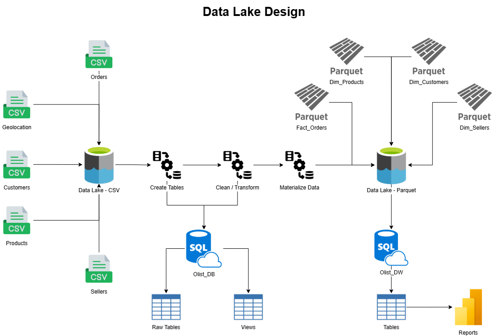
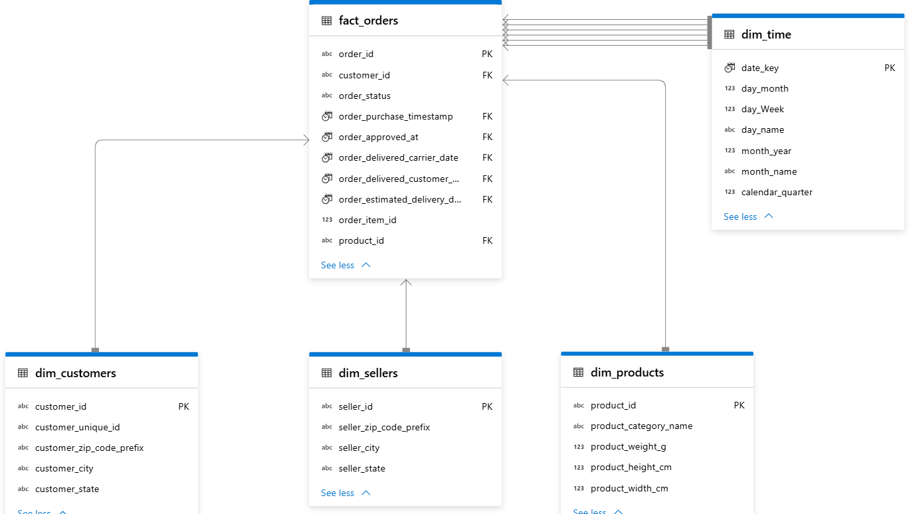

# Data exploration using Serverless SQL endpoint

The goal of this project was to build a **data lakehouse structure** on Azure using **Serverless SQL Pool** for exploration, transformation, and reporting.

Technologies:

* Azure Data Lake Gen2
* Azure Synapse Serverless SQL Pool
* Power BI

Link data: <https://www.kaggle.com/datasets/olistbr/brazilian-ecommerce?resource=download>

## 1. Data Lake Design

The data was organized following a **three-layer architecture**:

| Layer | Description | Example Path |
|--------|--------------|--------------|
| **Raw** | Original CSV files | `/files/Olist/csv/*products*.csv` | |
| **Stage** | Cleaned and standardized data using Synapse **views** | `/files/Olist/csv/*products*.csv` |
| **Data Warehouse** | Final curated tables stored as **Parquet** files | `/files/Olist/parquet/products/` |



## 2. Workflow

### 2.1. Create database

```sql
CREATE DATABASE Olist_DB
    COLLATE Latin1_General_100_BIN2_UTF8;
GO;

------------------ Start create schemas ------------------
-- Schema for raw data
CREATE SCHEMA raw;
GO;

-- Schema for cleaning, transforming and enriching data
CREATE SCHEMA stage;
GO;

-- Schema for curated data and data warehousing exploration
CREATE SCHEMA dw;
GO;
------------------ End create schemas ------------------

------------------ Start external data object ------------------
-- Path for raw data
CREATE EXTERNAL DATA SOURCE olist_raw_data WITH (
    LOCATION = 'https://xxxxxxxxxxxxxxx.dfs.core.windows.net/files/Olist/csv/'
);
GO;

-- Path for curated and cleaned data
CREATE EXTERNAL DATA SOURCE olist_cleaned_data WITH (
    LOCATION = 'https://xxxxxxxxxxxxxxx.dfs.core.windows.net/files/Olist/parquet/'
);
GO;
------------------ End external data object ------------------

------------------ Start external file format object ------------------
-- Format for raw data
CREATE EXTERNAL FILE FORMAT CsvFormat
    WITH (
        FORMAT_TYPE = DELIMITEDTEXT,
        FORMAT_OPTIONS(
            FIELD_TERMINATOR = ',',
            STRING_DELIMITER = '"',
            FIRST_ROW = 2
        )
    );
GO;

-- Format for curated data
CREATE EXTERNAL FILE FORMAT ParquetFormat
    WITH (
            FORMAT_TYPE = PARQUET,
            DATA_COMPRESSION = 'org.apache.hadoop.io.compress.SnappyCodec'
        );
GO;
------------------ End external file format object ------------------
```

### 2.2. Raw Layer – External Tables

Each external table points directly to each CSV file, which is located in Azure Data Lake.

```sql
CREATE EXTERNAL TABLE raw.products
(
    product_id NVARCHAR(50),
    product_category_name NVARCHAR(50),
    product_name_lenght NVARCHAR(10),
    product_description_lenght NVARCHAR(10),
    product_photos_qty NVARCHAR(10),
    product_weight_g NVARCHAR(10),
    product_length_cm NVARCHAR(10),
    product_height_cm NVARCHAR(10),
    product_width_cm NVARCHAR(10)
)
WITH
(
    DATA_SOURCE = olist_raw_data,
    LOCATION = '*products*.csv',
    FILE_FORMAT = CsvFormat
);
GO;

CREATE EXTERNAL TABLE raw.sellers
(
    seller_id NVARCHAR(50),
    seller_zip_code_prefix NVARCHAR(5),
    seller_city NVARCHAR(50),
    seller_state NVARCHAR(2)
)
WITH
(
    DATA_SOURCE = olist_raw_data,
    LOCATION = '*sellers*.csv',
    FILE_FORMAT = CsvFormat
);
GO;

CREATE EXTERNAL TABLE raw.customers
(
    customer_id VARCHAR(100),
    customer_unique_id VARCHAR(100),
    customer_zip_code_prefix VARCHAR(5),
    customer_city VARCHAR(50),
    customer_state VARCHAR(2)
)
WITH
(
    DATA_SOURCE = olist_raw_data,
    LOCATION = '*customers*.csv',
    FILE_FORMAT = CsvFormat
);
GO;

CREATE EXTERNAL TABLE raw.order_items
(
    order_id NVARCHAR(50),
    order_item_id NVARCHAR(5),
    product_id NVARCHAR(50),
    seller_id VARCHAR(50),
    shipping_limit_date NVARCHAR(50),
    price NVARCHAR(20),
    freight_value NVARCHAR(20)
)
WITH
(
    DATA_SOURCE = olist_raw_data,
    LOCATION = '*order_items*.csv',
    FILE_FORMAT = CsvFormat
);
GO;

CREATE EXTERNAL TABLE raw.order_payments
(
    order_id NVARCHAR(50),
    payment_sequential NVARCHAR(5),
    payment_type NVARCHAR(50),
    payment_installments NVARCHAR(5),
    payment_value NVARCHAR(20)
)
WITH
(
    DATA_SOURCE = olist_raw_data,
    LOCATION = '*order_payments*.csv',
    FILE_FORMAT = CsvFormat
);
GO;

CREATE EXTERNAL TABLE raw.order_reviews
(
    review_id NVARCHAR(50),
    order_id NVARCHAR(50),
    review_score NVARCHAR(5),
    review_comment_title NVARCHAR(50),
    review_comment_message NVARCHAR(250),
    review_creation_date NVARCHAR(50),
    review_answer_timestamp NVARCHAR(50)
)
WITH
(
    DATA_SOURCE = olist_raw_data,
    LOCATION = '*order_reviews*.csv',
    FILE_FORMAT = CsvFormat
);
GO;

CREATE EXTERNAL TABLE raw.orders
(
    order_id NVARCHAR(50),
    customer_id NVARCHAR(50),
    order_status NVARCHAR(20),
    order_purchase_timestamp NVARCHAR(50),
    order_approved_at NVARCHAR(50),
    order_delivered_carrier_date NVARCHAR(50),
    order_delivered_customer_date NVARCHAR(50),
    order_estimated_delivery_date NVARCHAR(50)
)
WITH
(
    DATA_SOURCE = olist_raw_data,
    LOCATION = '*orders*.csv',
    FILE_FORMAT = CsvFormat
);
GO;
```

### 2.3. Stage Layer – Data Cleaning and Transformation

Created views to clean and standardize the data.

Steps:

1. Replaced missing values.
    * Numeric columns were filled with '0'.
    * Date columns were filled with '1900-01-01 00:00:00.000'.
    * String columns were filled with ''.
2. Trimmed spaces from string columns.
3. Removed duplicated values.
4. Validated data integrity.

```sql
---------------------------- Start Identify Missing Values ----------------------------
--------------- raw.orders ---------------
SELECT
	SUM(IIF(order_id IS NULL, 1, 0)) AS order_id_missing,
	SUM(IIF(customer_id IS NULL, 1, 0)) AS customer_id_missing,
	SUM(IIF(order_status IS NULL, 1, 0)) AS order_status_missing
FROM raw.orders;
GO;

-- Grouped by order_status in order to identify the logic to fill missing values
SELECT
	order_status,
	SUM(IIF(order_purchase_timestamp IS NULL, 1, 0)) AS order_purchase_timestamp_missing,
	SUM(IIF(order_approved_at IS NULL, 1, 0)) AS order_approved_at_missing,
	SUM(IIF(order_delivered_carrier_date IS NULL, 1, 0)) AS order_delivered_carrier_date_missing,
	SUM(IIF(order_delivered_customer_date IS NULL, 1, 0)) AS order_delivered_customer_date_missing,
	SUM(IIF(order_estimated_delivery_date IS NULL, 1, 0)) AS order_estimated_delivery_date_missing
FROM raw.orders
GROUP BY order_status;
GO;
--------------- raw.orders ---------------

--------------- raw.order_items ---------------
SELECT
	SUM(IIF(order_id IS NULL, 1, 0)) AS order_id_missing,
	SUM(IIF(order_item_id IS NULL, 1, 0)) AS order_item_id_missing,
	SUM(IIF(product_id IS NULL, 1, 0)) AS product_id_missing,
	SUM(IIF(seller_id IS NULL, 1, 0)) AS seller_id_missing,
	SUM(IIF(shipping_limit_date IS NULL, 1, 0)) AS shipping_limit_date_missing,
	SUM(IIF(price IS NULL, 1, 0)) AS price_date_missing,
	SUM(IIF(freight_value IS NULL, 1, 0)) AS freight_value_date_missing
FROM raw.order_items;
GO;
--------------- raw.order_items ---------------

--------------- raw.order_payments ---------------
SELECT
	SUM(IIF(order_id IS NULL, 1, 0)) AS order_id_missing,
	SUM(IIF(payment_sequential IS NULL, 1, 0)) AS payment_sequential_missing,
	SUM(IIF(payment_type IS NULL, 1, 0)) AS payment_type_missing,
	SUM(IIF(payment_installments IS NULL, 1, 0)) AS payment_installments_missing,
	SUM(IIF(payment_value IS NULL, 1, 0)) AS payment_value_missing
FROM raw.order_payments;
GO;
--------------- raw.order_payments ---------------

--------------- raw.order_reviews ---------------
SELECT
	SUM(IIF(review_id IS NULL, 1, 0)) AS review_id_missing,
	SUM(IIF(order_id IS NULL, 1, 0)) AS order_id_missing,
	SUM(IIF(review_score IS NULL, 1, 0)) AS review_score_missing,
	SUM(IIF(review_comment_title IS NULL, 1, 0)) AS review_comment_title_missing,
	SUM(IIF(review_comment_message IS NULL, 1, 0)) AS review_comment_message_missing,
	SUM(IIF(review_creation_date IS NULL, 1, 0)) AS review_creation_date_missing,
	SUM(IIF(review_answer_timestamp IS NULL, 1, 0)) AS review_answer_timestamp_missing
FROM raw.order_reviews;
GO;
--------------- raw.order_reviews ---------------

--------------- raw.products ---------------
SELECT
	SUM(IIF(product_id IS NULL, 1, 0)) AS product_id_missing,
	SUM(IIF(product_category_name IS NULL, 1, 0)) AS product_category_name_missing,
	SUM(IIF(product_name_lenght IS NULL, 1, 0)) AS product_name_lenght_missing,
	SUM(IIF(product_description_lenght IS NULL, 1, 0)) AS product_description_lenght_missing,
	SUM(IIF(product_photos_qty IS NULL, 1, 0)) AS product_photos_qty_missing,
	SUM(IIF(product_weight_g IS NULL, 1, 0)) AS product_weight_g_missing,
	SUM(IIF(product_length_cm IS NULL, 1, 0)) AS product_length_cm_missing,
	SUM(IIF(product_height_cm IS NULL, 1, 0)) AS product_height_cm_missing,
	SUM(IIF(product_width_cm IS NULL, 1, 0)) AS product_width_cm_missing
FROM raw.products;
GO;
--------------- raw.products ---------------

--------------- raw.sellers ---------------
SELECT
	SUM(IIF(seller_id IS NULL, 1, 0)) AS seller_id_missing,
	SUM(IIF(seller_zip_code_prefix IS NULL, 1, 0)) AS seller_zip_code_prefix_missing,
	SUM(IIF(seller_city IS NULL, 1, 0)) AS seller_city_missing,
	SUM(IIF(seller_state IS NULL, 1, 0)) AS seller_state_missing
FROM raw.sellers;
GO;
--------------- raw.sellers ---------------
---------------------------- End Identify Missing Values ----------------------------

---------------------------- Start View Missing Values ----------------------------
--------------- raw.orders ---------------
-- View for trimming and making capital letter string columns
CREATE VIEW stage.vw_orders_trim
AS
SELECT
	order_id,
	customer_id,
	UPPER(TRIM(order_status)) AS order_status,
	order_purchase_timestamp,
	order_approved_at,
	order_delivered_carrier_date,
	order_delivered_customer_date,
	order_estimated_delivery_date
FROM raw.orders;
GO;

-- View for filling missing values
CREATE VIEW stage.vw_orders_no_missing_values
AS
SELECT
	order_id,
	customer_id,
	order_status,
	order_purchase_timestamp,
	ISNULL(order_approved_at, '1900-01-01 00:00:00.000') AS order_approved_at,
	ISNULL(order_delivered_carrier_date, '1900-01-01 00:00:00.000') AS order_delivered_carrier_date,
	ISNULL(order_delivered_customer_date, '1900-01-01 00:00:00.000') AS order_delivered_customer_date,
	order_estimated_delivery_date
FROM stage.vw_orders_trim
WHERE order_status IN ('CREATED', 'PROCESSING', 'APPROVED', 'INVOICED', 'UNAVAILABLE', 'CANCELED')
UNION ALL
SELECT
	order_id,
	customer_id,
	order_status,
	order_purchase_timestamp,
	ISNULL(order_approved_at, order_approved_at) AS order_approved_at,
	ISNULL(order_delivered_carrier_date, order_delivered_carrier_date) AS order_delivered_carrier_date,
	ISNULL(order_delivered_customer_date, '1900-01-01 00:00:00.000') AS order_delivered_customer_date,
	order_estimated_delivery_date
FROM stage.vw_orders_trim
WHERE order_status = 'SHIPPED'
UNION ALL
SELECT
	order_id,
	customer_id,
	order_status,
	order_purchase_timestamp,
	ISNULL(order_approved_at, order_purchase_timestamp) AS order_approved_at,
	ISNULL(order_delivered_carrier_date, order_purchase_timestamp) AS order_delivered_carrier_date,
	ISNULL(order_delivered_customer_date, order_purchase_timestamp) AS order_delivered_customer_date,
	order_estimated_delivery_date
FROM stage.vw_orders_trim
WHERE order_status = 'DELIVERED';
GO;
--------------- raw.orders ---------------

--------------- raw.order_payments ---------------
-- View for trimming and making capital letter string columns
CREATE VIEW stage.vw_order_payments_no_missing_values
AS
SELECT
	order_id,
	payment_sequential,
	UPPER(TRIM(payment_type)) AS payment_type,
	payment_installments,
	payment_value
FROM raw.order_payments;
GO;
--------------- raw.order_payments ---------------

--------------- raw.order_reviews ---------------
-- View for trimming and making capital letter string columns
-- View for filling missing values
CREATE VIEW stage.vw_order_reviews_no_missing_values
AS
SELECT
	review_id,
	order_id,
	review_score,
	UPPER(TRIM(ISNULL(review_comment_title, ''))) AS review_comment_title,
	UPPER(TRIM(ISNULL(review_comment_message, ''))) AS review_comment_message,
	review_creation_date,
	review_answer_timestamp
FROM raw.order_reviews;
GO;
--------------- raw.order_reviews ---------------

--------------- raw.customers ---------------
-- View for trimming and making capital letter string columns
CREATE VIEW stage.vw_customers_no_missing_values
AS
SELECT
	customer_id,
	customer_unique_id,
	customer_zip_code_prefix,
	UPPER(TRIM(customer_city)) AS customer_city,
	UPPER(TRIM(customer_state)) AS customer_state
FROM raw.customers;
GO;
--------------- raw.customers ---------------

--------------- raw.products ---------------
-- View for trimming and making capital letter string columns
-- View for filling missing values
-- Create 'UNKNOWN' category
CREATE VIEW stage.vw_products_no_missing_values
AS
SELECT
	product_id,
	UPPER(TRIM(ISNULL(product_category_name, 'UNKNOWN'))) AS product_category_name,
	ISNULL(product_name_lenght, '0') AS product_name_lenght,
	ISNULL(product_description_lenght, '0') AS product_description_lenght,
	ISNULL(product_photos_qty, '0') AS product_photos_qty,
	ISNULL(product_weight_g, '0') AS product_weight_g,
	ISNULL(product_length_cm, '0') AS product_length_cm,
	ISNULL(product_height_cm, '0') AS product_height_cm,
	ISNULL(product_width_cm, '0') AS product_width_cm
FROM raw.products;
GO;
--------------- raw.products ---------------

--------------- raw.sellers ---------------
-- View for trimming and making capital letter string columns
CREATE VIEW stage.vw_sellers_no_missing_values
AS
SELECT
	seller_id,
	seller_zip_code_prefix,
	UPPER(TRIM(seller_city)) AS seller_city,
	UPPER(TRIM(seller_state)) AS seller_state
FROM raw.sellers;
GO;
--------------- raw.sellers ---------------
---------------------------- End View Missing Values ----------------------------

---------------------------- Start Identify Duplicated Values ----------------------------
--------------- raw.orders ---------------
SELECT
	COUNT(*) AS count_duplicated,
	order_id,
	customer_id,
	order_status,
	order_purchase_timestamp,
	order_approved_at,
	order_delivered_carrier_date,
	order_delivered_customer_date,
	order_estimated_delivery_date
FROM stage.vw_orders_no_missing_values
GROUP BY
	order_id,
	customer_id,
	order_status,
	order_purchase_timestamp,
	order_approved_at,
	order_delivered_carrier_date,
	order_delivered_customer_date,
	order_estimated_delivery_date
HAVING COUNT(*) > 1;
GO;
--------------- raw.orders ---------------

--------------- raw.order_items ---------------
SELECT
	COUNT(*) AS count_duplicated,
	order_id,
	order_item_id,
	product_id,
	seller_id,
	shipping_limit_date,
	price,
	freight_value
FROM raw.order_items
GROUP BY
	order_id,
	order_item_id,
	product_id,
	seller_id,
	shipping_limit_date,
	price,
	freight_value
HAVING COUNT(*) > 1;
GO;
--------------- raw.order_items ---------------

--------------- raw.order_payments ---------------
SELECT
	COUNT(*) AS count_duplicated,
	order_id,
	payment_sequential,
	payment_type,
	payment_installments,
	payment_value
FROM raw.order_payments
GROUP BY
	order_id,
	payment_sequential,
	payment_type,
	payment_installments,
	payment_value
HAVING COUNT(*) > 1;
GO;
--------------- raw.order_payments ---------------

--------------- raw.order_reviews ---------------
SELECT
	COUNT(*) AS count_duplicated,
	review_id,
	order_id,
	review_score,
	review_comment_title,
	review_comment_message,
	review_creation_date,
	review_answer_timestamp
FROM stage.vw_order_reviews_no_missing_values
GROUP BY
	review_id,
	order_id,
	review_score,
	review_comment_title,
	review_comment_message,
	review_creation_date,
	review_answer_timestamp
HAVING COUNT(*) > 1;
GO;
--------------- raw.order_reviews ---------------

--------------- raw.customers ---------------
SELECT
	COUNT(*) AS count_duplicated,
	customer_id,
	customer_unique_id,
	customer_zip_code_prefix,
	customer_city,
	customer_state
FROM raw.customers
GROUP BY
	customer_id,
	customer_unique_id,
	customer_zip_code_prefix,
	customer_city,
	customer_state
HAVING COUNT(*) > 1;
GO;
--------------- raw.customers ---------------

--------------- raw.products ---------------
SELECT
	COUNT(*) AS count_duplicated,
	product_id,
	product_category_name,
	product_name_lenght,
	product_description_lenght,
	product_photos_qty,
	product_weight_g,
	product_length_cm,
	product_height_cm,
	product_width_cm
FROM stage.vw_products_no_missing_values
GROUP BY
	product_id,
	product_category_name,
	product_name_lenght,
	product_description_lenght,
	product_photos_qty,
	product_weight_g,
	product_length_cm,
	product_height_cm,
	product_width_cm
HAVING COUNT(*) > 1;
GO;
--------------- raw.products ---------------

--------------- raw.sellers ---------------
SELECT
	COUNT(*) AS count_duplicated,
	seller_id,
	seller_zip_code_prefix,
	seller_city,
	seller_state
FROM raw.sellers
GROUP BY
	seller_id,
	seller_zip_code_prefix,
	seller_city,
	seller_state
HAVING COUNT(*) > 1;
GO;
--------------- raw.sellers ---------------
---------------------------- End Identify Duplicated Values ----------------------------

---------------------------- Start Validating Data Integrity ----------------------------
--------------- raw.orders ---------------
SELECT
    order_id,
    order_purchase_timestamp,
    order_approved_at,
    order_delivered_carrier_date,
    order_delivered_customer_date,
    order_estimated_delivery_date
FROM stage.vw_orders_no_missing_values
WHERE TRY_CAST(order_purchase_timestamp AS DATETIME) IS NULL
OR TRY_CAST(order_approved_at AS DATETIME) IS NULL
OR TRY_CAST(order_delivered_carrier_date AS DATETIME) IS NULL
OR TRY_CAST(order_delivered_customer_date AS DATETIME) IS NULL
OR TRY_CAST(order_estimated_delivery_date AS DATETIME) IS NULL;
GO;
--------------- raw.orders ---------------

--------------- raw.order_items ---------------
SELECT
    order_id,
    order_item_id,
    shipping_limit_date,
    price,
    freight_value
FROM raw.order_items
WHERE TRY_CAST(order_item_id AS INT) IS NULL
OR TRY_CAST(shipping_limit_date AS DATETIME) IS NULL
OR TRY_CAST(price AS DECIMAL(10, 2)) IS NULL
OR TRY_CAST(freight_value AS DECIMAL(10, 2)) IS NULL;
GO;
--------------- raw.order_items ---------------

--------------- raw.order_payments ---------------
SELECT
    order_id,
    payment_sequential,
    payment_installments,
    payment_value
FROM stage.vw_order_payments_no_missing_values
WHERE TRY_CAST(payment_sequential AS INT) IS NULL
OR TRY_CAST(payment_installments AS INT) IS NULL
OR TRY_CAST(payment_value AS DECIMAL(10, 2)) IS NULL;
GO;
--------------- raw.order_payments ---------------

--------------- raw.order_reviews ---------------
SELECT
    review_id,
    review_score,
    review_creation_date,
    review_answer_timestamp
FROM stage.vw_order_reviews_no_missing_values
WHERE TRY_CAST(review_score AS INT) IS NULL
OR TRY_CAST(review_creation_date AS DATETIME) IS NULL
OR TRY_CAST(review_answer_timestamp AS DATETIME) IS NULL;
GO;
--------------- raw.order_reviews ---------------

--------------- raw.products ---------------
SELECT
    product_id,
    product_name_lenght,
    product_description_lenght,
    product_photos_qty,
    product_weight_g,
    product_length_cm,
    product_height_cm,
    product_width_cm
FROM stage.vw_products_no_missing_values
WHERE TRY_CAST(product_name_lenght AS INT) IS NULL
OR TRY_CAST(product_description_lenght AS INT) IS NULL
OR TRY_CAST(product_photos_qty AS INT) IS NULL
OR TRY_CAST(product_weight_g AS INT) IS NULL
OR TRY_CAST(product_length_cm AS INT) IS NULL
OR TRY_CAST(product_height_cm AS INT) IS NULL
OR TRY_CAST(product_width_cm AS INT) IS NULL;
GO;
--------------- raw.products ---------------
---------------------------- End Validating Data Integrity ----------------------------
```

### 2.4. Curated Layer

The data was materialized into Parquet files.

```sql
--------------- dw.fact_orders ---------------
CREATE EXTERNAL TABLE dw.fact_orders
    WITH (
        LOCATION = 'orders/',
        DATA_SOURCE = olist_cleaned_data,
        FILE_FORMAT = ParquetFormat
    )
AS
SELECT
    CAST(o.order_id AS VARCHAR(50)) AS order_id,
    CAST(o.customer_id AS VARCHAR(50)) AS customer_id,
    CAST(o.order_status AS VARCHAR(20)) AS order_status,
    CAST(o.order_purchase_timestamp AS DATETIME) AS order_purchase_timestamp,
    CAST(o.order_approved_at AS DATETIME) AS order_approved_at,
    CAST(o.order_delivered_carrier_date AS DATETIME) AS order_delivered_carrier_date,
    CAST(o.order_delivered_customer_date AS DATETIME) AS order_delivered_customer_date,
    CAST(o.order_estimated_delivery_date AS DATETIME) AS order_estimated_delivery_date,
    CAST(i.order_item_id AS INT) AS order_item_id,
    CAST(i.product_id AS VARCHAR(50)) AS product_id,
    CAST(i.seller_id AS VARCHAR(50)) AS seller_id,
    CAST(i.shipping_limit_date AS DATETIME) AS shipping_limit_date,
    CAST(i.price AS DECIMAL(10, 2)) AS price,
    CAST(i.freight_value AS DECIMAL(10, 2)) AS freight_value,
    CAST(p.payment_sequential AS INT) AS payment_sequential,
    CAST(p.payment_type AS VARCHAR(20)) AS payment_type,
    CAST(p.payment_installments AS INT) AS payment_installments,
    CAST(p.payment_value AS DECIMAL(10, 2)) AS payment_value,
    CAST(r.review_score AS INT) AS review_score,
    r.review_comment_message
FROM stage.vw_orders_no_missing_values o
INNER JOIN raw.order_items i ON o.order_id = i.order_id
INNER JOIN stage.vw_order_payments_no_missing_values p ON p.order_id = o.order_id
INNER JOIN stage.vw_order_reviews_no_missing_values r ON r.order_id = o.order_id;
GO;
--------------- dw.fact_orders ---------------

--------------- dw.dim_customers ---------------
CREATE EXTERNAL TABLE dw.dim_customers
    WITH (
        LOCATION = 'customers/',
        DATA_SOURCE = olist_cleaned_data,
        FILE_FORMAT = ParquetFormat
    )
AS
SELECT
	CAST(customer_id AS VARCHAR(50)) AS customer_id,
	CAST(customer_unique_id AS VARCHAR(50)) AS customer_unique_id,
	CAST(customer_zip_code_prefix AS CHAR(5)) AS customer_zip_code_prefix,
	customer_city,
	CAST(customer_state AS CHAR(2)) AS customer_state
FROM stage.vw_customers_no_missing_values;
GO;
--------------- dw.dim_customers ---------------

--------------- dw.dim_products ---------------
CREATE EXTERNAL TABLE dw.dim_products
    WITH (
        LOCATION = 'products/',
        DATA_SOURCE = olist_cleaned_data,
        FILE_FORMAT = ParquetFormat
    )
AS
SELECT
	CAST(product_id AS VARCHAR(50)) AS product_id,
	product_category_name,
	CAST(product_weight_g AS INT) AS product_weight_g,
	CAST(product_height_cm AS INT) AS product_height_cm,
	CAST(product_width_cm AS INT) AS product_width_cm
FROM stage.vw_products_no_missing_values;
GO;
--------------- dw.dim_products ---------------

--------------- dw.dim_sellers ---------------
CREATE EXTERNAL TABLE dw.dim_sellers
    WITH (
        LOCATION = 'sellers/',
        DATA_SOURCE = olist_cleaned_data,
        FILE_FORMAT = ParquetFormat
    )
AS
SELECT
    CAST(seller_id AS VARCHAR(50)) AS seller_id,
	CAST(seller_zip_code_prefix AS CHAR(2)) AS seller_zip_code_prefix,
	seller_city,
	CAST(seller_state AS CHAR(2)) AS seller_state
FROM stage.vw_sellers_no_missing_values;
GO;
--------------- dw.dim_sellers ---------------
```

### 2.5. Lake Database

In terms of reporting, a lake database layer was created.


