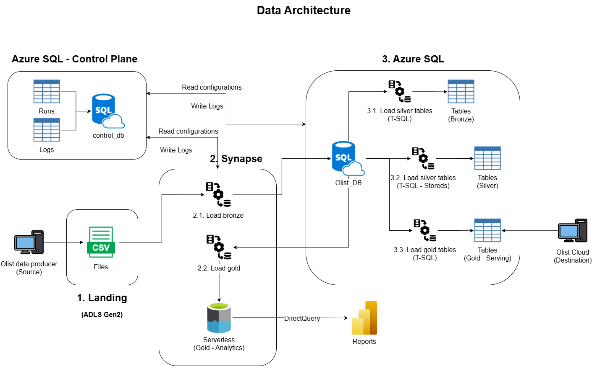

# Data Engineering Project - Synapse Pipelines + Azure SQL (End-to-End)

This project designs an end-to-end data engineering solution on Microsoft Azure to ingest, curate, and serve Brazilian E-Commerce data using a **Medallion Architecture (Bronze/Silver/Gold)**. The solution uses **Synapse Pipelines (ADF-style orchestration)** for ingestion, and **Azure SQL Database** for relational transformations and serving.

Link data: <https://www.kaggle.com/datasets/olistbr/brazilian-ecommerce>

## 1. Business Scenario

A E-commerce company wants to understand **demand patterns**. For that reason, data arrives daily as CSV, which extracts information from the E-commerce application.

The goal is:
* **Standardize ingestion** and ensure **reproducible and idempotent** loads.
* Build curated and enriched tables for **BI and analytics**.
* Produce reporting assets to support decisions.

## 2. Architecture

This architecture is designed for a business that receives **daily batch extracts** from an operational application and needs a reliable path from raw data to BI-ready insights. It balances **auditability, operational reliability, scalability, and analytics performance**.

1. **E-commerce App** generates daily CSV extracts.
2. Files are dropped into **ADLS Gen2 (Landing zone)**.
3. A **Synapse Data Pipeline** is triggered based on an scheduled.
4. Synapse performs loads raw data into **Azure SQL (Bronze)**.
5. Transformations are executed in **Azure SQL** to produce:
   - `bronze` (raw, as received)
   - `silver` (cleaned, conformed, etc)
   - `gold` serving layer for application consumption (stable contracts)
6. Analytics Gold is exported to **ADLS Gen2 (Parquet/Delta)** and exposed via **Synapse SQL Serverless** for BI querying.
7. Power BI consumes Gold through **DirectQuery to Synapse SQL Serverless** views.
8. A separate **Control Plane (Azure SQL)** stores pipeline configuration and operational logs (runs, row counts, failures, reprocess history).

## 3. Architecture decisions

### 3.1. Batch processing

The source produces **daily CSV drops** (not continuous streaming). Using ADLS Gen2 as the landing zone and event-based triggering in Synapse aligns with a batch ingestion pattern:

* Partition data by process like: payments, orders, etc.
* Clear operational boundaries per process (reprocess a single process if needed).

### 3.2. Landing zone

Keeping a dedicated **ADLS Gen2 landing zone** provides a clean boundary between:

* Upstream producer responsibilities (drop files).
* Downstream data engineering responsibilities (validate, transform, serve).

This removes coupling between the pipeline and the producer proving a clear separation of concerns.

### 3.3. Bronze in Azure SQL (raw + metadata)

Bronze is implemented as SQL tables to make raw data immediately queryable with transactional guarantees.
Each record includes ingestion metadata (e.g., `run_id`, `ingest_ts`, `source_file_path`) to support:

* Auditing and reproducibility.
* Controlled reruns and operational debugging.
* Consistent downstream reads.

### 3.4. Silver in Azure SQL (trust boundary)

Source data can contain errors, so silver is the “trust boundary” where:

* Standard data types and formats.
* Deduplication and key enforcement.
* Data quality rules and constraints.

### 3.5. Gold serving in Azure SQL (for apps)

Gold serving tables/views provide:

* Stable schema contracts.
* Performance-oriented modeling (indexes, aggregations where appropriate).

### 3.6 Gold analytics in ADLS (queried via Synapse SQL Serverless)

For BI and analytics, curated Gold is published to ADLS in columnar format (Parquet). Synapse SQL Serverless exposes these files through views, enabling:

* Cost-efficient, scalable analytics queries.
* Clean interface for Power BI (DirectQuery) without managing dedicated pools.

### 3.7. Scheduled-triggered pipelines

Running the pipeline based on an schedule:

* Improves data freshness for reporting.
* Prevents “someone forgot to run the job” failures.
* Creates a consistent operational pattern for future datasets.

### 3.8. Control plane (configuration + run logging)

A control database supports:

* Dataset configuration (paths, schema mappings, keys, rules).
* Ingestion state (processed files, hashes, watermarks).
* Pipeline runs and metrics (duration, row counts, status, errors).

This enables **idempotency**, replay, and traceability.

### 3.9. Why SQL for transformations

Transformations are primarily relational (joins, deduplication, conformance, star-schema shaping). Implementing them in Azure SQL:

* Reinforces SQL optimization skills (indexes, query tuning).
* Provides predictable serving performance for apps.
* Keeps orchestration separate from transformation logic.

## 4. Data Model Overview

The data is made of a group of CSV files, where each one represents an entity:

* Customers
* Geolocation
* Order_Items
* Order_Payments
* Order_Reviews
* Orders
* Products
* Sellers

## 5. Storage Layout (ADLS Gen2)

The path where the input files are stored is: `raw/brazilian_e_commerce/<entity>/file_name.csv`. The name of the file does not follow any pre-defined value, because the pipeline reads all CSV files.

## 6. Orchestration (Synapse Pipelines)

Pipelines are desined like Data Factory:

* **Trigger**: scheduled (once per day).
* **Steps**:
   1) Get Metadata (which entities to process) + initial / incremental execution.
   2) Apply basic validations (file exists, size > 0).
   3) Idempontency check (control table).
   4) Copy to Azure SQL (Bronze).
   5) Execute stored procedures (Bronze → Silver → Gold Serving).
   6) Export Gold Analytics to ADLS (Parquet)

## 7. Idempotency & Reprocessing

Pipelines run **per entity folder** (e.g., `raw/orders/`) and ingest **all CSV files found** in that folder in a single execution (file names can be anything).

* **On success:** processed files are **deleted** from the landing path.
* **Incremental logic:** new arrivals are applied using **SCD Type 1 upserts**.
* **Reruns:** safe to re-execute—data is **replaced/updated where applicable**.

## 8. Serving & Consumption

* **Applications:** read from `gold_serving` in Azure SQL (stable schema contracts).
* **BI/Analytics:** query `gold_analytics` in ADLS through **Synapse SQL Serverless** views (Power BI DirectQuery or Import).

## 9. Security & Access Control

This project follows least-privilege access.

* **Synapse Managed Identity** is used for all service-to-service access (no secrets).
* **Azure SQL** uses schema-based permissions and database roles:
  - ETL can write `bronze/silver/gold` and run stored procedures.
  - Applications have read-only access to `gold` only.
  - Bronze/Silver are not exposed to consumers.
* **BI access** is provided via Synapse SQL Serverless curated views, not direct file paths.
