# Synapse Dedicated DW → Microsoft Fabric DW Migration (Medallion + Control Plane)

This project demonstrates a practical data warehouse migration from Azure Synapse Dedicated SQL Pool (source DW) to Microsoft Fabric Warehouse (target DW), using a medallion-style processing flow (Bronze → Silver → Gold) and an external control plane for operational metadata.

The solution is designed to be:

* Re-runnable / idempotent
* Observable (run tracking, step logs, row counts)
* Scalable by partition for large fact tables (year-based export/load)

## 1. Architecture

The project consists of three main components:

* **Azure SQL Database**: control plane that enables run tracking and centralized logging.
* **Azure Synapse Dedicated SQL Pool**: data source (AdventureWorksDW2022).
* **Microsoft Fabric**: data destination.

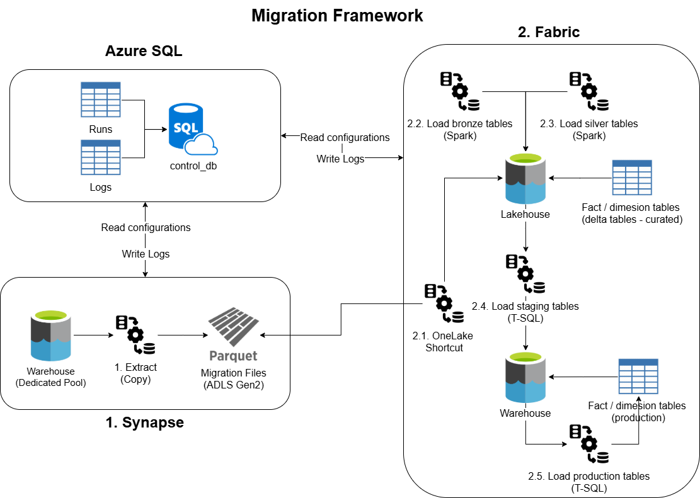

## 2. Architecture decisions (why these choices)

### Why export Synapse tables to Parquet?

* **Decouples extraction from processing**: the Parquet exports act as a stable handoff between Synapse and Fabric.
* **Efficient analytics format**: Parquet is columnar and compressed, improving read performance and reducing storage.

### Why OneLake shortcuts?

* **Avoid duplicate copies**: Fabric can read exported Parquet files in-place.
* **Faster onboarding**: reduces setup time and accelerates Bronze ingestion.

### Why partition the fact table by year?

* **Operational control for large facts**: each year is a bounded unit of work (cost / time).
* **Restartability**: rerun only the failed year.

### Why cache control-plane metadata in Delta and sync via Pipelines (Azure SQL - Lakehouse)?

This solution uses **Azure SQL** as the system of record for operational metadata (runs, logs, configuration, etc). To make validations fast and reduce external dependencies during Spark execution:

* **Pipeline loads configuration into Delta**: validation_rules (Azure SQL to Lakehouse) is loaded at the start of each run.
    * This allows Spark notebooks to read metadata efficiently from Delta instead of repeatedly querying Azure SQL.
    * It also provides a consistent **snapshot** of rules for the entire run.
* **Notebooks write validation output to Delta**: logs (Lakehouse to Azure SQL) is loaded back at the end of each sub run.

## 3. About data

This project uses the sample data warehousing: AdventureWorksDW2022, which was loaded into Synapse Dedicated SQL pool.

Tables migrated:

* **Fact tables**:
    * FactFinance
* **Dimension tables**:
    * DimOrganization
    * DimDepartmentGroup
    * DimScenario
    * DimAccount

## 4. Quickstart (high level)

1. Deploy **Azure SQL control plane** objects (tables + stored procedures + seed config).
2. Run **Synapse pipelines** to export tables to Parquet (fact tables partitioned by year).
3. Create a **Fabric shortcut** to the Parquet export location.
4. Create Fabric **Lakehouse** and run the environment setup notebook (schemas + Delta tables).
5. Create Fabric **Warehouse** and deploy schemas / tables / stored procedures.
6. Restore fabric pipelines and run the **Fabric pipelines**.
7. Verify outputs (rows counts + logs in Azure SQL).

## 5. Prerequisites

**Services**:

* Azure SQL Database (control plane).
* Azure Synapse Workspace with Dedicated SQL Pool.
* Storage location for Parquet exports (ADLS Gen2).
* Microsoft Fabric Workspace with:
    * Lakehouse
    * Warehouse
    * Data Factory pipelines

**Security / connections**:

* Use **Managed Identity** for Azure resources where possible.
* For on-premise SQL via Self-hosted Integration Runtime: **Key Vault** for Secrets.

**Required configuration**:

* Linked services / connections:
    * **Synapse**: on-premise / dedicated pool / Azure SQL / storage.
    * **Fabric**: shortcut to export storage + Azure SQL connection.
* Export path pattern:
    * **Dimension**: one file per table.
    * **Fact**: one file per year.

## 6. Workflow

### 6.1. Azure SQL Database

A dedicated Azure SQL database is used to store process control and operational metadata, decoupled from the analytical data stored in Fabric.

This control layer provides:

* Auditability of pipeline executions.
* Run tracking across Synapse and Fabric components.
* Centralized logging.

| Table | Description |
|--------|--------------|
| **projects** | stores all data engineering projects, but only one is used at the time. For this project is id = 1 |
| **runs** | stores all main pipeline executions. For this project there are two: AdventureWorksDW2022 - Synapse and AdventureWorksDW2022 - Fabric |
| **sub_runs** | stores all sub pipeline executions. For example: extract data from one table in Bronze |
| **logs** | stores all messages, metrics, and error information |
| **project_tables** | stores all tables that are part of the migration process, where only active ones are processed |
| **validation_rules** | stores metadata information about each column of the structured data, in order to be in validation process |
| **fact_table_years** | stores years of a fact, in order to be used for filtering and partitioning |

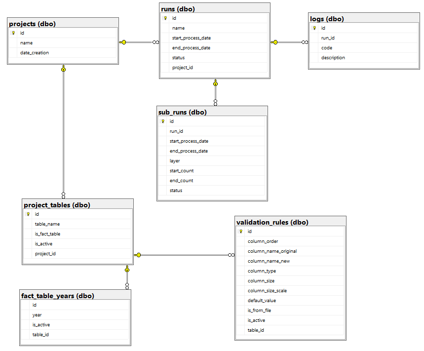

### 6.2. Azure Synapse Dedicated SQL Pool

The goal of this project is to migrate data in Synapse to Fabric, so AdventureWorksDW2022 database was created in Synapse Dedicated Pool, in order to be used as a data source.

In Synapse, the project copy data from tables to Parquet, where there is a file per dimension table. In case of fact tables, the data was partion by calendar year.

#### 6.2.1. Main pipeline

This is the started pipeline.

Steps:

* **Start process**: register a new pipeline execution in dbo.runs table (Synapse and AdventureWorksDW2022).
* **Get tables**: get tables from dbo.project_tables, which are part of this project.
* **ForEach**: execute a pipeline by table, where there are two workflows: dimension and fact tables.
* **End process**: update status to COMPLETED.

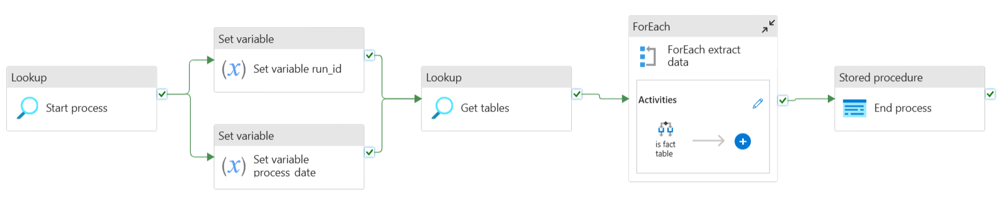

Run executions:

Sub run executions:

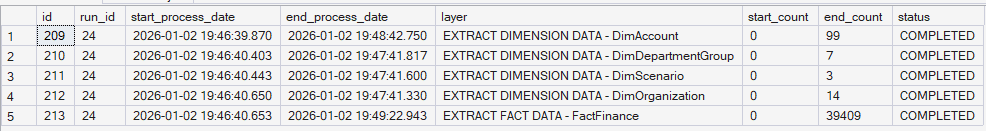

#### 6.2.2. Dimension pipeline

This pipeline extract data for dimension tables.

Steps:

* **Start sub process**: register a new pipeline execution in dbo.sub_runs table.
* **Delete previous extraction**: delete files from previous executions.
* **Extract data**: copy data from dedicated table to a Parquet.
* **End sub process**: update status to COMPLETED.

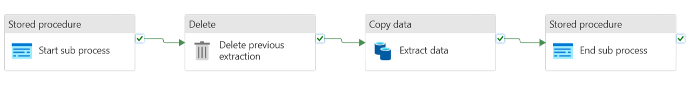

#### 6.2.3. Fact pipeline

This pipeline extract data for fact tables.

Steps:

* **Start sub process**: register a new pipeline execution in dbo.sub_runs table.
* **Delete previous extraction**: delete files from previous executions.
* **Get year partitions**: get calendar year for current fact table.
* **ForEach partition**: copy a year slice to Parquet.
* **End sub process**: update status to COMPLETED.

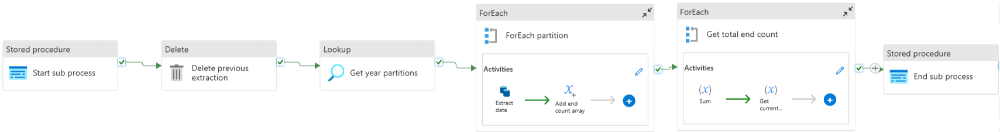

### 6.3. Microsoft Fabric (Parquet → Lakehouse → Warehouse)

This is the destination part of the migration process, where final data (gold) is stored in Data Warehouse (staging and production), meanwhile there are copies in Lakehouse for bronze and silver data.

#### 6.3.1. Main pipeline

This is the started pipeline.

Steps:

* **Start process**: register a new pipeline execution in dbo.runs table (Fabric and AdventureWorksDW2022).
* **Extract validation rules Azure**: extract data from dbo.validation_rules (Azure SQL) and load into a delta table in Lakehouse with the same name.
* **Pipeline bronze process**: Bronze process.
* **Pipeline silver processe**: Silver process.
* **Pipeline dw staging process**: data warehouse staging process.
* **Pipeline dw production process**: data warehouse production process.
* **End sub process**: update status to COMPLETED.

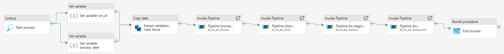

#### 6.3.2. Bronze pipeline

This pipeline orchestrates bronze process.

Steps:

* **Get tables**: get tables to process.
* **ForEach tables**: call Bronze pipelines.

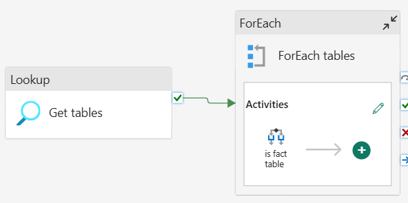

#### 6.3.3. Bronze dimension pipeline

This pipeline extract data for dimension tables, by reading Parquet using PySpark and storing data into delta tables (bronze schema).

Steps:

* **Start sub process**: register a new pipeline execution in dbo.sub_runs table.
* **Notebook bronze layer**: bronze process using PySpark, with one reusable notebook for all dimensions.
* **End sub process**: update status to COMPLETED.

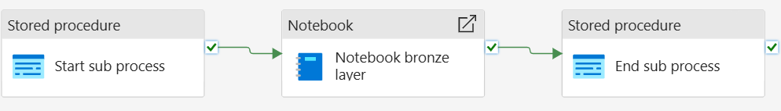

#### 6.3.4. Bronze fact pipeline

This pipeline extract data for fact tables, by reading Parquet using PySpark and storing data into delta tables (bronze schema). However, the execution is done by table and year partition.

Steps:

* **Get year partitions**: get calendar year for current fact table.
* **Start sub process**: register a new pipeline execution in dbo.sub_runs table.
* **Notebook bronze layer**: bronze process using PySpark, with one reusable notebook for all facts.
* **End sub process**: update status to COMPLETEDD.

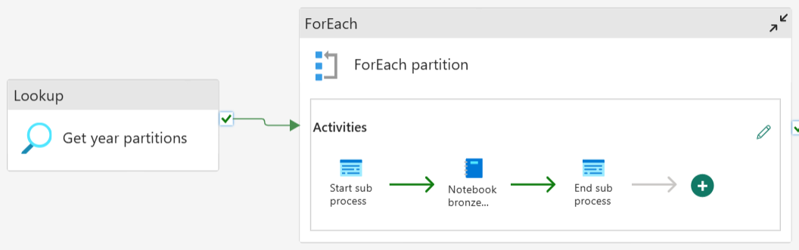

#### 6.3.5. Silver pipeline

This pipeline orchestrates silver process.

* **Get tables**: get tables to process.
* **Filter only dimension tables**: filter dimension tables.
* **ForEach dimension tables**: call silver pipelines for dimension tables.
* **Filter only fact tables**: filter fact tables.
* **ForEach fact tables**: call silver pipelines for fact tables.

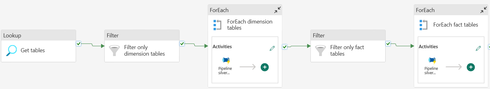

#### 6.3.6. Silver dimension pipeline

This pipeline extract, clean and transform data for dimension tables, by using PySpark and storing data into delta tables (silver schema).

Steps:

* **Start sub process**: register a new pipeline execution in dbo.sub_runs table.
* **Notebook silver layer**: silver process using PySpark. There is one notebook per table, in order to have custom validations depending on the table.
* **End sub process**: update status to COMPLETED.

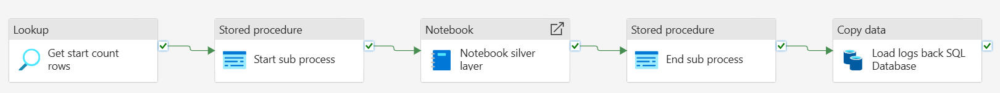

#### 6.3.7. Silver fact pipeline

This pipeline extract, clean and transform data for fact tables, by using PySpark and storing data into delta tables (silver schema). However, the execution is done by table and year partition.

Steps:

* **Get year partitions**: get calendar year for current fact table.
* **Start sub process**: register a new pipeline execution in dbo.sub_runs table.
* **Notebook silver layer**: silver process using PySpark. There is one notebook per table, in order to have custom validations depending on the table. But, the execution is by year partition.
* **End sub process**: update status to COMPLETED.

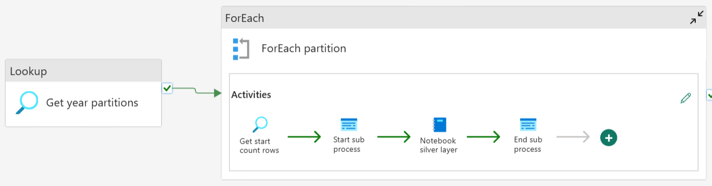

#### 6.3.8. Data Warehouse staging pipeline

This pipeline orchestrates data warehouse staging process.

Steps:

* **Get tables**: get tables to process.
* **ForEach tables**: call staging pipelines for dimension and fact tables.
* **Load DimDate**: create date data based on years ingested into fact tables.

#### 6.3.9. Data Warehouse staging dimension pipeline

This pipeline load data for dimension tables into data warehouse (staging schema).

Steps:

* **Start sub process**: register a new pipeline execution in dbo.sub_runs table.
* **Truncate staging table**: delete data from previous executions.
* **Load staging table**: read data from Lakehouse and load it into Data Warehouse using SQL stored procedures. There is one stored procedure per table.
* **End sub process**: update status to COMPLETED.

#### 6.3.10. Data Warehouse staging fact pipeline

This pipeline load data for fact tables into data warehouse (staging schema). However, the execution is done by table and year partition.

Steps:

* **Get year partitions**: get calendar year for current fact table.
* **Start sub process**: register a new pipeline execution in dbo.sub_runs table.
* **Remove data year staging table**: delete data from previous executions.
* **Load staging table**: read data from Lakehouse and load it into Data Warehouse using SQL stored procedures. There is one stored procedure per table.
* **End sub process**: update status to COMPLETED.

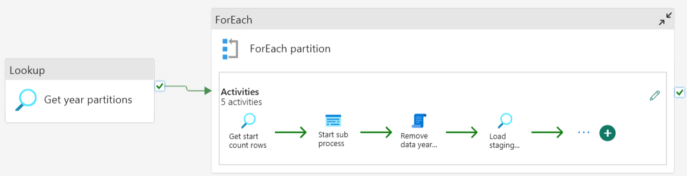

#### 6.3.11. Data Warehouse production pipeline

This pipeline orchestrates data warehouse production process.

Steps:

* **Get tables**: get tables to process.
* **Filter only dimension tables**: filter dimension tables.
* **ForEach dimension tables**: call production pipelines for dimension tables.
* **Load DimDate**: load date data.
* **Filter only fact tables**: filter fact tables.
* **ForEach fact tables**: call production pipelines for fact tables.

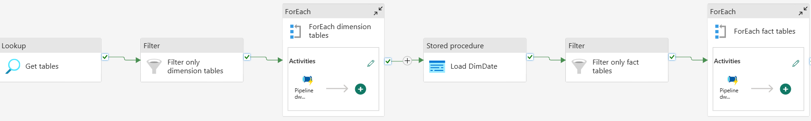

#### 6.3.12. Data Warehouse production dimension pipeline

This pipeline load data for dimension tables into data warehouse (production schema).

Steps:

* **Start sub process**: register a new pipeline execution in dbo.sub_runs table.
* **Load production table**: read data from staging schema and load it into production Data Warehouse using SQL stored procedures. There is one stored procedure per table. Additionally, it uses slowly changing dimension type 2 to load data.
* **End sub process**: update status to COMPLETED.

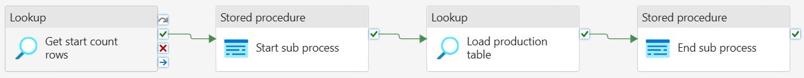

#### 6.3.13. Data Warehouse production dimension pipeline

This pipeline load data for fact tables into data warehouse (production schema). However, the execution is done by table and year partition.

Steps:

* **Get year partitions**: get calendar year for current fact table.
* **Start sub process**: register a new pipeline execution in dbo.sub_runs table.
* **Load staging table**: read data from Lakehouse and load it into Data Warehouse using SQL stored procedures. There is one stored procedure per table. Additionally, data from previous execution is remove by year.
* **End sub process**: update status to COMPLETED.

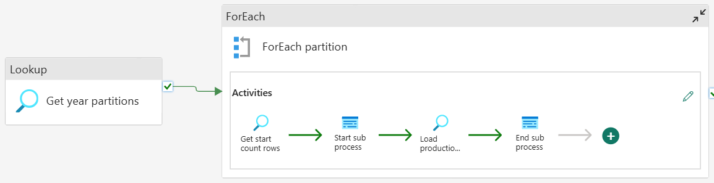

## 7. Idempotency strategy (reruns)

* Lakehouse:
    * Dimensions: overwrite to avoid duplicates.
    * Facts: overwrite per year partition.
* Warehouse:
    * Staging: truncate (dimensions) / delete by year (facts).
    * Production:
        * Dimensions: load as SCD Type 2.
        * Facts: load via year refresh (delete + insert).

## 8. Verification

After a sucessful run, confirm:

* Lakehouse tables exist and contain **run_id** / **process_date**.
* Warehouse staging and production tables are populated.
* Azure SQL control plane tables contain the latest run entries.

## 9. Troubleshooting (common issues)

* **Schema / type conversion errors**: review **validation_rules** and ensure casts match source data.
* **Write conflicts / concurrent updates**: ensure fact loads execute sequentially per year.
* **Missing foreign keys**: ensure Silver dimensions are loaded before Silver facts.

## 10. Cleanup (cost control)

* Pause / stop Synapse Dedicated SQL Pool when not in use.
* Delete unused pipelines / workspaces / resources created for the demo.
* Remove Key Vault resource if created only for learning.
