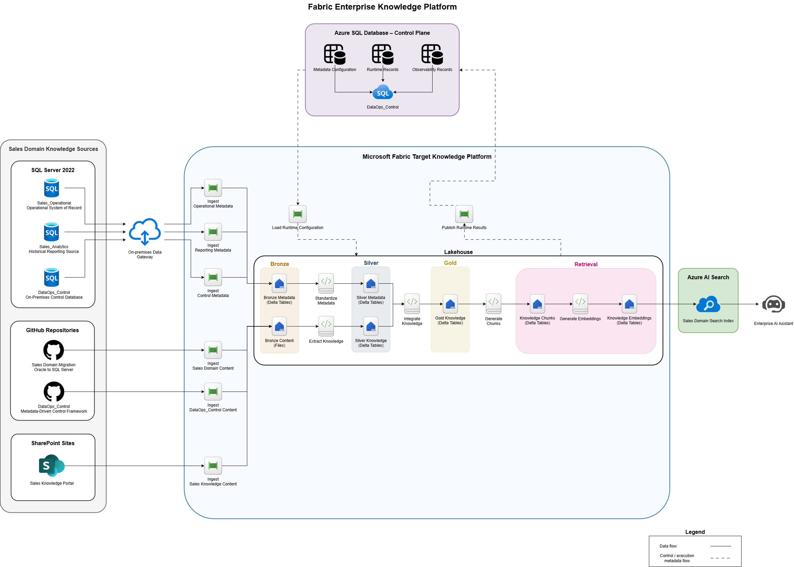

# Fabric Enterprise Knowledge Platform

## Overview

This project presents an enterprise knowledge platform for consolidating structured and unstructured Sales domain knowledge into Microsoft Fabric and making it available to AI-driven applications.

The platform ingests metadata from SQL Server databases and content from GitHub repositories and SharePoint, using a Fabric Lakehouse to progressively transform source information into trusted knowledge assets.

The solution follows a Bronze, Silver, and Gold architecture for knowledge processing, followed by a Retrieval layer that prepares knowledge chunks and embeddings for indexing in Azure AI Search. An Enterprise AI Assistant consumes the resulting search index to retrieve relevant organizational knowledge.

The platform follows a metadata-driven approach using `DataOps_Control` for configuration, execution tracking, observability, and rerun control.

## Project Scope

| Area | In Scope |
|---|---|
| Business domain | Sales |
| Structured sources | SQL Server 2022 |
| Repository sources | GitHub |
| Enterprise content | SharePoint |
| Orchestration | Microsoft Fabric Data Factory |
| Knowledge storage | Fabric Lakehouse |
| Raw layer | Bronze metadata and source content |
| Curated layer | Silver metadata and extracted knowledge |
| Trusted layer | Gold knowledge |
| Retrieval preparation | Knowledge chunks and embeddings |
| Search and retrieval | Azure AI Search |
| AI consumption | Enterprise AI Assistant |
| Control framework | `DataOps_Control` |

## Out of Scope

| Area | Reason |
|---|---|
| Source-system replacement | Existing operational, reporting, repository, and collaboration platforms remain authoritative sources |
| Non-Sales domains | The initial implementation focuses on Sales domain knowledge |
| Source application modernization | Source applications and repositories are not redesigned by this project |
| Model training | The project consumes AI models rather than training foundation models |
| Production infrastructure | Detailed networking, sizing, HA, disaster recovery, and production topology are addressed separately from the high-level solution |

## High-Level Architecture

## Technologies

| Category | Technology |
|---|---|
| Structured sources | SQL Server 2022 |
| Source repositories | GitHub |
| Enterprise content | SharePoint |
| Cloud platform | Microsoft Fabric |
| Orchestration | Fabric Data Factory |
| Knowledge storage | Fabric Lakehouse |
| Data processing | Fabric Notebooks / PySpark / Python |
| Storage format | Delta |
| Embedding generation | AI embedding model |
| Search and retrieval | Azure AI Search |
| Control layer | Azure SQL Database / `DataOps_Control` |
| AI consumption | Enterprise AI Assistant |

## Project Dependencies

This project builds on supporting portfolio projects that provide Sales domain data, technical documentation, and execution control capabilities.

| Dependency | Purpose | Repository |
|---|---|---|
| SQL Server Sales databases | Provides the `Sales_Operational` and `Sales_Analytics` source databases used by this modernization project | [Sales Domain Architecture: Oracle to SQL Server Migration](https://github.com/WilderJoseth/data-engineering-projects/tree/main/on_premise/sales_modernization_oracle_to_sql_server) |
| `DataOps_Control` | Provides the metadata-driven execution control, validation, reconciliation, logging, and rerun control database used by integration pipelines | [Metadata-Driven Control Framework for Data Engineering Projects](https://github.com/WilderJoseth/data-engineering-projects/tree/main/on_premise/DataOps_Control) |

## Project Status

| Area | Status |
|---|---|
| Project framing | Done |
| High-level architecture | Done |
| Detailed documentation | Planned |
| Fabric ingestion implementation | Planned |
| Lakehouse knowledge processing | Planned |
| Retrieval layer implementation | Planned |
| Azure AI Search implementation | Planned |
| Enterprise AI Assistant implementation | Planned |
| Validation and observability | Planned |
| Security implementation | Planned |
| End-to-end testing | Planned |
