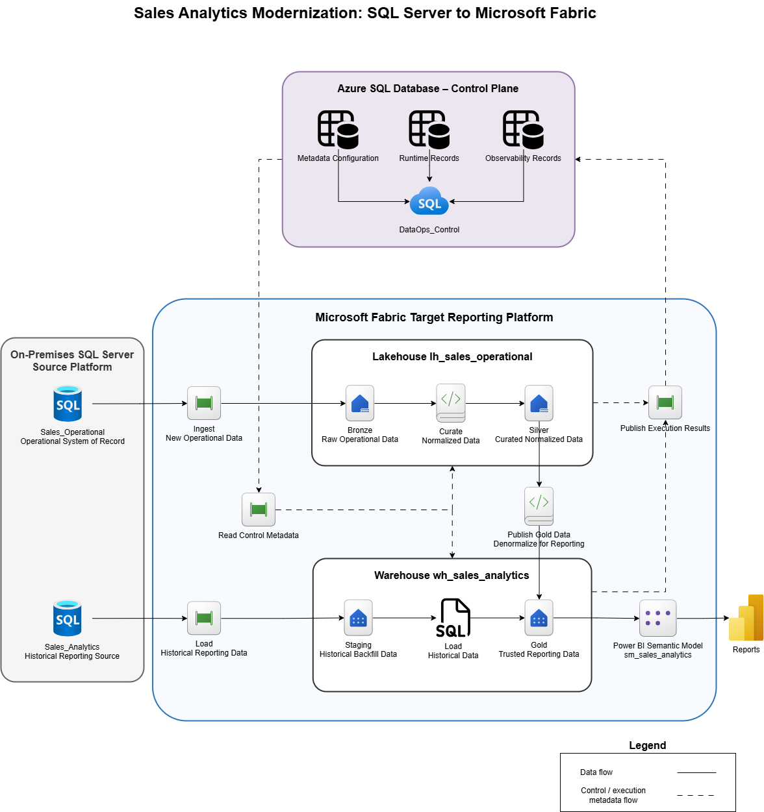

# Sales Analytics Modernization: SQL Server to Microsoft Fabric

## Overview

This project describes a Sales Analytics Modernization initiative from an on-premise SQL Server environment to Microsoft Fabric.

The goal is to design a cloud-based reporting architecture that supports historical migration, incremental data processing, operational source ingestion, analytical reporting, and controlled execution tracking.

This project is part of a data engineering portfolio focused on cloud modernization, Microsoft Fabric, data platform design, and migration practices.

## Project Scope

| Area | In Scope |
|---|---|
| Source platform | On-premise SQL Server 2022 Sales databases |
| Source systems | `Sales_Operational` and `Sales_Analytics` |
| Target reporting platform | Microsoft Fabric with Lakehouse and Warehouse |
| DataOps control | Azure SQL Database for execution tracking, validation, reconciliation, logging, and rerun control |
| Data processing | Historical reporting migration and incremental operational data processing |
| Data architecture | Bronze, Silver, Staging, and Gold layer design |
| Validation | Data validation and reconciliation design |
| Security | Design-level access control, authentication, secret handling, and sensitive data handling |
| Deployment | Development and Production environment strategy |
| Consumption | Reporting-ready Gold data and a future Power BI semantic model |

## Out of Scope

| Area | Reason |
|---|---|
| Operational system replacement | `Sales_Operational` remains on-premise and is not replaced by Microsoft Fabric |
| Real-time streaming | The first version focuses on batch-based historical and incremental processing |
| Full enterprise migration | The scope is limited to the Sales reporting domain |
| Live production deployment | The project is a portfolio design baseline and is not deployed as a live production system |
| Power BI report development | The semantic model is considered later; report/dashboard design is not part of the current scope |

## High-Level Architecture

## Technologies

| Category | Technology |
|---|---|
| Source system | SQL Server |
| Cloud platform | Microsoft Fabric |
| Orchestration | Fabric data pipelines |
| Storage | Fabric Lakehouse |
| Analytics | Fabric Warehouse |
| Processing | SQL / PySpark |
| Reporting | Power BI |
| Control layer | Azure SQL Database |

## Project Dependencies

This project depends on supporting portfolio projects that provide source database structures and execution control capabilities.

| Dependency | Purpose | Repository |
|---|---|---|
| SQL Server Sales databases | Provides the `Sales_Operational` and `Sales_Analytics` source databases used by this modernization project. | [Sales Domain Architecture: Oracle to SQL Server Migration](https://github.com/WilderJoseth/data-engineering-projects/tree/main/on_premise/oracle_mssql_migration) |
| `DataOps_Control` | Provides the metadata-driven execution control, validation, reconciliation, logging, and rerun control database used by the Fabric pipelines. | [Metadata-Driven Control Framework for Data Engineering Projects](https://github.com/WilderJoseth/data-engineering-projects/tree/main/on_premise/DataOps_Control) |

## Documentation

The solution design is supported by detailed documents.

| Area | Document | Purpose |
|---|---|---|
| Current state assessment | [01_current_state_assessment.md](docs/01_current_state_assessment.md) | Defines the current Sales data platform, its limitations, and the modernization need |
| Source Data Profile | [02_source_data_profile.md](docs/02_source_data_profile.md) | Defines the SQL Server source databases, their roles, estimated volumes, growth, and profiling assumptions |
| Target Data Architecture | [03_target_data_architecture.md](docs/03_target_data_architecture.md) | Defines the Fabric target structure, including the Lakehouse Bronze/Silver schemas and Warehouse Staging/Gold schemas |
| Data Flow Strategy | [04_data_flow_strategy.md](docs/04_data_flow_strategy.md) | Defines the historical reporting flow from `Sales_Analytics` and the new reporting flow from `Sales_Operational` |
| Load Strategy | [05_load_strategy.md](docs/05_load_strategy.md) | Defines the append, incremental, full reload, batch period reload, and upsert patterns used across the solution |
| Validation and Reconciliation | [06_validation_and_reconciliation_strategy.md](docs/06_validation_and_reconciliation_strategy.md) | Defines the row count checks, total checks, reconciliation grain, and result tracking in `DataOps_Control` |
| CI/CD and Deployment | [07_ci_cd_and_deployment_strategy.md](docs/07_ci_cd_and_deployment_strategy.md) | Defines the Development and Production environments, deployment pipeline usage, repository structure, and deployment scope |
| Security and Access | [08_security_and_access_strategy.md](docs/08_security_and_access_strategy.md) | Defines authentication, access control, secret handling, source users, `DataOps_Control` access, and sensitive data handling |

## Project Status

| Area | Status |
|---|---|
| Project framing | Done |
| Design documentation | Done |
| Repository structure | In progress |
| Fabric implementation | Planned |
| Validation and reconciliation implementation | Planned |
| Reporting layer | Planned |
