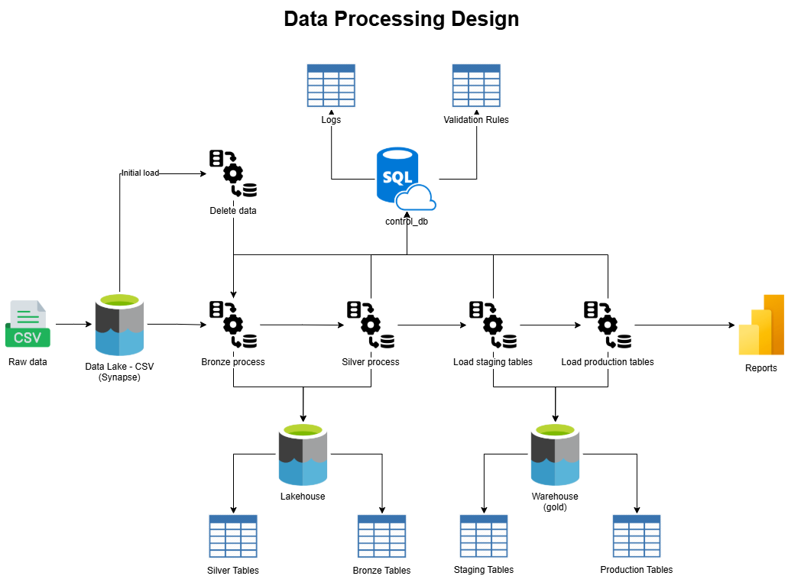
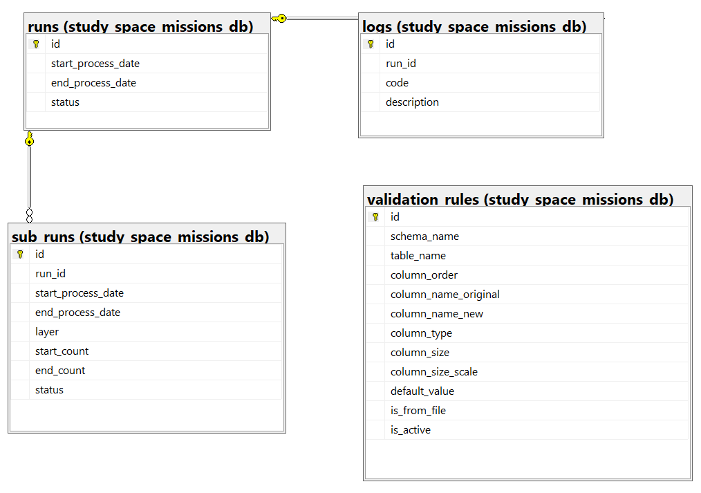
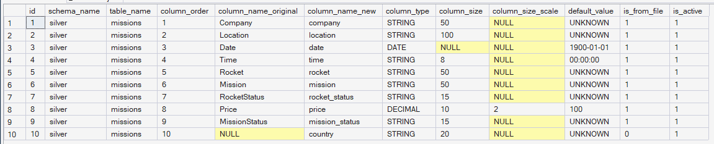
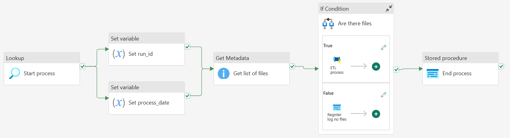
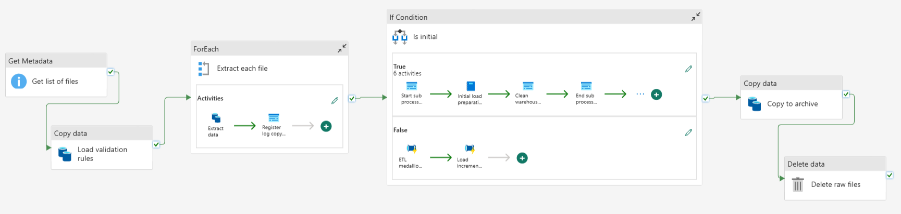
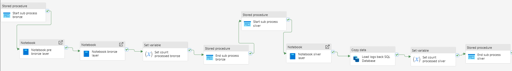
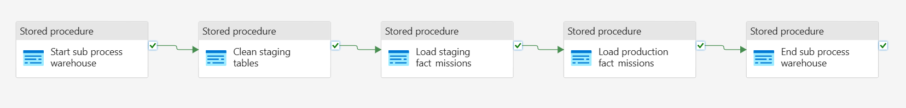

# Data Engineering Project – Medallion Architecture with Microsoft Fabric

This project demonstrates an end-to-end data engineering solution using Microsoft Fabric, implementing a **Medallion Architecture (Bronze / Silver / Gold)** over structured CSV data.

The solution covers:

* Data ingestion using Fabric Data Factory Pipelines.
* Raw and curated storage in Fabric Lakehouse.
* Transformations using Apache Spark (PySpark) notebooks.
* Analytical modeling using Fabric Warehouse and SQL stored procedures.
* End-to-end orchestration and reproducibility.

In addition to data ingestion and transformation, the project includes a dedicated control and observability layer implemented using Azure SQL, enabling:

* End-to-end run tracking.
* Step-level logging.
* Reproducibility and auditability.
* Clear separation between data processing and process control.

Each pipeline execution is uniquely identified using a run_id, which is propagated across pipelines, notebooks, and SQL procedures.

## 1. Data Processing Design

| Layer | Description | Example Path |
|--------|--------------|--------------|
| **Control** | Control tables stored in SQL Azure Database |  |
| **Raw** | Original CSV files in synapse storage | `/raw/study_space_missions/*.csv` |
| **Bronze** | Managed tables without data transformation | `/Tables/bronze` |
| **Silver** | Managed tables after data transformation | `/Tables/silver` |
| **Staging** | Warehouse tables | |
| **Production** | Warehouse tables | |

## 2. About data

The full description is in the link data source (kaggle), however, there are some details to mention:

* There is only one csv file, so the process only works with one entity (mission).
* The process save final data to one fact table in data warehouse.
* There are no dimension tables.

Link data: <https://www.kaggle.com/datasets/sidraaazam/a-comprehensive-study-of-space-missions>

## 3. Workflow

### 3.1. Control and observability layer (Azure SQL)

A dedicated Azure SQL database is used to store process control and operational metadata, decoupled from the analytical data stored in Fabric.

This control layer provides:

* Auditability of pipeline executions.
* Run tracking across Fabric components.
* Centralized logging.

| Table | Description |
|--------|--------------|
| **runs** | One row per pipeline execution |
| **sub_runs** | One row per sub process (bronze, silver, etc) |
| **logs** | Messages, metrics, and error information |
| **validation_rules** | Metadata information about each column of the structured data |

#### Runs:

* Each pipeline execution generates a unique run id.
* Passed as a pipeline parameter.
* Propagated to Spark notebooks.
* Passed into SQL stored procedures.

#### Sub_runs:

* There are three sub process: bronze, silver and gold (warehouse).
* Provides information about how many data was processed (input / output).
* Provides information about status (started / completed).

#### Logs:

* There are four types of logs:
	* 01: No files found.
	* 02: File copied stage.
	* 03: Missing values.
	* 04: Wrong data integrity.

#### Validation rules:

Metadata information about each column of the structured data.

### 3.2. Main pipeline

The project is made of a series of Fabric Data Factory pipelines, which starts with **pl_main**. 

Steps:

* **Start process**: register id run.
* **Get files**: identify files to process.
* **Sub process**:
	* If there are files, start ingestion process.
	* If there are no files, register log no files.
* **End process**: update run status to completed.

### 3.3. Sub main pipeline

Before getting into ETL process, there are some steps to complete:

* **Load validation rules**: from Azure SQL to Lakehouse (delta table), in order to be used for silver process.
* **Extract each file**: copy raw data to Lakehouse (Files).
* **Is initial?**
	* **True**: perform an initial load, by running a notebook, which truncates bronze and silver tables.
	* **False**: perform an incremental load.
* **Copy data**: copy processed files to archive folder in Lakehouse.
* **Delete data**: delete process files.

### 3.4. Medallion process

The ETL process is made of the main following steps:

* **Notebook pre bronze layer**: validate if each file have the right columns. Wrong files are move to **invalid folder**.
* **Notebook bronze layer**: load bronze tables.
* **Notebook silver layer**: validate, clean and load silver tables.
* **Register sub process**: each layer is registered to sub_runs table.

### 3.5. Gold process

This pipeline orchestrates data warehouse ingestion using T-SQL (stored procedures).

* Clean staging tables.
* Load staging tables.
* Load production tables.

## 4. Limitations

This project has the following limititations:

* Data in data source (Synapse storage) is not remove after process.
* There is no a fail activity to address errors.
* In spite of validation_rules table, the validation is limitated to column size and default value. The validation of column names is hard-code in notebooks.
* Data warehouse layer is not registering amount of rows processed.
