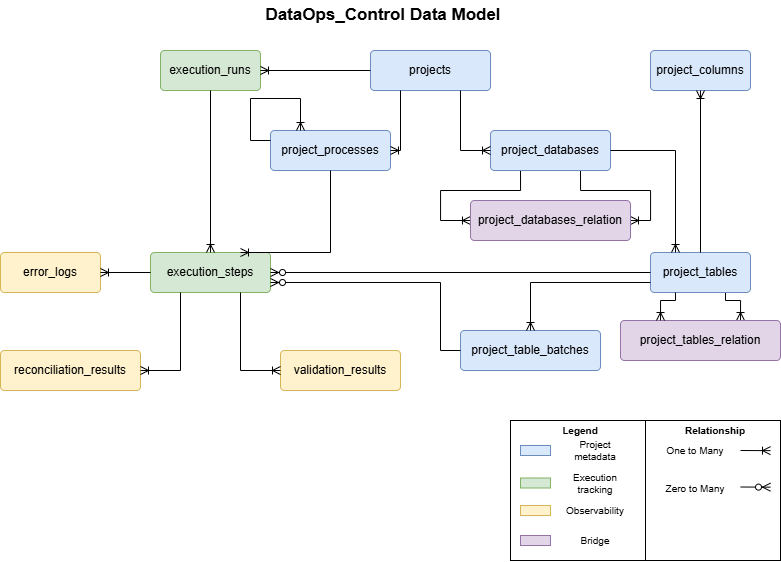

# Solution Design

## Purpose

This document describes the technical design for the Metadata-Driven Control Framework for Data Engineering Projects solution.

## Target Architecture

`DataOps_Control` is organized into four responsibility-based schemas:

| Schema | Responsibility |
|---|---|
| `metadata` | Defines the projects, databases, processes, controlled target tables, target columns, source-to-target mappings, and batch metadata managed by the framework. |
| `runtime` | Tracks execution runs and execution steps. |
| `observability` | Stores validation results, reconciliation results, and technical error logs generated during execution. |
| `reference` | Stores controlled code values used by the framework, such as statuses and validation types. |

## Data Model

The data model is organized around four main areas:

| Area | Main tables |
|---|---|
| Metadata | `projects`, `project_databases`, `project_database_mappings`, `project_processes`, `project_tables`, `project_table_mappings`, `project_columns`, `project_table_batches` |
| Runtime | `execution_runs`, `execution_steps` |
| Observability | `error_logs`, `validation_results`, `reconciliation_results` |
| Reference | `status_codes`, `validation_codes` |

## Table Implementation Standards

Table Naming:

- Tables should use `snake_case`, for example `metadata.project_database_mappings`.

Constraint Rules:

- All tables should have a primary key constraint.
- The name of the primary key should follow `pk_[schema]_[table]_[column]`.
- The name of the foreign key should follow `fk_[schema]_[table]_[column]`.

## Table Catalog

### metadata

#### Table summary

| Table | Description |
|---|---|
| `projects` | Registers data engineering projects managed by the framework. |
| `project_databases` | Registers databases, platforms, or logical data stores associated with each project. |
| `project_database_mappings` | Defines source-to-target database mappings. |
| `project_processes` | Defines logical processes and process hierarchy. |
| `project_tables` | Registers controlled target tables or managed objects. |
| `project_table_mappings` | Defines source-to-target table mappings. |
| `project_columns` | Stores target-side column metadata for registered tables. |
| `project_table_batches` | Defines batch slices for reloadable tables. |

#### Important columns

| Table | Column | Description |
|---|---|---|
| `project_databases` | `platform_type` | Identifies the technology or platform, such as Oracle, SQL Server, Azure SQL, Fabric Lakehouse, or Fabric Warehouse. |
| `project_databases` | `database_role` | Classifies the role of the database, such as source, target, operational, analytical, or control-related. |
| `project_database_mappings` | `database_source_id`, `database_target_id` | Defines database-level source-to-target relationships. |
| `project_processes` | `parent_process_id` | Supports process hierarchy, such as parent process, subprocess, table load, or batch process. |
| `project_tables` | `schema_name` | Stores the schema of the registered controlled object. |
| `project_tables` | `is_fact_table` | Identifies analytical fact tables. |
| `project_tables` | `is_transactional_table` | Identifies transactional tables that may require incremental or batch processing. |
| `project_tables` | `batch_column_active` | Indicates whether the table supports batch-based processing. |
| `project_tables` | `rerun_required` | Marks a table for controlled reprocessing. |
| `project_table_mappings` | `table_source_id`, `table_target_id` | Defines table-level source-to-target relationships. |
| `project_columns` | `is_nullable` | Supports metadata-driven not-null validation. |
| `project_columns` | `is_watermark` | Identifies columns used for incremental load logic. |
| `project_columns` | `is_reconciliation_column` | Identifies columns used in reconciliation metrics. |
| `project_table_batches` | `batch_column_name` | Identifies the column used to define the batch. |
| `project_table_batches` | `batch_value` | Stores the batch identifier, such as `202401`. |
| `project_table_batches` | `batch_start_value`, `batch_end_value` | Support range-based batch definitions. |
| `project_table_batches` | `rerun_required` | Marks a specific batch for controlled reprocessing. |

### runtime

#### Table summary

| Table | Description |
|---|---|
| `execution_runs` | Tracks project-level execution runs. |
| `execution_steps` | Tracks process-level, table-level, or batch-level execution steps. |

#### Important columns

| Table | Column | Description |
|---|---|---|
| `execution_runs` | `start_run_date`, `end_run_date` | Track the execution duration of a project run. |
| `execution_runs` | `status_code_id` | References the controlled status of the execution run. |
| `execution_runs` | `project_id` | Associates the run with a registered project. |
| `execution_steps` | `status_code_id` | References the controlled status of the execution step. |
| `execution_steps` | `execution_run_id` | Associates the step with a project execution run. |
| `execution_steps` | `project_process_id` | Links the runtime step to the defined process metadata. |
| `execution_steps` | `project_table_id` | Optionally links the step to a controlled table. |
| `execution_steps` | `project_table_batch_id` | Optionally links the step to a specific table batch. |

### observability

#### Table summary

| Table | Description |
|---|---|
| `error_logs` | Stores technical error records. |
| `reconciliation_results` | Stores reconciliation metrics generated during execution. |
| `validation_results` | Stores summary-level validation results. |

#### Important columns

| Table | Column | Description |
|---|---|---|
| `error_logs` | `error_source` | Identifies where the error came from, such as a package, task, stored procedure, or pipeline activity. |
| `error_logs` | `details` | Stores technical error details. |
| `error_logs` | `execution_step_id` | Links the error to the execution step where it occurred. |
| `reconciliation_results` | `metric_name` | Identifies the reconciliation metric, such as `RowCount` or `SalesAmount`. |
| `reconciliation_results` | `reconciliation_key` | Identifies the reconciliation scope or grouping. |
| `reconciliation_results` | `reconciliation_side` | Identifies the side being measured, such as source, target, staging, or final. |
| `reconciliation_results` | `metric_value_decimal`, `metric_value_bigint` | Store decimal or integer reconciliation values. |
| `validation_results` | `validation_code_id` | References the controlled validation type. |
| `validation_results` | `affected_row_count` | Stores the number of rows affected by the validation result. |
| `validation_results` | `details` | Stores a summary of the validation result. |

### reference

#### Table summary

| Table | Description |
|---|---|
| `status_codes` | Stores controlled execution status values. |
| `validation_codes` | Stores controlled validation types and severity levels. |

#### Important columns

| Table | Column | Description |
|---|---|---|
| `status_codes` | `code` | Stores values such as `Pending`, `Running`, `Success`, `Failed`, `Skipped`, or `RerunRequired`. |
| `validation_codes` | `code` | Stores validation identifiers such as `NOT_NULL`, `FK_CHECK`, or `DUPLICATE`. |
| `validation_codes` | `severity` | Classifies the validation impact, such as error, warning, or information. |

## Stored Procedure Implementation Pattern

Names should follow the following structure: `usp_[action]_[TableName]`. Exceptions may apply.

## Stored Procedure Catalog

