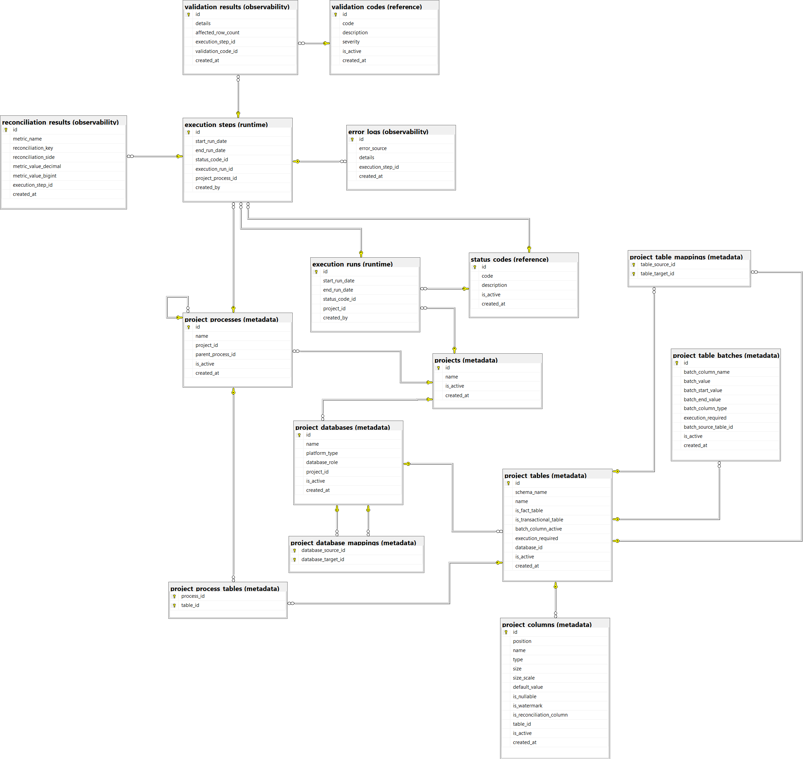

# Solution Design

## Purpose

This document describes the technical design of `DataOps_Control`, a reusable metadata-driven control framework for data engineering projects.

## Schema Organization

`DataOps_Control` is organized into four responsibility-based schemas:

| Schema | Responsibility |
|---|---|
| `metadata` | Defines projects, databases, processes, registered source/target tables, columns, source-to-target mappings, process-to-table execution scope, process-table batch execution scope, and batch metadata managed by the framework. |
| `runtime` | Tracks execution runs and execution steps. |
| `observability` | Stores validation results, reconciliation results, and technical error logs generated during execution. |
| `reference` | Stores controlled code values used by the framework, such as statuses and validation types. |

## Entity Relationship Diagram



| Area | Main tables |
|---|---|
| Metadata | `projects`, `project_databases`, `project_database_mappings`, `project_processes`, `project_tables`, `project_table_mappings`, `project_process_tables`, `project_process_table_batches`, `project_columns`, `project_table_batches` |
| Runtime | `execution_runs`, `execution_steps` |
| Observability | `error_logs`, `validation_results`, `reconciliation_results` |
| Reference | `status_codes`, `validation_codes` |

## Tables

### Table Implementation Standards

#### Naming Rules

| Object | Standard |
|---|---|
| Tables | Use `snake_case`, for example `metadata.project_database_mappings`. |
| Primary keys | `pk_[schema]_[table]` |
| Foreign keys | `fk_[schema]_[table]_[column]` |
| Unique constraints | `uk_[schema]_[table]_[column_or_purpose]` |
| Default constraints | `df_[schema]_[table]_[column]` |

#### Key and Identifier Column Guidelines

| Guideline | Description |
|---|---|
| Primary keys | All tables should have a primary key constraint. |
| Metadata identifiers | Metadata tables use manually assigned identifiers where stable, predictable IDs are useful for seed scripts, testing, and reusable framework configuration. |
| Reference identifiers | Reference tables use manually assigned IDs because they are treated as framework constants. |
| Runtime and observability identifiers | Runtime and observability tables should use auto-incremental IDs. |

#### Bridge Table Rules

Bridge tables use composite primary keys when the relationship itself is the entity.

| Bridge table | Relationship represented |
|---|---|
| `metadata.project_database_mappings` | Source-to-target database relationship. |
| `metadata.project_table_mappings` | Source-to-target table relationship. |
| `metadata.project_process_tables` | Process-to-table execution scope. |
| `metadata.project_process_table_batches` | Process-table-to-batch execution scope. |

#### Audit Columns

Common audit/control columns used across the model include:

| Column | Purpose | Type | Allow nulls | Default value |
|---|---|---|---|---|
| `created_at` | When the record was inserted. | DATETIME2 | No | SYSUTCDATETIME() |
| `created_by` | User or process that inserted the record. | VARCHAR(50) | No | USER_NAME() |
| `is_active` | Indicates whether the record is active in the model. | BIT | No | 1 |

### Table Catalog

#### metadata

##### Table summary

| Table | Description |
|---|---|
| `projects` | Registers data engineering projects managed by the framework. |
| `project_databases` | Registers databases, platforms, or logical data stores associated with each project. |
| `project_database_mappings` | Defines source-to-target database mappings. |
| `project_processes` | Defines logical processes and process hierarchy. |
| `project_tables` | Registers source tables, target tables, or managed objects when they are needed for mapping, execution control, batch filtering, validation, or reconciliation. |
| `project_table_mappings` | Defines source-to-target table mappings. |
| `project_process_tables` | Associates controlled tables with the processes responsible for executing them. |
| `project_process_table_batches` | Associates configured batch slices with a specific process-table execution scope. |
| `project_columns` | Stores column metadata for registered tables. |
| `project_table_batches` | Defines batch slices for reloadable tables. |

##### Important columns

| Table | Column | Description |
|---|---|---|
| `project_databases` | `platform_type` | Identifies the technology or platform, such as Oracle, SQL Server, Azure SQL, Fabric Lakehouse, or Fabric Warehouse. |
| `project_databases` | `database_role` | Classifies the role of the database, such as source, target, operational, analytical, or control-related. |
| `project_database_mappings` | `database_source_id`, `database_target_id` | Defines database-level source-to-target relationships. |
| `project_processes` | `project_id` | Associates the process with a registered project. |
| `project_processes` | `parent_process_id` | Supports process hierarchy, such as parent process, subprocess, or table-level load. |
| `project_tables` | `schema_name` | Stores the schema of the registered controlled object. For target tables, this usually represents the final target schema. |
| `project_tables` | `is_fact_table` | Identifies analytical fact tables. |
| `project_tables` | `is_transactional_table` | Identifies transactional tables that may require incremental or batch processing. |
| `project_tables` | `batch_column_active` | Indicates whether the table supports batch-based processing. |
| `project_tables` | `execution_required` | Marks a table as requiring execution. |
| `project_table_mappings` | `table_source_id`, `table_target_id` | Defines table-level source-to-target relationships. |
| `project_process_tables` | `process_id`, `table_id` | Defines which controlled table is handled by a registered process. |
| `project_process_table_batches` | `process_id`, `table_id`, `batch_id` | Defines which batch slices are assigned to a specific process-table execution scope. |
| `project_columns` | `is_nullable` | Supports metadata-driven not-null validation. |
| `project_columns` | `is_watermark` | Identifies columns used for incremental load logic. |
| `project_columns` | `is_reconciliation_column` | Identifies columns used in reconciliation metrics. |
| `project_table_batches` | `batch_column_name` | Identifies the column used to define the batch. |
| `project_table_batches` | `batch_value` | Stores the batch identifier, such as `202401`. |
| `project_table_batches` | `batch_start_value`, `batch_end_value` | Support range-based batch definitions. |
| `project_table_batches` | `execution_required` | Marks a specific batch as requiring execution. |
| `project_table_batches` | `batch_column_type` | Stores the data type of the batch column and is used by dynamic SQL logic to apply the correct conversion. |

#### runtime

##### Table summary

| Table | Description |
|---|---|
| `execution_runs` | Tracks project-level execution runs. |
| `execution_steps` | Tracks process-level execution steps. A process may represent a package, subprocess, or table-level load. Table and batch context is resolved through metadata relationships. |

##### Important columns

| Table | Column | Description |
|---|---|---|
| `execution_runs` | `start_run_date`, `end_run_date` | Track the execution duration of a project run. |
| `execution_runs` | `status_code_id` | References the controlled status of the execution run. |
| `execution_runs` | `project_id` | Associates the run with a registered project. |
| `execution_steps` | `status_code_id` | References the controlled status of the execution step. |
| `execution_steps` | `execution_run_id` | Associates the step with a project execution run. |
| `execution_steps` | `project_process_id` | Links the runtime step to the defined process metadata. |

#### observability

##### Table summary

| Table | Description |
|---|---|
| `error_logs` | Stores technical error records. |
| `reconciliation_results` | Stores reconciliation metrics generated during execution. |
| `validation_results` | Stores summary-level validation results. |

##### Important columns

| Table | Column | Description |
|---|---|---|
| `error_logs` | `error_source` | Identifies where the error came from, such as a package, task, stored procedure, or pipeline activity. |
| `error_logs` | `details` | Stores technical error details. |
| `error_logs` | `execution_step_id` | Links the error to the execution step where it occurred. |
| `reconciliation_results` | `metric_name` | Identifies the reconciliation metric, such as `ROW_COUNT`, `TOTAL_DUE`, or `SALES_AMOUNT`. |
| `reconciliation_results` | `reconciliation_key` | Identifies the reconciliation scope or grouping, such as `TOTAL`, `BATCH=2011-05`, or `TERRITORY=NORTHWEST`. |
| `reconciliation_results` | `reconciliation_side` | Identifies the side being measured, such as `SOURCE`, `TARGET`, `STAGING`, `WORK`, or `FINAL`. |
| `reconciliation_results` | `metric_value_decimal`, `metric_value_bigint` | Store decimal or integer reconciliation values. |
| `validation_results` | `validation_code_id` | References the controlled validation type. |
| `validation_results` | `affected_row_count` | Stores the number of rows affected by the validation result. |
| `validation_results` | `details` | Stores a summary of the validation result. |

#### reference

##### Table summary

| Table | Description |
|---|---|
| `status_codes` | Stores controlled execution status values. |
| `validation_codes` | Stores controlled validation types and severity levels. |

##### Important columns

| Table | Column | Description |
|---|---|---|
| `status_codes` | `id` | Stable manually assigned status identifier used by runtime tables. |
| `status_codes` | `code` | Stores values such as `Pending`, `Running`, `Success`, `Failed`, `Skipped`, or `Observed`. |
| `validation_codes` | `id` | Stable manually assigned validation identifier used by validation result records. |
| `validation_codes` | `code` | Stores validation identifiers such as `NOT_NULL`, `FK_CHECK`, or `DUPLICATE`. |
| `validation_codes` | `severity` | Classifies the validation impact, such as error, warning, or information. |

## Stored Procedures and Functions

### Implementation Standards

| Rule | Description |
|---|---|
| Keep procedures focused | Each procedure should have one clear responsibility. |
| Do not embed business reconciliation logic | Business-specific validation and reconciliation decisions belong to the process owner or project-specific procedures. |
| Use set-based inserts for observability results | `validation_results` and `reconciliation_results` may receive multiple rows per execution step, so they are loaded directly using set-based inserts. |
| Use generic procedures for single operational actions | Starting/ending runs, starting/ending steps, and logging technical errors are handled by reusable procedures. |

### Naming Rules

| Object | Standard |
|---|---|
| Stored procedures | `usp_[action]_[object_or_process]` |
| User-defined functions | `ufn_[action]_[object_or_process]` |
| Exceptions | Exceptions may apply when a shorter or clearer name improves readability. |

### Stored Procedure and Function Catalog

| Object | Type | Purpose |
|---|---|---|
| `runtime.usp_start_execution_run` | Stored procedure | Creates an execution run with `Running` status and returns `execution_run_id`. |
| `runtime.usp_start_execution_step` | Stored procedure | Creates an execution step with `Running` status and returns `execution_step_id`. |
| `runtime.usp_end_execution_step` | Stored procedure | Updates an execution step with its final status and end date. |
| `runtime.usp_end_execution_run` | Stored procedure | Ends an execution run and derives the final run status from its execution steps. |
| `observability.usp_log_error` | Stored procedure | Inserts a technical error record for an execution step. |
| `metadata.ufn_list_project_process_tables` | Inline table-valued function | Lists active child processes and associated controlled tables for a parent process. |
| `metadata.ufn_list_project_process_table_batches` | Inline table-valued function | Lists active child processes, target tables, source batch tables, and batch definitions for a given parent process. |

## Security and Access Model

### Role Permissions

| Role | Permissions |
|---|---|
| `DataOps_Admin` | Can read and maintain `metadata`, `reference`, `runtime`, and `observability` objects. Can execute framework procedures. |
| `DataOps_Project_Executor` | Can read `metadata` and `reference` objects, execute `runtime` and `observability` procedures, insert validation and reconciliation results, and read runtime/observability history for troubleshooting. |

### Access Principles

| Principle | Description |
|---|---|
| Project-specific access | Each consuming project should use its own SQL Server login or service account. |
| Database user mapping | The project login or service account is mapped to a database user in `DataOps_Control`. |
| Role assignment | The database user is added to the `DataOps_Project_Executor` role. |
| Metadata protection | Project execution accounts should not directly modify framework metadata or reference values during normal pipeline execution. |

Example access path:

```text
Project service account
    → Database user in DataOps_Control
        → DataOps_Project_Executor
```

## Framework Execution Model

`DataOps_Control` uses a process-based execution model. The framework separates configuration, runtime tracking, and execution evidence so that different projects can use the same control structure without embedding project-specific business rules in the control database.

### Main Execution Concepts

#### Runtime levels

The framework records execution at two runtime levels:

| Level | Table | Purpose |
|---|---|---|
| Project run | `runtime.execution_runs` | Represents one execution of a registered project. |
| Process step | `runtime.execution_steps` | Represents one executed process within the project run. |

#### Runtime metadata path

A project is registered in `metadata.projects`, and each project contains one or more processes registered in `metadata.project_processes`.

```text
metadata.projects
    ├── defines → metadata.project_processes
    └── runs as → runtime.execution_runs
                    └── runtime.execution_steps → one metadata.project_process
```

#### Table context path

Table context is resolved through process metadata:

```text
metadata.project_processes
    → metadata.project_process_tables
        → metadata.project_tables
```

#### Batch context path

Batch context is resolved through the process-table batch scope:

```text
metadata.project_processes
    → metadata.project_process_tables
        → metadata.project_process_table_batches
            → metadata.project_table_batches
```

#### Lineage path

Source-to-target lineage is defined separately:

```text
metadata.project_table_mappings
    source table → target table
```

### Source and Target Table Interpretation

| Concept | Description |
|---|---|
| Source table | Registered when needed for source-to-target mappings, batch filtering, validation, or reconciliation. |
| Target table | Registered when controlled by execution, validation, reconciliation, or final model rules. |
| Source-to-target mapping | Defined through `metadata.project_table_mappings`. |
| Batch source table | Defined through `metadata.project_table_batches.batch_source_table_id` because batch filters are applied against the source table. |
| Process-table batch scope | Defined through `metadata.project_process_table_batches` when a process-table relationship requires batch execution. |

### Data Flow Types

The framework supports three common execution patterns:

| Flow type | When it is used |
|---|---|
| Table load flow | A controlled table is loaded as a single execution unit. |
| Grouped table load flow | A parent process groups multiple related table-level processes. |
| Batch load flow | A large or transactional source table is processed in smaller slices. |

### Table Load Flow

#### Purpose

A table load is used when a controlled table is loaded as a single execution unit.

Examples:

- `AddressType Load`
- `ProductCategory Load`
- `Customer Load`
- `DimCustomer Load`

#### Metadata pattern

In this pattern, each table-level load should have a registered process.

```text
Project: Oracle to SQL Server Migration

Reference Data Load
    ├── AddressType Load        → metadata.project_tables.AddressType
    ├── ProductCategory Load    → metadata.project_tables.ProductCategory
    ├── ShipMethod Load         → metadata.project_tables.ShipMethod
    └── SpecialOffer Load       → metadata.project_tables.SpecialOffer
```

The parent process, `Reference Data Load`, is used for orchestration. The child processes represent table-level execution units.

#### Runtime behavior

At runtime, each child process creates its own execution step:

| execution_step | project_process | controlled table |
|---|---|---|
| Step 1 | `AddressType Load` | `AddressType` |
| Step 2 | `ProductCategory Load` | `ProductCategory` |
| Step 3 | `ShipMethod Load` | `ShipMethod` |
| Step 4 | `SpecialOffer Load` | `SpecialOffer` |

Observability records are linked to the execution step.

#### Reconciliation example

Example reconciliation for `AddressType Load`:

| metric_name | reconciliation_key | reconciliation_side | metric_value_bigint | execution_step_id |
|---|---|---|---:|---:|
| `ROW_COUNT` | `TOTAL` | `SOURCE` | 6 | 4 |
| `ROW_COUNT` | `TOTAL` | `TARGET` | 6 | 4 |

### Grouped Table Load Flow

#### Purpose

A grouped table load is used when one parent process organizes multiple related table-level processes.

```text
Geography Load
    ├── CountryRegion Load
    ├── StateProvince Load
    └── SalesTerritory Load
```

#### Metadata pattern

| Process type | Responsibility | Table mapping |
|---|---|---|
| Parent process | Orchestration or grouping | Usually no direct table mapping. |
| Child process | Table-level execution | Maps to one controlled table. |

Example with table mapping:

```text
Geography Load
    ├── CountryRegion Load  → CountryRegion
    ├── StateProvince Load  → StateProvince
    └── SalesTerritory Load → SalesTerritory
```

#### Runtime behavior

This pattern keeps observability clear. Technical errors, validation summaries, and reconciliation metrics can be linked to the specific table-level execution step instead of being attached only to the parent group.

### Batch Load Flow

#### Purpose

A batch load is used when a large or transactional table is processed in smaller slices.

Examples:

- Monthly sales orders.
- Daily transactions.
- Date-range based fact loads.
- Historical backfills.

#### Batch metadata

Batch definitions are stored in `metadata.project_table_batches`. These records define the available source slices that can be used for batch filtering.

The batch definition is based on the source table used for filtering, not necessarily the final target table.

Example batch metadata:

| source table | batch_column_name | batch_column_type | batch_value | batch_start_value | batch_end_value |
|---|---|---|---|---|---|
| `SALES_SALESORDERHEADER` | `OrderDate` | `DATETIME` | `2011-05` | `2011-05-01` | `2011-05-31` |
| `SALES_SALESORDERHEADER` | `OrderDate` | `DATETIME` | `2011-06` | `2011-06-01` | `2011-06-30` |

#### Process-table-batch execution scope

The batch execution scope is defined through `metadata.project_process_table_batches`. This bridge table assigns one or more batch definitions to a specific process-table relationship.

```text
metadata.project_processes
    → metadata.project_process_tables
        → metadata.project_process_table_batches
            → metadata.project_table_batches
```

This allows the same source batch definition to be reused by different process-table execution scopes when needed.

Example process-table-batch scope:

```text
Sales Load
    ├── SalesOrderHeader → Batch 2011-05
    ├── SalesOrderHeader → Batch 2011-06
```

#### Source and target resolution

| Object | Responsibility |
|---|---|
| `metadata.project_process_tables` | Resolves the controlled target table for the process. |
| `metadata.project_process_table_batches` | Assigns configured batch slices to the process-table execution scope. |
| `metadata.project_table_batches` | Resolves the source batch table and batch filter values. |
| `metadata.project_table_mappings` | Documents source-to-target lineage. |

Example lineage context:

```text
metadata.project_process_tables.table_id              → SalesOrderHeader
metadata.project_process_table_batches.batch_id       → Batch 2011-05
metadata.project_table_batches.batch_source_table_id  → SALES_SALESORDERHEADER
metadata.project_table_mappings.table_source_id       → SALES_SALESORDERHEADER
metadata.project_table_mappings.table_target_id       → SalesOrderHeader
```

The table-level process controls the load, while process-table-batch metadata defines which source slices should be processed for that table execution scope.

#### Reconciliation example

For a batch execution, reconciliation metrics should include the batch context in `reconciliation_key`.

Example row-count reconciliation:

| metric_name | reconciliation_key | reconciliation_side | metric_value_bigint | execution_step_id |
|---|---|---|---:|---:|
| `ROW_COUNT` | `BATCH=2011-05` | `SOURCE` | 436 | 25 |
| `ROW_COUNT` | `BATCH=2011-05` | `TARGET` | 436 | 25 |

Example amount reconciliation:

| metric_name | reconciliation_key | reconciliation_side | metric_value_decimal | execution_step_id |
|---|---|---|---:|---:|
| `TOTAL_DUE` | `BATCH=2011-05` | `SOURCE` | 815233.4200 | 25 |
| `TOTAL_DUE` | `BATCH=2011-05` | `TARGET` | 815233.4200 | 25 |

### Observability and Status Behavior

#### Observability responsibility

Observability tables store execution evidence, not business ownership decisions.

| Table | Purpose |
|---|---|
| `observability.error_logs` | Stores technical error details. |
| `observability.validation_results` | Stores summary-level validation findings. |
| `observability.reconciliation_results` | Stores reconciliation metrics. |

#### Design boundaries

| Boundary | Description |
|---|---|
| Rejected records | `DataOps_Control` does not store row-level rejected business records centrally. |
| Business reconciliation decisions | `DataOps_Control` does not own business-specific reconciliation decisions. |
| Final step status | The process owner or project-specific procedure decides whether an execution step completed as `Success`, `Observed`, or `Failed`. |

For example, source and target row counts may not match when the target is an aggregated table. In that case, the project-specific reconciliation procedure should register comparable metrics, such as `INVOICE_COUNT` or `TOTAL_AMOUNT`, instead of raw row counts.

#### Execution statuses

Execution statuses are controlled through `reference.status_codes`.

| Status | Meaning |
|---|---|
| `Pending` | The execution is registered but has not started. |
| `Running` | The execution is currently in progress. |
| `Success` | The execution completed and expected control checks passed. |
| `Observed` | The execution completed technically, but validation or reconciliation results require review. |
| `Failed` | The execution failed due to a technical error. |
| `Skipped` | The execution was intentionally skipped. |

#### Run status derivation

For execution runs, the final status is derived from the related execution steps:

| Step results | Final run status |
|---|---|
| Any step is `Failed` | `Failed` |
| No failed steps, but at least one step is `Observed` | `Observed` |
| All completed steps are successful or skipped | `Success` |
