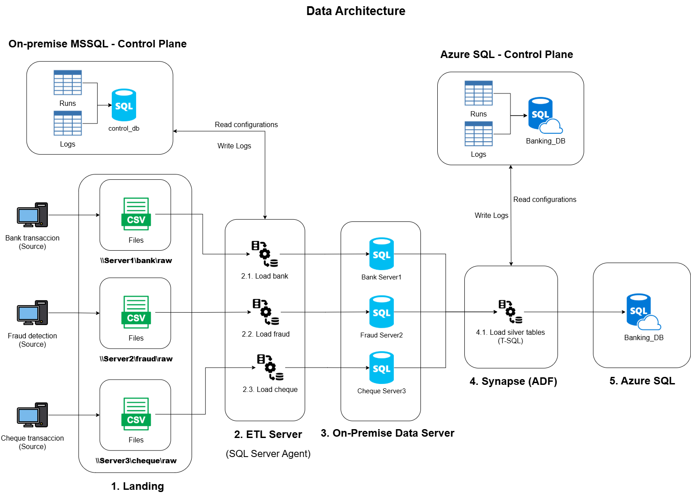

# Data Engineering Project - Hybrid Banking Data Platform (On-Prem SQL Server + SSIS + Synapse Pipelines + Azure SQL)

This project designs an end-to-end data engineering solution on Microsoft technology (on-premise / cloud) to ingest, curate, and serve banking data from multiple sources. 

The platform follows a **medallion architecture (Bronze/Silver/Gold)**, using:

* **On-premise SQL Server + SSIS + SQL Server Agent** for ingestion and domain-level curation.
* **Control planes (on-prem + cloud)** to track runs, logs, metrics, and replayability.
* **Synapse Pipelines (ADF-style orchestration)** to integrate curated datasets from on-premise into the cloud.
* **Azure SQL Database** to host conformed/curated tables and serve reporting-ready datasets.

Link bank data: <https://www.kaggle.com/datasets/apoorvwatsky/bank-transaction-data>

Link fraud data: <https://www.kaggle.com/datasets/ealaxi/paysim1>

Link cheque data: <https://www.kaggle.com/datasets/medali1992/cheque-images>

## 1. Business Scenario

A financial services organization needs to ingest and consolidate multiple operational data sources to support **customer statements**, **fraud analytics**, and **cheque processing controls**.

Every day, three independent upstream systems generate files on different on-premise servers:

* **Bank transactions** (customer/account activity).
* **Fraud events** (PaySim-like payment events and fraud flags).
* **Cheque data** (cheque images + derived metadata).

The goal is:

* **Standardize ingestion** across heterogeneous sources and file formats, ensuring **reproducible and idempotent** batch loads.
* Build curated datasets using a **Bronze/Silver/Gold (medallion)** approach for domain-level consumption on-premise.
* **Integrate curated on-premise datasets into the cloud** (Synapse Pipelines / ADF-style orchestration) to produce a **reporting-ready dataset** in Azure SQL.
* Implement **control planes** (on-premise and cloud) to provide end-to-end observability: run tracking, row-count/sum reconciliation, error handling, and reprocessing capabilities.

## 2. Architecture

This solution is designed for a financial services environment that receives **daily batch extracts** from operational systems and requires a reliable, auditable path from **raw files → curated datasets → reporting-ready data**. It balances **auditability, operational reliability, scalability, and analytics performance**.

High-level flow:

1. **Upstream banking systems** generate daily extracts (primarily CSV; extensible to XML/fixed-width).
2. Files land in **domain-specific on-premise servers**:
   - `Server1` → banking transactions
   - `Server2` → fraud / PaySim events
   - `Server3` → cheque/document data
3. An **ETL Server** runs scheduled pipelines (SQL Server Agent) that trigger **SSIS packages** per domain.
4. Each domain loads data into its local SQL Server and applies a **medallion model** using T-SQL (stored procedures):
   - **Bronze**: raw as received.
   - **Silver**: cleaned, standardized, deduplicated, quality-checked.
   - **Gold**: business-ready serving layer with stable contracts for downstream apps/reports.
5. **Synapse Pipelines (ADF-style orchestration)** integrate curated datasets from the on-premise domain servers into the cloud.
6. **Azure SQL Database (`Banking_DB`)** hosts the cloud curated layer (conformed / reporting-ready), enabling centralized analytics and cross-domain reporting.
7. A dedicated **Control Plane** exists for both environments (**on-premise SQL Server** and **Azure SQL**) to store pipeline configuration and operational telemetry, including:
   - Batch/run tracking.
   - File-level lineage (name, business date, hash).
   - Row counts and reconciliation metrics.
   - Error logs and failure reasons.
   - Reprocess/replay history.

## 3. Architecture decisions

### 3.1. Batch processing

All upstream sources in this project generate **daily batch extracts** (not streaming). A batch-driven design matches typical banking operations where **end-of-day (EOD)** processing is required.

Key implications:
* Clear operational boundaries per domain (bank / fraud / cheque).
* Simple replay strategy (reprocess one domain/day without impacting others).
* Deterministic outputs for statement and compliance reporting.

### 3.2. Domain-based landing zones (on-premise)

Files land on **separate on-premise servers per domain**, creating strong separation of concerns:

* `Server1` → banking landing zone
* `Server2` → fraud landing zone
* `Server3` → cheque/document landing zone

This mirrors real enterprises where domains are owned by different teams/systems and promotes:

* Independent scheduling and SLAs per domain.
* Reduced coupling between producers and downstream pipelines.
* Easier security segmentation and access control.

### 3.3. Bronze in on-premise SQL Server (raw + lineage)

The **Bronze** layer is implemented as **SQL Server tables** within each domain server to make raw data queryable with transactional guarantees.

Each bronze row includes ingestion metadata such as:

* `run_id`
* `ingest_ts`
* `source_server`
* `source_file_path`

This supports:

* Auditing and traceability.
* Idempotent re-runs (detect duplicate files via hash + business date).

### 3.4. Silver in on-premise SQL Server (trust boundary)

Source data can be inconsistent or contain duplicates. **Silver** is the “trust boundary” where the project enforces:

* Strong typing and standardized formats (dates, amounts, currency, IDs).
* Deduplication and key enforcement.
* Data quality checks (null rules, referential checks, numeric ranges).
* Standardization across domains (e.g., consistent account/customer identifiers).

### 3.5. Gold in on-premise SQL Server (domain serving contracts)

Each on-premise domain server publishes a **Gold** layer as stable serving contracts for local apps/reports (out of scope for this project but included for realism).

Gold tables/views provide:

* Stable schemas and versioned contracts.
* Performance-oriented modeling (indexes, aggregations, partitioning where appropriate).
* Deterministic statement-like outputs.

### 3.6 Cloud integration in Synapse Pipelines (cross-domain conformance)

A **Synapse Pipeline (ADF-style)** integrates curated datasets from all three on-premise servers into the cloud.

The pipeline is responsible for:

* Incremental extraction from on-premise curated.
* Dependency ordering (e.g., dimensions before facts).
* End-to-end batch correlation (propagating `batch_id` across environments).

### 3.7. Curated cloud serving in Azure SQL (conformed reporting dataset)

The cloud target is **Azure SQL Database (`Banking_DB`)**, hosting the **integrated, conformed dataset** used for centralized reporting.

Azure SQL is used because:

* Transformations are primarily relational (joins, conformance, rollups).
* It provides predictable serving performance for reporting tools.
* It cleanly separates orchestration (Synapse Pipelines) from transformation logic (T-SQL).

### 3.8. Scheduled-triggered orchestration (SQL Agent + Synapse schedules)

Pipelines run on schedules to reflect typical banking batch operations:

* SQL Server Agent triggers SSIS packages on-premise.
* Synapse Pipelines trigger cloud integration after on-premise completion.

Benefits:

* Consistent data freshness for reporting.
* Reduced “manual run” risk.
* Repeatable operational execution pattern.

### 3.9. Dual control plane (on-prem + cloud)

This project implements a **control plane in both environments**:

* On-premise control DB tracks file arrivals, SSIS runs, row counts, errors, and replay history.
* Cloud control schema in Azure SQL tracks Synapse pipeline runs, load status, and reconciliation metrics.

This enables:

* Idempotency and replay (by `batch_id`).
* Full lineage from file → bronze → silver → cloud curated.
* Audit-grade operational reporting (durations, counts, failure reasons).

### 3.10. Why stored procedures for transformations

Transformations are executed primarily via **stored procedures** because:

* Banking transformations are often deterministic and relational.
* Procedures enable consistent execution plans, controlled transactions, and centralized logic.
* SSIS stays focused on extraction/load and orchestration, while SQL Server handles set-based transformations.

## 4. Domain-based landing zones (on-premise)

Upstream systems deliver **daily drops** to domain-specific landing zones (one server per domain).

* `\\Server1\bank\raw` → banking landing zone
* `\\Server2\farud\raw` → fraud landing zone
* `\\Server3\cheque\raw` → cheque/document landing zone

In addition to that, the processes, after success, move files to either `archived` or `rejected`.

* `\\<Server>\<domain>\archived\YYYYMMDD\...`
* `\\<Server>\<domain>\rejected\YYYYMMDD\...`

## 5. Orchestration (On-premise)

On-premise orchestration is executed by **SQL Server Agent**, which triggers **SSIS packages** (one package or package group per domain). SSIS focuses on extraction/load and operational handling, while **T-SQL stored procedures** implement transformations.

* **Trigger**: scheduled (once per day).
* **Steps**:
   1) Get Metadata (which entities to process) + initial / incremental execution.
   2) Apply basic validations (file exists, size > 0).
   3) Idempontency check (control table).
   4) Copy to on-premise MSSQL server (Bronze).
   5) Execute stored procedures (Bronze → Silver → Gold Serving).

## 6. Orchestration (Synapse)

Cloud orchestration is executed via **Synapse Pipelines**, responsible for integrating curated datasets from the on-premise SQL Servers into **Azure SQL (`Banking_DB`)**.

* **Trigger**: scheduled (once per day).
* **Steps**:
   1) Get Metadata (which entities to process) + initial / incremental execution.
   2) Idempontency check (control table).
   3) Copy from on-premise MSSQL server to cloud Azure SQL.
   5) Execute stored procedures for data warehouse modeling, by conforming dimensions and facts into the integrated model.

## 7. Idempotency & Reprocessing

Pipelines run **per domain** (e.g., `\\Server1bank\raw\`) and ingest **all eligible files found** in that folder in a single execution (file names can be anything).

* **On success:** processed files are **archived** by moving them to `\\<Server>\<domain>\archived\YYYYMMDD\....`
* **On rejected:** processed files are moved to `\\<Server>\<domain>\rejected\YYYYMMDD\....`
* **Incremental logic:** new arrivals are applied using **SCD Type 1 upserts**.
* **Reruns:** safe to re-execute—data is **replaced/updated where applicable**.

## 8. Security & Access Control

This project applies **least-privilege** principles across both **on-premise** and **cloud** components.

### On-premise security (SQL Server + file shares)

* **File shares** (`\\Server1\...`, `\\Server2\...`, `\\Server3\...`) are restricted to:
  - The upstream producer (write to `raw/`).
  - The ETL service account (read from `raw/`, write to `archived/` and `rejected/`).
* **SQL Server Agent / SSIS** runs under a dedicated **domain service account** with:
  - Read access to landing zones.
  - Insert/update permissions to domain databases (Bronze/Silver/Gold).
  - Execute permission on required stored procedures.
* **Database permissions** are role-based:
  - `db_etl_writer`: write to `bronze` + `silver` + `gold`, execute transform procedures.
  - `db_readonly_consumer`: read-only access to `gold` only.
  - Bronze/Silver are not exposed to consumers.

### Cloud security (Synapse Pipelines + Azure SQL)

* **Synapse Pipeline identity**
  - Synapse workspace **Managed Identity** is used for service-to-service access where supported (preferred over secrets).
  - Where on-prem connectivity requires it (e.g., self-hosted integration runtime), access is scoped to the minimum required endpoints.
* **Azure SQL** uses schema-based permissions and database roles:
  - Pipeline identity can write to staging/production schemas and execute stored procedures.
  - Reporting users/tools have read-only access to curated reporting schemas/views only.
  - Staging schemas are not exposed to consumers.

### Separation of duties (recommended pattern)

* ETL identities (on-premise SSIS service account, cloud pipeline identity) can **write and execute**.
* Consumer identities (apps/BI users) can **read only** from curated serving layer.
* Operational/audit tables (control plane) are restricted to engineering/support roles.
