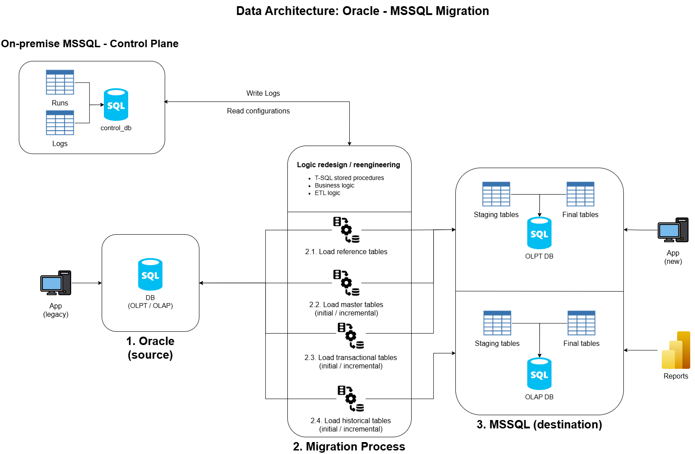

# Oracle to SQL Server 2022 Migration Architecture
## Sales Module Modernization Project

This document describes the target architecture and migration strategy for modernizing a legacy **Oracle-based Sales module** into a new **SQL Server 2022** platform.

The project is designed as a **modernization effort**, not as a simple database copy. Its purpose is to migrate both **data** and **business behavior** into a more maintainable, explicit, and scalable solution for on-premise Microsoft environments.

The migration strategy is based on three principles:

1. **Schema redesign**: The target SQL Server model will be designed according to the needs of the new platform, not as a direct copy of the Oracle source.
2. **Logic reengineering**: Legacy database logic will be analyzed and reimplemented using explicit and maintainable mechanisms such as stored procedures, ETL processes, and application logic where appropriate.
3. **Controlled data migration**: Data will be migrated using staged, validated, and auditable processes, including both **initial** and **incremental** loads.

## 1. Business Scenario

A large enterprise currently operates a legacy business platform whose core transactional data is stored in **Oracle**.  
One of the modules of this platform, the **Sales module**, supports critical day-to-day operations such as customer management, order processing, inventory-related transactions, billing-related processes, and operational reporting.

Over time, this module has accumulated significant technical and functional complexity. The current Oracle implementation includes not only business tables, but also legacy database logic such as procedures, packages, views, jobs, and other technical artifacts that were built to support operational processes, integrations, and reporting needs. As a result, the module mixes transactional workloads, historical data handling, and reporting-oriented structures in a way that increases maintenance effort and limits modernization.

The company has launched a project to modernize this module by migrating it to a new **web-based solution** that will use **SQL Server 2022** as its data platform.

The business requirement is not limited to moving data from one database engine to another.  
The new solution must provide:

- A modern and optimized **OLTP database** for the new application.
- A separate **OLAP/reporting layer** for analytics and reporting.
- Support for **initial** and **incremental** data migration.
- Controlled and auditable **ETL / batch processing**.
- Explicit and maintainable business logic, avoiding hidden logic and legacy dependencies.
- A migration approach capable of handling **large data volumes**.

From a business perspective, the project aims to reduce dependence on legacy Oracle structures, improve maintainability, support future growth, and establish a cleaner separation between operational processing and analytical consumption.

## 2. Architecture

The target solution is designed as a modern on-premise Microsoft data platform that separates operational processing, analytical consumption, and migration control responsibilities.

The architecture is based on three main layers:

- **Oracle source layer**
- **SQL Server destination layer**
- **Migration and control layer**

### 2.1. Layers

#### Oracle source layer

The source system is a legacy enterprise platform based on **Oracle Database Enterprise Edition 11g Release 2**, version **11.2.0.4**, running on **Linux** (Oracle Linux or Red Hat Enterprise Linux).

From an architectural perspective, the source environment represents a typical large-enterprise legacy implementation characterized by:

- A long-lived Oracle transactional platform.
- Strong dependency on database-side business logic.
- Coexistence of operational and historical data.
- Legacy batch and integration mechanisms.
- Partial overlap between transactional and reporting usage.

The source layer contains both business data and legacy technical artifacts, including:

- Business tables
- Historical data structures
- PL/SQL packages
- Stored procedures
- Views
- Oracle jobs
- Triggers
- Reporting-oriented objects

#### SQL Server destination layer

The destination platform is implemented in **SQL Server 2022** and is divided into two databases:

##### OLTP database
The OLTP database supports the new web application and stores current operational data required for day-to-day business processes.

It contains:

- Final business tables for the application.
- Technical schemas for staging and intermediate processing.
- Explicit database-side logic implemented without triggers.

##### OLAP database
The OLAP database supports reporting, analytics, and historical data consumption.

It contains:

- Dimensional and fact-oriented structures.
- Reporting-facing objects.
- Technical schemas for loading and transformation.

#### Migration and control layer

The migration layer is responsible for moving and transforming data from Oracle into SQL Server in a controlled and auditable way.

It includes:

- Logic redesign and reengineering activities.
- ETL workflows for initial and incremental loads.
- Explicit stored procedures for final load logic.
- Job orchestration for recurring executions.
- Control metadata for runs, logs, reconciliation, watermarks, and error handling.

This layer is implemented using:

- **SSIS** for extraction, transformation, and loading.
- **SQL Server stored procedures** for explicit load and business processing.
- **SQL Server Agent** for job scheduling and execution.

The migration flow follows a staged pattern:

**Oracle source → SQL Server staging → transformation/work layer → final target tables**

### 2.2. Architectural principles

The architecture follows these principles:

- **OLTP and OLAP separation**: operational and analytical workloads are isolated in different databases.
- **No trigger-based logic in the target**: all business behavior must be explicit and testable.
- **Controlled migration through staging**: data is not loaded directly into final business tables without validation and transformation.
- **Logic modernization**: legacy Oracle logic is analyzed and reimplemented where required.
- **Support for initial and incremental loading**: the architecture supports both historical migration and ongoing delta synchronization.

#### Architecture diagram

## 3. Migration Strategy

The objective is to move the legacy Sales module from Oracle to SQL Server 2022 while improving the target architecture, simplifying maintenance, making business logic explicit, and supporting large-volume data movement in a controlled way.

### 3.1. Principles

#### 3.1.1. Schema redesign

The target SQL Server schema will not be created as a direct copy of the Oracle source model.

Instead, the target structures will be designed according to:

- The needs of the new application.
- The separation between OLTP and OLAP workloads.
- Maintainability and explicit design.
- SQL Server best practices.
- Future operational scalability.

This means that:

- Some Oracle tables will be copied with light adaptation.
- Some will be restructured or merged.
- Some will be split into different target objects.
- Some will be moved to OLAP instead of OLTP.
- Some obsolete technical objects will be retired.

#### 3.1.2. Logic reengineering

Legacy database logic will be analyzed and reimplemented based on business intent, not by blindly copying the original Oracle implementation.

In the target solution:

- Triggers will not be used, because of risks of having hidden logic.
- Important database-side behavior will be implemented through explicit stored procedures.
- Some logic may be implemented in the application layer.
- Some logic may be implemented in ETL or batch processes.
- Obsolete or redundant logic will be retired.

The goal is to preserve the business result while improving clarity, maintainability, and operational control.

#### 3.1.3. Controlled data migration

Data will be migrated using staged and auditable processes.

The architecture will support:

- **Initial loads** for baseline migration of existing data.
- **Incremental loads** for synchronization of ongoing source changes.

The migration flow will follow this pattern:

**Oracle source → SQL Server staging → transformation/work layer → final target tables**

This allows the project to support:

- Source-to-target transformation.
- Validation and reconciliation.
- Batch restartability.
- Reject handling.
- Controlled cutover execution.

### 3.2. Table-based migration approach

To avoid unnecessary rework and to focus effort where it has the highest value, tables are classified into four business and technical categories:

- **Reference tables**
- **Master tables**
- **Transactional tables**
- **Historical tables**

#### Reference tables
Reference tables store controlled values such as currencies, countries, payment methods, and order types.

Migration approach:
- Usually copied or lightly adapted.
- Loaded through ETL into staging.
- Merged into final reference tables.

These tables are normally stable, low-volume, and low-risk.

#### Master tables
Master tables store core business entities such as customers, products, and warehouses.

Migration approach:
- Usually adapted.
- Reviewed for keys, datatypes, constraints, and indexing.
- Loaded through staging and controlled merge procedures.

These tables are central to business processing and require moderate redesign effort.

#### Transactional tables
Transactional tables store day-to-day business events such as orders, order lines, invoices, shipments, and inventory movements.

Migration approach:
- Adapted or redesigned.
- Reviewed carefully for performance, volume, and target fit.
- Bulk-loaded for initial migration.
- Synchronized incrementally after baseline load.

These are the most critical tables in terms of volume, business impact, and target optimization.

#### Historical tables
Historical tables store previous states or business traceability, such as order status history or price history.

Migration approach:
- Selectively retained.
- Moved to OLAP when appropriate.
- Loaded through batch-oriented processes.
- Managed separately from current OLTP needs when possible.

These tables are valuable for reporting, audit, and analysis, but should not overload the transactional model unnecessarily.

### 3.3. Tooling strategy

The migration will use a simplified Microsoft on-premise toolset:

- **Manual source analysis**: for understanding and classifying Oracle objects.
- **SSIS**: for extraction, transformation, and loading.
- **Stored procedures**: for explicit final-load logic, validation, and business processing.
- **SQL Server Agent**: for orchestration and scheduling.
- **Bulk-load methods**: where required for very large initial loads.

### 3.4. Control and validation

Because the migration will process large data volumes, each load cycle must be controlled and validated.

The migration framework will track:

- Execution runs
- Logs
- Source and target row counts
- Reconciliation results
- Watermarks for incremental processing
- Error and reject records

This ensures that migration is:

- Auditable
- Restartable
- Measurable
- Suitable for production cutover

### 3.5. Migration outcome

The final outcome of the migration strategy is a target solution where:

- OLTP and OLAP workloads are separated.
- Database behavior is explicit and maintainable.
- No trigger-based hidden logic is carried into the new platform.
- Historical and transactional data are loaded through controlled pipelines.
- The new platform is better aligned with long-term application and reporting needs.
