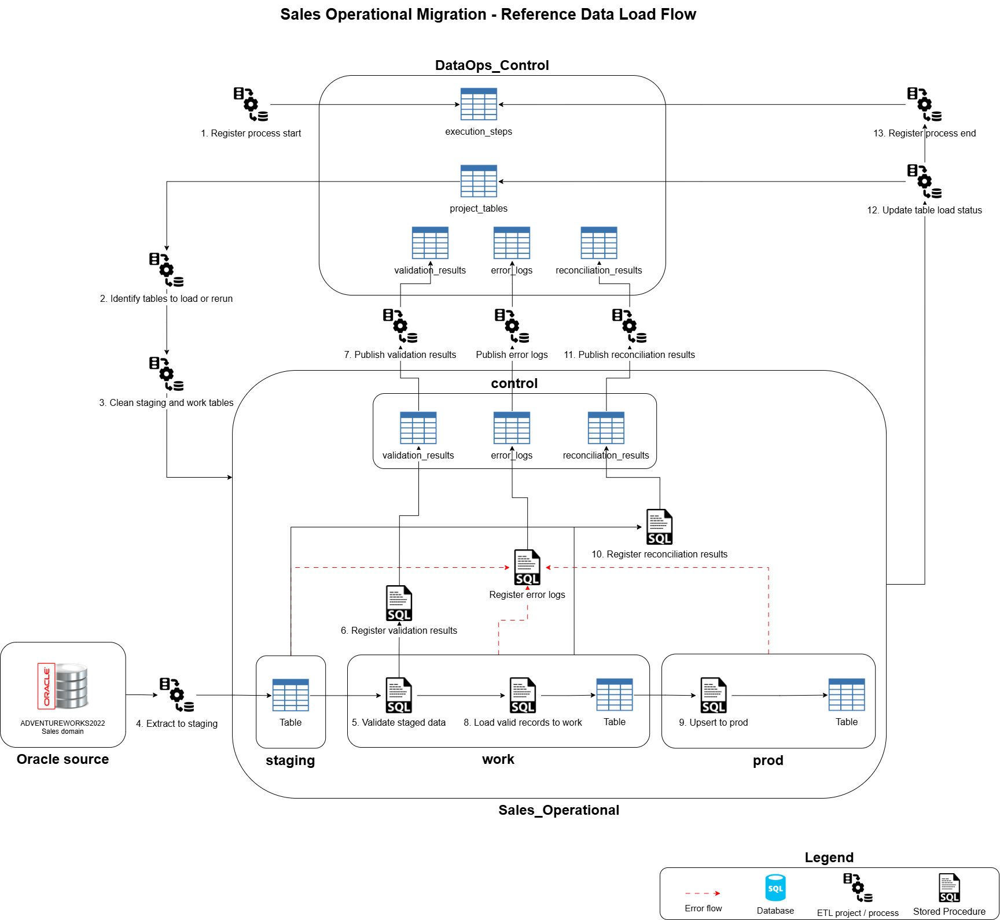
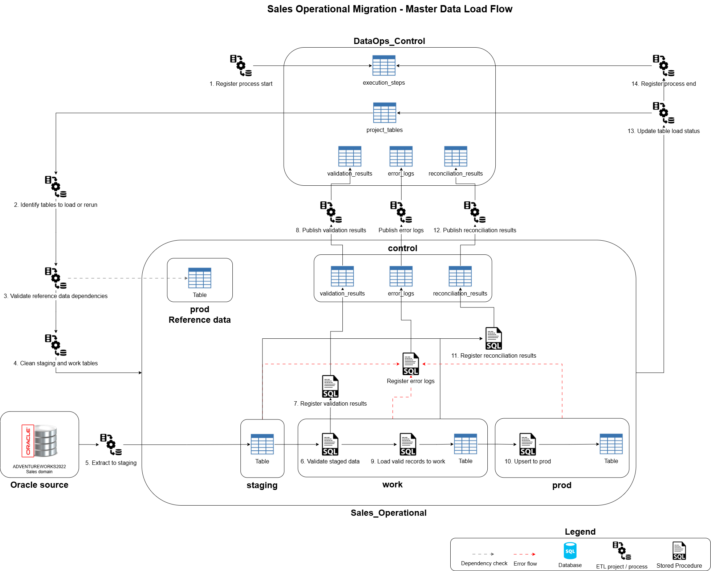
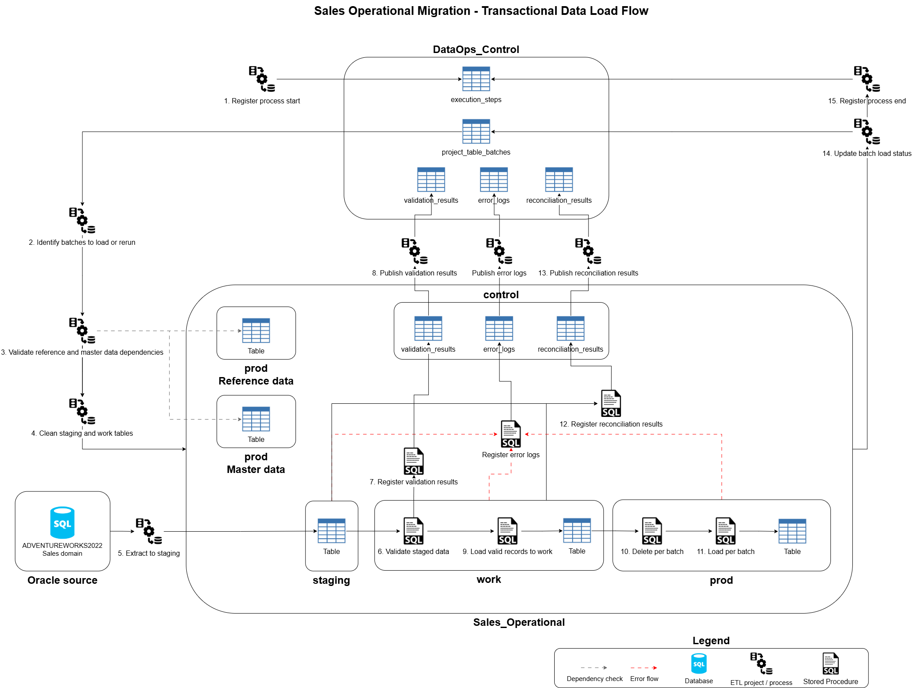
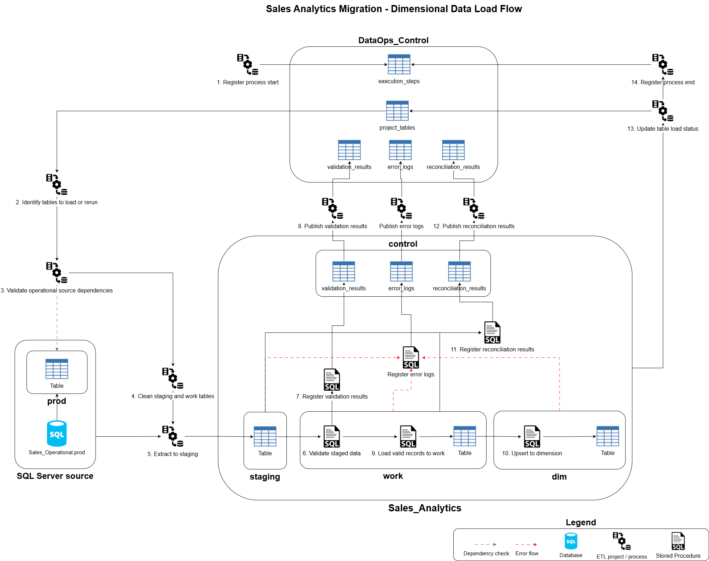
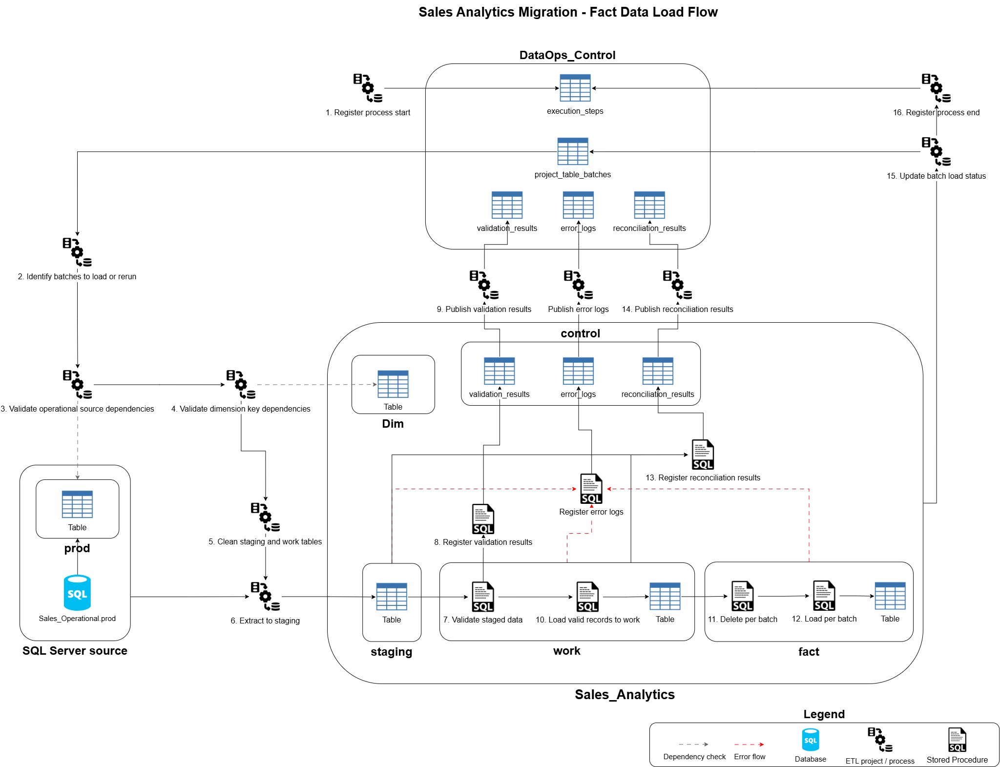

# Solution Design

## Purpose

This document describes the technical design for the Sales domain migration and modernization solution.

## Data Source in Scope

The operational migration scope includes the Sales order process and the supporting entities like Customer, Address, Product, and SalesPerson.

### Technical Details

- The database engine is `Oracle XE 21c`.
- Source schema is `ADVENTUREWORKS2022`.
- Each source table name includes the domain as a prefix, for example `SALES_SALESORDERHEADER`.
- All table names follow a `SCREAMING_SNAKE_CASE` pattern.
- No transformation logic is applied directly in Oracle.

### Data Model Diagram

The source model shows the selected Sales-domain tables included in the modernization scope.

| Data role | Source table | Purpose in migration |
|---|---|---|
| Transactional | `SALES_SALESORDERHEADER` | Preserves the main Sales order event. |
| Transactional | `SALES_SALESORDERDETAIL` | Preserves the products, quantities, prices, discounts, and line totals sold in each order. |
| Master / Core | `SALES_CUSTOMER` | Identifies the customer associated with each Sales order. |
| Master / Core | `PERSON_PERSON` | Provides person attributes used to enrich customers and salespeople. |
| Master / Core | `HUMANRESOURCES_EMPLOYEE` | Provides employee attributes required to build salesperson information. |
| Master / Core | `SALES_SALESPERSON` | Identifies the salesperson associated with each Sales order. |
| Master / Core | `PERSON_ADDRESS` | Preserves billing and shipping address context for Sales orders. |
| Master / Core | `PRODUCTION_PRODUCT` | Identifies the products sold in Sales order lines. |
| Master / Core | `SALES_CREDITCARD` | Preserves payment context when credit card information is present. |
| Master / Core | `PURCHASING_SHIPMETHOD` | Identifies the shipping method. |
| Reference / Lookup | `PERSON_ADDRESSTYPE` | Classifies the business purpose of addresses. |
| Reference / Lookup | `PERSON_STATEPROVINCE` | Supports regional geography for addresses and territory mapping. |
| Reference / Lookup | `PERSON_COUNTRYREGION` | Supports country/region grouping for geography. |
| Reference / Lookup | `SALES_CURRENCYRATE` | Provides currency context for order amounts. |
| Reference / Lookup | `SALES_CURRENCY` | Provides currency context for order amounts. |
| Reference / Lookup | `SALES_SALESTERRITORY` | Groups customers, salespeople, and orders by commercial territory. |
| Reference / Lookup | `SALES_SPECIALOFFER` | Preserves promotion or discount context applied to Sales lines. |
| Reference / Lookup | `PRODUCTION_PRODUCTSUBCATEGORY` | Provides the product classification level. |
| Bridge / Associative | `PERSON_BUSINESSENTITYADDRESS` | Maps business entities to addresses and address types in the source model. |
| Bridge / Associative | `SALES_SPECIALOFFERPRODUCT` | Provides source product-offer relationships. |

## Target Databases

The target solution uses three databases. Each database represents a different logical responsibility in the target architecture:

| Database | Responsibility |
|---|---|
| `Sales_Operational` | Normalized operational database for the migrated Sales domain. |
| `Sales_Analytics` | Analytical database for reporting and historical analysis. Follows a star schema design to simplify reporting and analytical queries. |
| `DataOps_Control` | Reusable technical control database for metadata, execution tracking, validation, reconciliation, error logging, batch control, and rerun support. |

### Technical details

- The target database engine is `SQL Server 2022`.
- `Sales_Operational` and `Sales_Analytics` are designed to run on the same SQL Server instance because they belong to the same Sales migration solution.
- `DataOps_Control` is designed as a reusable control database and may be deployed on a separate SQL Server instance to support multiple projects.
- The database names use descriptive names with underscores to improve readability.

## Schema Organization

The schema names follow a `lower_case` pattern.

### Sales_Operational

| Schema | Purpose |
|---|---|
| `prod` | Final operational business tables. |
| `staging` | Raw data extracted from Oracle before validation and transformation. |
| `work` | Intermediate validated/transformed data used during loads. |
| `control` | Database-specific helper objects used by ETL and integration with `DataOps_Control`. |

### Sales_Analytics

| Schema | Purpose |
|---|---|
| `dim` | Analytical dimensions. |
| `fact` | Analytical fact tables. |
| `staging` | Data extracted from `Sales_Operational` before analytical validation and transformation. |
| `work` | Intermediate dimensional/fact processing. |
| `control` | Database-specific helper objects used by ETL and integration with `DataOps_Control`. |

## Target Data Models

### Sales_Operational Data Model

The `Sales_Operational` model is a normalized target model for the Sales domain.

Key design decisions:

- `SalesPerson` consolidates source `HUMANRESOURCES_EMPLOYEE`, `PERSON_PERSON`, and `SALES_SALESPERSON` data.
- `Customer` consolidates source `PERSON_PERSON` and `SALES_CUSTOMER` data.
- `PERSON_BUSINESSENTITYADDRESS` is removed; address classification is handled directly through `AddressType` and `Address`.
- `SALES_SPECIALOFFERPRODUCT` is removed; the applied offer is stored at `SalesOrderDetail` level.
- Source `PRODUCTION_PRODUCTSUBCATEGORY` values are loaded into target `ProductCategory`, simplifying the product hierarchy to one classification level.
- `SalesOrderHeader` includes separate billing and shipping address relationships.

| Data role | Target table |
|---|---|
| Transactional | `SalesOrderHeader`, `SalesOrderDetail` |
| Master / Core | `Customer`, `SalesPerson`, `Address`, `Product`, `CreditCard` |
| Reference / Lookup | `CountryRegion`, `StateProvince`, `SalesTerritory`, `AddressType`, `ShipMethod`, `Currency`, `CurrencyRate`, `SpecialOffer`, `ProductCategory` |

### Sales_Analytics Data Model

The `Sales_Analytics` model is a star schema.

Key design decisions:

- `Sales_Analytics` is loaded from `Sales_Operational.prod` to avoid duplicating Oracle cleansing and validation logic and focuses on business-friendly reporting.
- `SalesOrderHeader` and `SalesOrderDetail` are combined into `FactSales`.
- The grain of `FactSales` is one Sales order detail line.
- Product category attributes are denormalized into `DimProduct`.
- Country/region attributes are denormalized into `DimSalesTerritory`.
- `CreditCard` is transformed into `DimPaymentMethod` to avoid exposing unnecessary card-level details.
- `CurrencyRate` is not modeled as a dimension; analytical sales measures are standardized to USD.
- `SpecialOffer` and detailed `Address` are not modeled.
- `DimDate` supports order, due, and ship date analysis through role-playing date keys.
- `FactSales` foreign keys should resolve to valid dimension rows. Missing, invalid, or not applicable source values are handled through default dimension members, such as `Unknown`, `Not Applicable`, or `Invalid`, rather than using `NULL` foreign keys.

| Data role | Target table |
|---|---|
| Fact | `FactSales` |
| Dimension | `DimDate`, `DimCustomer`, `DimSalesPerson`, `DimSalesTerritory`, `DimProduct`, `DimPaymentMethod`, `DimShipMethod` |

### DataOps_Control Data Model

The model is organized into three logical groups:

| Group | Tables | Purpose |
|---|---|---|
| Project metadata | `projects`, `project_processes`, `project_databases`, `project_tables`, `project_columns`, `project_table_batches` | Defines projects, process hierarchy, databases, tables, columns, table-level load metadata, and batch-level load metadata. |
| Execution tracking | `execution_runs`, `execution_steps` | Tracks full runs, hierarchical execution steps, and batch-level execution for large tables. |
| Observability | `error_logs`, `validation_results`, `reconciliation_results` | Stores technical errors, validation outcomes, and reconciliation checks. |

#### Technical details

- `project_processes` and `execution_steps` support self-relations to represent hierarchies such as ETL project, package, subprocess, table load, and child execution steps.
- `project_tables` can store table-level control metadata such as `load_type`, `batch_enabled`, `batch_column_name`, `rerun_required`, `last_load_status`, and `last_successful_run_id`.
- `project_table_batches` supports large transactional tables split by period or key range. For this project, transactional batches use monthly `yyyyMM` periods based on `SalesOrderHeader.OrderDate`.

## Table Implementation Standards

### Table Naming

- Business tables should use `PascalCase`, for example `prod.SalesOrderHeader`.
- Staging/work tables should use `PascalCase`, for example `staging.SalesOrderHeader`.
- Control tables should use `snake_case`, for example `control.reconciliation_results`.

### Data Type Mapping Guidelines

Oracle source types should be mapped to SQL Server target types based on business meaning, precision, and expected usage.

| Oracle source type | SQL Server target type | Mapping rule |
|---|---|---|
| `NUMBER(p, 0)` | `INT` or `BIGINT` | Use for whole-number identifiers, counters, etc. |
| `NUMBER(p, s)` | `DECIMAL(p, s)` | Use for monetary values, rates, percentages, etc. |
| `VARCHAR2(n)` | `VARCHAR(n)` or `NVARCHAR(n)` | Use for text attributes. Use `NVARCHAR` when Unicode support is required. |
| `CHAR(n)` | `CHAR(n)` | Use for fixed or short code values when length is stable. |
| `DATE` | `DATE` or `DATETIME2` | Use `DATE` for date-only attributes. Use `DATETIME2` when time values must be preserved. |
| `TIMESTAMP` | `DATETIME2` | Use when datetime precision is required. |

### Key and Identifier Column Guidelines

- Final business tables should use a SQL Server-generated `IDENTITY` column as the surrogate key.
- Surrogate keys should use the suffix `Key`, for example `CustomerKey`, `ProductKey`, or `SalesOrderHeaderKey`.
- Source business keys should be preserved with a `Source` prefix, for example `SourceCustomerID`, `SourceProductID`, or `SourceSalesOrderID`. They are needed for:
  - Source-to-target traceability
  - Reconciliation
  - Rerun logic
  - Historical audit
  - Integration with other source-derived objects

### Audit Columns

Final business tables may include audit/technical columns when required.

| Column | Purpose | Type | Allow nulls | Default value |
|---|---|---|---|---|
| `created_at` | When the record was inserted. | DATETIME2 | No | SYSUTCDATETIME() |
| `created_by` | User or process that inserted the record. | VARCHAR(50) | No | USER_NAME() |
| `updated_at` | When the record was last updated. | DATETIME2 | Yes | |
| `updated_by` | User or process that last updated the record. | VARCHAR(50) | Yes | |
| `created_run_id` | Execution run that inserted the record. | INT | No | |
| `is_active` | Indicates whether the record is active in the target model. | BIT | No | 1 |

### Constraint Rules

- All tables should have a primary key constraint.
- Final business tables should use the surrogate key as the primary key.
- Avoid composite primary keys in final business tables unless there is a clear design reason.
- Foreign keys should be defined where they support target integrity and do not conflict with the migration/reload strategy.
- The name of the primary key should follow `pk_[schema]_[table]_[column]`.
- The name of the foreign key should follow `fk_[schema]_[table]_[column]`.

## Stored Procedure Implementation Pattern

SQL Server stored procedures handle database-side validation, transformation, final loading, reconciliation, and status updates.

### Stored Procedure Naming

Names should follow the following structure: `usp_[action]_[TableName]`. Exceptions may apply.

Common stored procedure prefixes include:

| Prefix | Purpose | Example |
|---|---|---|
| `usp_cleanup_` | Clean staging/work objects | `usp_cleanup_tables` |
| `usp_load_` | Load data into tables | `usp_load_AddressType` |
| `usp_validate_` | Validate staged or working data | `usp_validate_AddressType` |
| `usp_reconcile_` | Register reconciliation checks | `usp_reconcile_AddressType` |
| `usp_register_` | Register execution, step, log, or result metadata | `usp_register_reconciliation_result` |

### Final Load Procedure Pattern

Final load procedures should use the strategy appropriate to the load type.

| Load type | Final load strategy |
|---|---|
| Reference / master | `MERGE` or UPSERT using source business keys. |
| Transactional | Controlled delete and reload by batch period. |
| Dimension | `MERGE` or UPSERT for Type 1 dimensions unless otherwise defined. |
| Fact | Controlled delete and reload by batch period. |

### Reconciliation Procedure Pattern

Reconciliation procedures should register results in `control.reconciliation_results` before publishing them to `DataOps_Control`.

Common reconciliation checks include:

- Source-to-staging row counts.
- Work-to-final row counts.
- Financial totals for transactional and fact loads.

## SSIS Implementation Guidelines

### ETL and Data Movement

Data movement is implemented through two controlled flows:

| Flow | Pattern |
|---|---|
| Operational migration | `Oracle source -> Sales_Operational.staging -> Sales_Operational.work -> Sales_Operational.prod` |
| Analytical migration | `Sales_Operational.prod -> Sales_Analytics.staging -> Sales_Analytics.work -> Sales_Analytics.dim / Sales_Analytics.fact` |

### Load Rules

- Data is not loaded directly from Oracle into final business tables.
- Reference and master data are loaded before transactional data.
- Large transactional tables use batch-based processing by `SalesOrderHeader.OrderDate` period in `yyyyMM` format.
- Analytical loading uses `Sales_Operational.prod` as the curated source.
- Execution status, validation results, reconciliation results, errors, and batch checkpoints are published to `DataOps_Control`.
- `staging`, `work`, and `control` tables are managed through controlled cleanup rules.

#### Common Table-Level Load Pattern

This pattern applies to reference, master, and dimension loads where records are processed at table level and final tables are loaded using `MERGE` or UPSERT logic.

1. Register the process or table load start in `DataOps_Control.execution_steps`.
2. Identify the tables to load or rerun using metadata from `DataOps_Control.project_tables`.
3. Clean the related `staging`, `work`, and `control` tables.
4. Extract source data into `staging`.
5. Validate staged data using SQL Server stored procedures.
6. Store validation results in the local `control.validation_results` table.
7. Publish validation results to `DataOps_Control.validation_results`.
8. Load valid records into `work`.
9. Load final records using `MERGE` or UPSERT logic.
10. Register reconciliation results in the local `control.reconciliation_results` table.
11. Publish reconciliation results to `DataOps_Control.reconciliation_results`.
12. Update table load status in `DataOps_Control.project_tables`.
13. Register the process end in `DataOps_Control.execution_steps`.

#### Common Batch-Level Load Pattern

This pattern applies to transactional and fact loads where data is processed by reloadable business periods instead of by full table.

1. Register the process or batch load start in `DataOps_Control.execution_steps`.
2. Identify the batches to load or rerun using metadata from `DataOps_Control.project_table_batches`.
3. Validate required reference and master data dependencies before processing the batch.
4. Clean the related `staging`, `work` and `control` tables.
5. Extract source data for the current batch into `staging`.
6. Validate staged data using SQL Server stored procedures.
7. Store validation results in the local `control.validation_results` table.
8. Publish validation results to `DataOps_Control.validation_results`.
9. Load valid records into `work`.
10. Delete existing final records for the current batch period.
11. Load final records for the current batch period.
12. Register reconciliation results in the local `control.reconciliation_results` table.
13. Publish reconciliation results to `DataOps_Control.reconciliation_results`.
14. Update batch load status in `DataOps_Control.project_table_batches`.
15. Register the process end in `DataOps_Control.execution_steps`.

### Database Communication Strategy

- Database communication is handled through SSIS data flows, connection managers, and staging tables.
- The solution does not rely on linked servers or direct cross-database querying. This keeps each database responsible for its own processing stages and avoids hidden dependencies between final business tables.

### Project Parameters

Common project-level parameters may include:

| Parameter | Purpose |
|---|---|
| `p_project_id` | Identifies the registered project in `DataOps_Control`. |
| `p_[db_name]_database` | Identifies the database name. |
| `p_[db_name]_server` | Identifies the server name. |
| `p_[db_name]_username` | Identifies the database user or service account. |
| `p_[db_name]_password` | Identifies the database password or secret reference. |

### Package Parameters

Common package-level parameters may include:

| Parameter | Purpose |
|---|---|
| `p_execution_run_id` | Identifies the current execution run. |
| `p_execution_step_id` | Identifies the current execution step. |
| `p_project_table_id` | Identifies the table being processed. |
| `p_batch_period_yyyymm` | Identifies the current batch period when batching is used. |
| `p_rerun_required` | Indicates whether the object is being reprocessed. |

### Package Variables

Common variables may include:

| Variable | Purpose |
|---|---|
| `v_source_row_count` | Stores the number of rows extracted from the source or staging layer. |
| `v_target_row_count` | Stores the number of rows loaded into the target table. |
| `v_package_start_time` | Stores the package execution start time. |
| `v_package_end_time` | Stores the package execution end time. |

### Connection Managers

| Connection | Connection manager type | Purpose |
|---|---|---|
| Oracle source connection | Oracle Connection Manager / Oracle provider | Extracts Sales-domain source data from Oracle. |
| `Sales_Operational` target connection | OLE DB | Loads staging/work/final operational tables and executes SQL Server stored procedures. |
| `Sales_Analytics` target connection | OLE DB | Loads staging/work/dimension/fact tables and executes SQL Server stored procedures. |
| `DataOps_Control` connection | OLE DB | Registers execution metadata, validation results, reconciliation results, errors, and status updates. |

Connection values should be environment-configurable and should not be hardcoded inside package logic.

### Event Handlers

SSIS `OnError` event handlers should register unexpected technical failures in `DataOps_Control.error_logs`.

## ETL Implementation Projects

The migration is implemented through two Integration Services projects:

| Project | Responsibility |
|---|---|
| `Sales_Operational_Migration` | Migrates validated Sales-domain data from Oracle into `Sales_Operational`. |
| `Sales_Analytics_Migration` | Builds the analytical model in `Sales_Analytics` using `Sales_Operational.prod` as the curated source. |

This separation keeps operational and analytical responsibilities independent.

### Sales_Operational_Migration

| Package | Purpose |
|---|---|
| `PKG_OPERATIONAL_MIGRATION` | Orchestrates reference, master, and transactional packages. |
| `PKG_REFERENCE_DATA` | Loads reference data. |
| `PKG_MASTER_DATA` | Loads master/core entities. |
| `PKG_TRANSACTIONAL_DATA` | Loads Sales transactions by batch. |

#### Reference Data Load Flow

Reference data is loaded using the common table-level load pattern. Independent reference tables can be loaded separately, while related parent-child tables are handled through grouped load containers and controlled stored procedure sequences.

| Load container | Target table | Source table | Dependency | Execution behavior |
|---|---|---|---|---|
| `AddressType Load` | `AddressType` | `PERSON_ADDRESSTYPE` | None | Independent table load; can run in parallel. |
| `ProductCategory Load` | `ProductCategory` | `PRODUCTION_PRODUCTSUBCATEGORY` | None | Independent table load; can run in parallel. |
| `SpecialOffer Load` | `SpecialOffer` | `SALES_SPECIALOFFER` | None | Independent table load; can run in parallel. |
| `ShipMethod Load` | `ShipMethod` | `PURCHASING_SHIPMETHOD` | None | Independent table load; can run in parallel. |
| `Geography Load` | `CountryRegion` | `PERSON_COUNTRYREGION` | None | Loaded first within the geography sequence. |
| `Geography Load` | `StateProvince` | `PERSON_STATEPROVINCE` | `CountryRegion` | Loaded after `CountryRegion`. |
| `Geography Load` | `SalesTerritory` | `SALES_SALESTERRITORY` | `CountryRegion`, `StateProvince` | Loaded after `CountryRegion` and `StateProvince`. |
| `Currency Load` | `Currency` | `SALES_CURRENCY` | None | Loaded first within the currency sequence. |
| `Currency Load` | `CurrencyRate` | `SALES_CURRENCYRATE` | `Currency` | Loaded after `Currency`. |

The following diagram shows the reference data load flow.

#### Master Data Load Flow

Master data is loaded using the common table-level load pattern. Independent master tables can be loaded once their required reference data is available.

| Load container | Target table | Source table | Dependency | Execution behavior |
|---|---|---|---|---|
| `CreditCard Load` | `CreditCard` | `SALES_CREDITCARD` | None | Independent table load; can run in parallel. |
| `Address Load` | `Address` | `PERSON_ADDRESS` | `StateProvince`, `AddressType` | Loaded after required reference data is available. |
| `Product Load` | `Product` | `PRODUCTION_PRODUCT` | `ProductCategory` | Loaded after required reference data is available. |
| `SalesPerson Load` | `SalesPerson` | `PERSON_PERSON`, `SALES_SALESPERSON`, `HUMANRESOURCES_EMPLOYEE` | `SalesTerritory` | Loaded after parent master and reference data. |
| `Customer Load` | `Customer` | `PERSON_PERSON`, `SALES_CUSTOMER` | `SalesTerritory` | Loaded after parent master and reference data. |

The following diagram shows the master data load flow.

#### Transactional Data Load Flow

Transactional data is loaded after reference and master data because sales transactions depend on previously loaded customers, salespeople, addresses, products, payment methods, shipping methods, currencies, territories, and promotions.

Transactional processing uses the common batch-level load pattern. Batches are defined by `yyyyMM` period using `SalesOrderHeader.OrderDate` as the batch driver.

Each batch includes:

- `SalesOrderHeader` records where `OrderDate` belongs to the selected period.
- Related `SalesOrderDetail` records for those headers.

Header and detail records are extracted and processed together within the same batch because the batch period is defined at header level and detail rows depend on the related order header.

| Load container | Target table | Source table | Dependency | Execution behavior |
|---|---|---|---|---|
| `Sales Load` | `SalesOrderHeader`, `SalesOrderDetail` | `SALES_SALESORDERHEADER`, `SALES_SALESORDERDETAIL` | `Customer`, `SalesPerson`, `Address`, `Product`, `CreditCard`, `CurrencyRate`, `ShipMethod`, `SalesTerritory`, `SpecialOffer` | Processed together within each `yyyyMM` batch; final load uses delete-and-reload logic for the selected period. |

The following diagram shows the transactional data load flow.

### Sales_Analytics_Migration

| Package | Purpose |
|---|---|
| `PKG_ANALYTICS_MIGRATION` | Orchestrates analytical loads. |
| `PKG_DIMENSIONS` | Loads analytical dimensions. |
| `PKG_FACTS` | Loads analytical fact tables. |

#### Dimension Data Load Flow

Dimension tables are loaded from `Sales_Operational.prod` into `Sales_Analytics.dim` using the common table-level load pattern. Most dimensions can be loaded independently because they are built from curated operational tables and do not depend on fact data.

| Target table | Source tables | Mapping rule |
|---|---|---|
| `DimCustomer` | `Customer` | Builds a reporting customer dimension and excludes sensitive or unnecessary operational attributes. |
| `DimPaymentMethod` | `CreditCard` | Converts payment-related data into a reporting-safe payment method dimension. |
| `DimShipMethod` | `ShipMethod` | Maps shipping method attributes for reporting by fulfillment method. |
| `DimProduct` | `Product`, `ProductCategory` | Denormalizes product category attributes into the product dimension. |
| `DimSalesTerritory` | `CountryRegion`, `SalesTerritory` | Denormalizes country/region attributes into the sales territory dimension. |
| `DimSalesPerson` | `SalesPerson` | Builds the salesperson reporting dimension from curated operational salesperson data. |

The following diagram shows the dimension data load flow.

#### Fact Data Load Flow

Fact tables are loaded after dimensions because `FactSales` depends on dimension surrogate keys from `DimCustomer`, `DimSalesPerson`, `DimProduct`, `DimSalesTerritory`, `DimPaymentMethod`, `DimShipMethod`, and `DimDate`.

`FactSales` uses the common batch-level load pattern and is loaded by `yyyyMM` sales period to support batch-level execution, reconciliation, and reruns.

| Target table | Source tables | Mapping rule |
|---|---|---|
| `FactSales` | `SalesOrderHeader`, `SalesOrderDetail` | Combines header and detail data into a line-grain fact table. |

The following diagram shows the fact data load flow.

## Rerun and Recovery Strategy

Rerun and recovery behavior is metadata-driven. The framework uses `DataOps_Control` to identify which tables or batches are active, failed, incomplete, or explicitly marked for reprocessing.

### Standard Status Values

| Status | Meaning |
|---|---|
| `Pending` | Object is waiting to run. |
| `Running` | Object is currently executing. |
| `Success` | Object completed successfully. |
| `Failed` | Object failed due to a technical, validation, or reconciliation issue. |
| `Skipped` | Object was intentionally skipped. |
| `RerunRequired` | Object is marked for reprocessing. |

### Table-Level Rerun Rules

A table may be included in a rerun when:

- It is active.
- The previous load failed.
- It is explicitly marked as rerun required.
- A parent dependency was reprocessed.
- The table is included in a selected recovery scope.

### Batch-Level Rerun Rules

A batch may be included in a rerun when:

- The batch failed.
- Reconciliation failed.
- The batch is explicitly marked as rerun required.
- The batch belongs to a selected recovery period.

## Assumptions and Scope Boundaries

- Migration is executed during an offline migration window.
- The target design modernizes the Sales domain instead of copying the source schema one-to-one.
- Analytical sales amounts are standardized to USD.
- Continuous synchronization is out of scope.

## Security, Users, and Roles

Security separates business access, ETL execution, operational support, and database administration responsibilities. Access follows the principle of least privilege.

### Design Rules

- Business users do not have direct write access to technical schemas.
- Technical schemas such as `staging`, `work`, and `control` are restricted to ETL and support processes.
- ETL execution accounts use only the permissions required for extraction, processing, loading, and publishing execution results.
- Access to `DataOps_Control` is limited to operational and technical roles.
- Administrative privileges are separated from normal ETL execution.

### Role Categories

| Role category | Access scope |
|---|---|
| Application access | Limited access to final operational tables when required by downstream applications. |
| ETL execution | Read/write access to `staging`, `work`, `control`, and required final target tables; execution rights on ETL stored procedures. |
| Read-only reporting access | Read access to `Sales_Analytics.dim` and `Sales_Analytics.fact`. |
| Operational support | Read access to execution logs, validation results, reconciliation results, and error details in `DataOps_Control`. |
| Database administration | Administrative access for deployment, maintenance, security management, and troubleshooting. |

## Implementation Tooling

| Component | Tool |
|---|---|
| Source platform | Oracle XE 21c |
| Target platform | SQL Server 2022 |
| ETL tool | SQL Server Integration Services, SSIS |
| Development environment | Visual Studio 2026 |
| Target-side processing | Transact-SQL stored procedures |
| Job scheduling | SQL Server Agent |
