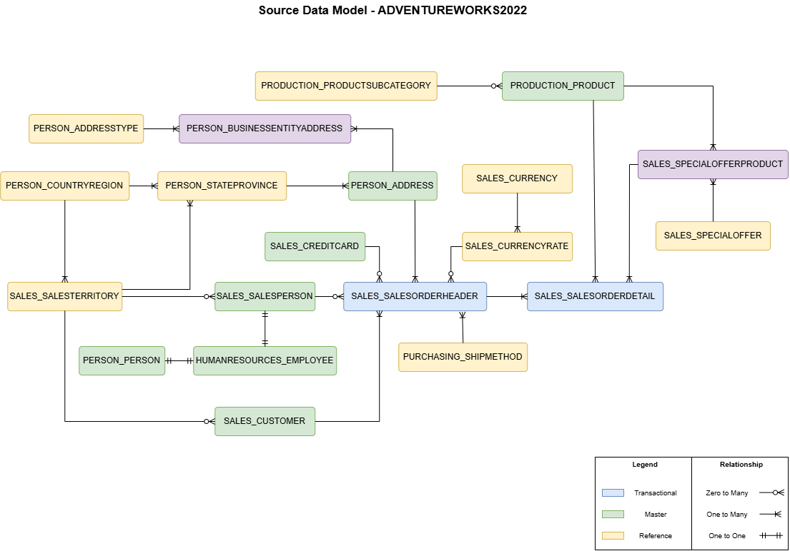
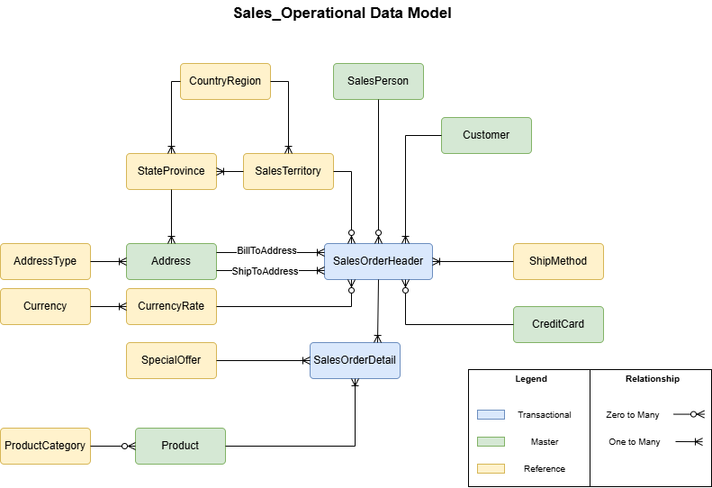
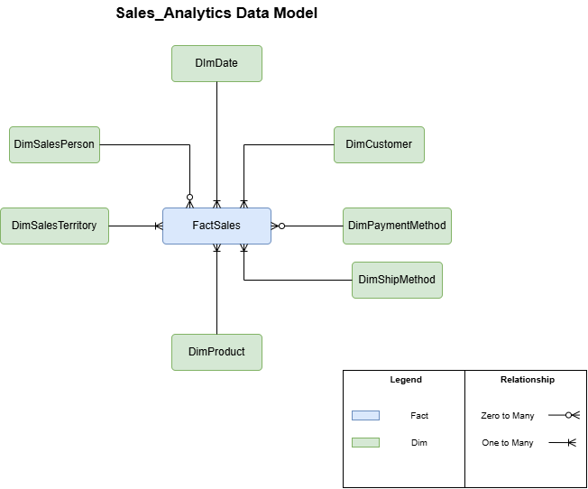
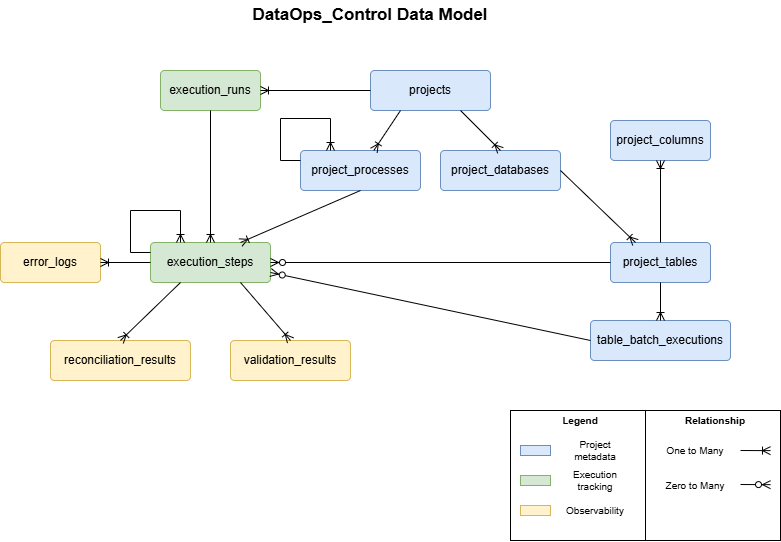
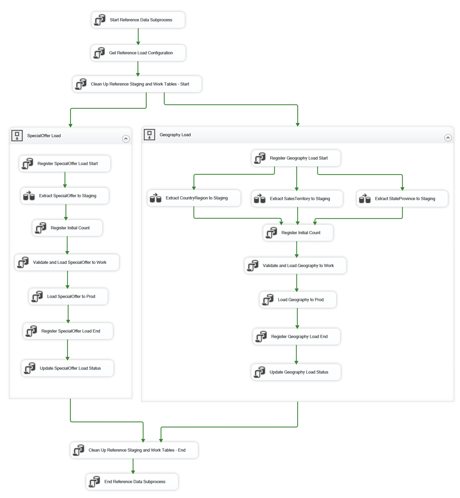
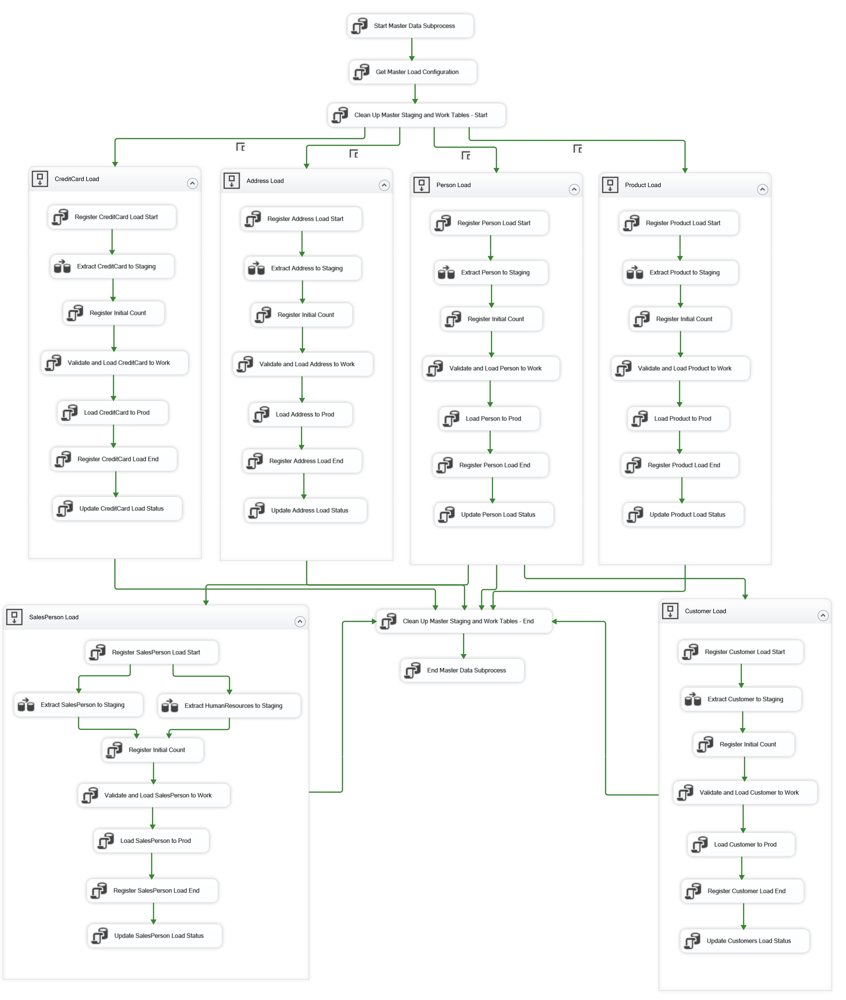
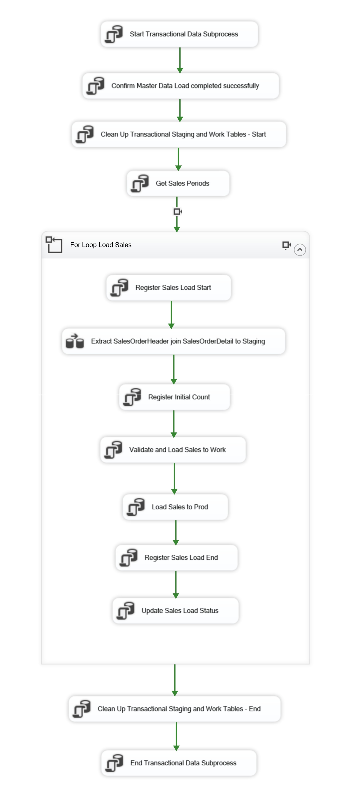
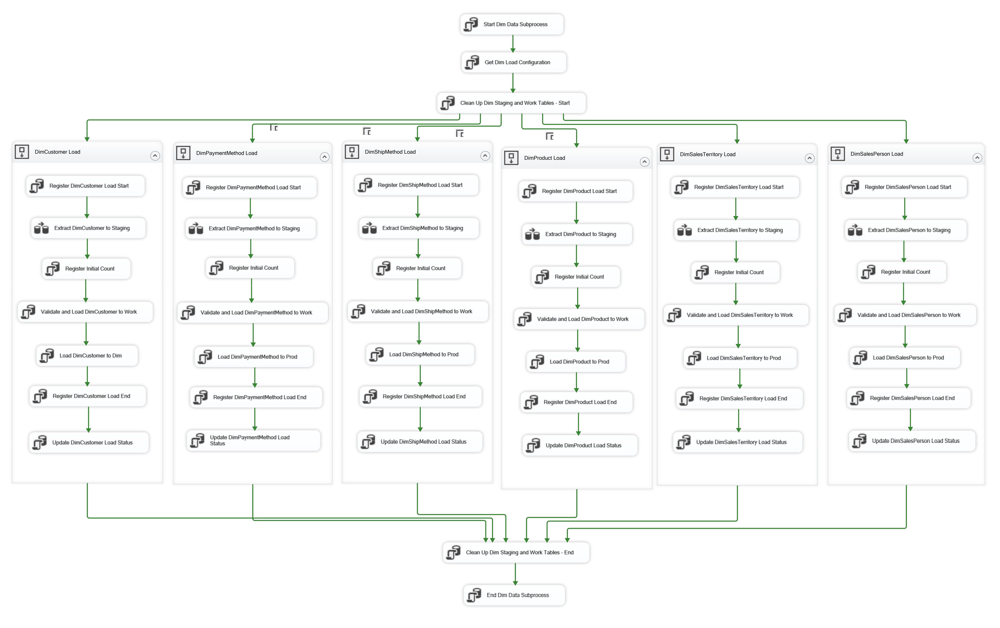
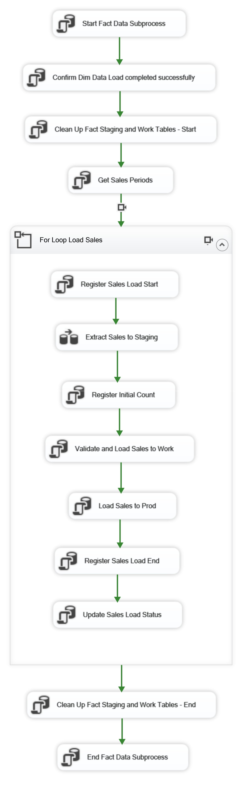

# Solution Design

## Purpose

This document describes the technical design for the Sales domain migration and modernization solution.

## Target Databases

The target solution uses three SQL Server 2022 databases:

| Database | Responsibility |
|---|---|
| `Sales_Operational` | Normalized operational database for the migrated Sales domain. |
| `Sales_Analytics` | Analytical database for reporting and historical analysis. Follows a star schema design to simplify reporting and analytical queries. |
| `DataOps_Control` | Reusable technical control database for metadata, execution tracking, validation, reconciliation, error logging, batch control, and rerun support. |

## Schema Organization

### Sales_Operational

| Schema | Purpose |
|---|---|
| `prod` | Final operational business tables. |
| `staging` | Raw extracted data before validation and transformation. |
| `work` | Intermediate validated/transformed data used during loads. |
| `control` | Database-specific helper objects used by ETL and integration with `DataOps_Control`. |

### Sales_Analytics

| Schema | Purpose |
|---|---|
| `dim` | Analytical dimensions. |
| `fact` | Analytical fact tables. |
| `staging` | Raw extracted data before validation and transformation. |
| `work` | Intermediate dimensional/fact processing. |
| `control` | Database-specific helper objects used by ETL and integration with `DataOps_Control`. |

## Source Tables in Scope

The operational migration scope includes the Sales order process and the supporting entities required for customer, address, product, territory, currency, shipping, promotion, salesperson, and payment context.

### Source Data Model Diagram

The source model shows the selected ADVENTUREWORKS2022 Sales-domain scope before modernization.



| Data role | Source table | Purpose in migration |
|---|---|---|
| Transactional | `SALES_SALESORDERHEADER` | Preserves the main Sales order event and order-level business context. |
| Transactional | `SALES_SALESORDERDETAIL` | Preserves the products, quantities, prices, discounts, and line totals sold in each order. |
| Master / Core | `SALES_CUSTOMER` | Identifies the customer associated with each Sales order. |
| Master / Core | `PERSON_PERSON` | Provides person attributes used to enrich customers and salespeople. |
| Master / Core | `HUMANRESOURCES_EMPLOYEE` | Provides employee attributes required to build salesperson information. |
| Master / Core | `SALES_SALESPERSON` | Identifies the salesperson associated with each Sales order. |
| Master / Core | `PERSON_ADDRESS` | Preserves billing and shipping address context for Sales orders. |
| Master / Core | `PRODUCTION_PRODUCT` | Identifies the products sold in Sales order lines. |
| Master / Core | `SALES_CREDITCARD` | Preserves payment context when credit card information. |
| Master / Core | `PURCHASING_SHIPMETHOD` | Identifies the shipping method. |
| Reference / Lookup | `PERSON_ADDRESSTYPE` | Classifies the business purpose of addresses. |
| Reference / Lookup | `PERSON_STATEPROVINCE` | Supports regional geography for addresses and territory mapping. |
| Reference / Lookup | `PERSON_COUNTRYREGION` | Supports country/region grouping for geography and reporting. |
| Reference / Lookup | `SALES_CURRENCYRATE` | Provides currency context for order amounts. |
| Reference / Lookup | `SALES_CURRENCY` | Provides currency context for order amounts. |
| Reference / Lookup | `SALES_SALESTERRITORY` | Groups customers, salespeople, and orders by commercial territory. |
| Reference / Lookup | `SALES_SPECIALOFFER` | Preserves promotion or discount context applied to Sales lines. |
| Reference / Lookup | `PRODUCTION_PRODUCTSUBCATEGORY` | Provides the product classification level. |
| Bridge / Associative | `PERSON_BUSINESSENTITYADDRESS` | Cross-reference table mapping customers, and employees to their addresses. |
| Bridge / Associative | `SALES_SPECIALOFFERPRODUCT` | Provides source product-offer relationships used to validate Sales line context. |

### Dependency Logic

The load order is driven by dependencies:

1. Reference data.
2. Master/core entities.
3. Source bridge/associative relationships when needed for target transformations.
4. Transactional tables.

This order reduces the risk of orphaned transactional records and supports controlled validation.

## Table Design Principles

- Oracle source structures are not copied blindly into SQL Server.
- All objects for this project are created in the `PRIMARY` filegroup.
- Final target tables use surrogate primary keys, implemented as SQL Server-generated identifiers such as `IDENTITY`.
- Source business keys are preserved when required for reconciliation, traceability, reruns, and dependent loads.
- Nullability and data types are defined explicitly.
- Required business columns use `NOT NULL`.
- Defaults are used only when they represent valid technical or business behavior.
- Relationships are defined explicitly in the target model.
- Final tables may include audit/technical columns such as `created_at`, `updated_at`, `run_id`, and `is_active`.

## Target Data Models

The target solution contains two business data models:

- `Sales_Operational`: normalized operational model.
- `Sales_Analytics`: dimensional analytical model.

### Sales_Operational Data Model

The `Sales_Operational` model is a normalized target model for the Sales domain.



Key design decisions:

- `SalesPerson` consolidates source `HUMANRESOURCES_EMPLOYEE`, `PERSON_PERSON`, and `SALES_SALESPERSON` data.
- `Customer` consolidates source `PERSON_PERSON` and `SALES_CUSTOMER` data.
- `PERSON_BUSINESSENTITYADDRESS` is removed; address classification is handled directly through `AddressType` and `Address`.
- `SALES_SPECIALOFFERPRODUCT` is removed; the applied offer is stored at `SalesOrderDetail` level.
- Source `PRODUCTION_PRODUCTSUBCATEGORY` values are loaded into target `ProductCategory`, creating one product classification level.
- `SalesOrderHeader` includes separate billing and shipping address relationships.

| Data role | Target table |
|---|---|
| Transactional | `SalesOrderHeader`, `SalesOrderDetail` |
| Master / Core | `Customer`, `SalesPerson`, `Address`, `Product`, `CreditCard` |
| Reference / Lookup | `CountryRegion`, `StateProvince`, `SalesTerritory`, `AddressType`, `ShipMethod`, `Currency`, `CurrencyRate`, `SpecialOffer`, `ProductCategory` |

### Sales_Analytics Data Model

The `Sales_Analytics` model is a star schema.



Key design decisions:

- `Sales_Analytics` is loaded from `Sales_Operational.prod` to avoid duplicating Oracle cleansing and validation logic and focuses on business-friendly reporting.
- `SalesOrderHeader` and `SalesOrderDetail` are combined into `FactSales`.
- The grain of `FactSales` is one Sales order detail line.
- Product category attributes are denormalized into `DimProduct`.
- Country/region attributes are denormalized into `DimSalesTerritory`.
- `CreditCard` is transformed into `DimPaymentMethod` to avoid exposing unnecessary card-level details.
- `CurrencyRate` is not modeled as a dimension; analytical sales measures are standardized to USD.
- `SpecialOffer` and detailed `Address` are not modeled.
- `DimDate` supports order, due, and ship date analysis through role-playing date keys.

| Data role | Target table |
|---|---|
| Fact | `FactSales` |
| Dimension | `DimDate`, `DimCustomer`, `DimSalesPerson`, `DimSalesTerritory`, `DimProduct`, `DimPaymentMethod`, `DimShipMethod` |

## DataOps_Control Data Model



In this project, it supports both `Sales_Operational_Migration` and `Sales_Analytics_Migration` by tracking metadata, executions, validation results, reconciliation results, errors, batch executions, and rerun state.

The model is organized into three logical groups:

| Group | Tables | Purpose |
|---|---|---|
| Project metadata | `projects`, `project_processes`, `project_databases`, `project_tables`, `project_columns`, `table_batch_executions` | Defines projects, process hierarchy, databases, tables, columns, and table-level load metadata. |
| Execution tracking | `execution_runs`, `execution_steps` | Tracks full runs, hierarchical execution steps, and batch-level execution for large tables. |
| Observability | `error_logs`, `validation_results`, `reconciliation_results` | Stores technical errors, validation outcomes, and reconciliation checks. |

`project_processes` and `execution_steps` support self-relations to represent hierarchies such as ETL project, package, subprocess, table load, and child execution steps.

`project_tables` can store table-level control metadata such as `load_type`, `batch_enabled`, `batch_column_name`, `rerun_required`, `last_load_status`, and `last_successful_run_id`.

`table_batch_executions` supports large transactional tables split by period or key range. For this project, transactional batches use monthly `yyyyMM` periods based on `SalesOrderHeader.OrderDate`.

## Implementation Tooling

| Component | Tool |
|---|---|
| Source platform | Oracle XE 21c |
| Target platform | SQL Server 2022 |
| ETL tool | SQL Server Integration Services, SSIS |
| Development environment | Visual Studio 2026 |
| Target-side processing | Transact-SQL stored procedures |
| Job scheduling | SQL Server Agent |

## ETL and Data Movement

Data movement is implemented through two controlled flows:

| Flow | Pattern |
|---|---|
| Operational migration | `Oracle source -> Sales_Operational.staging -> Sales_Operational.work -> Sales_Operational.prod` |
| Analytical loading | `Sales_Operational.prod -> Sales_Analytics.staging -> Sales_Analytics.work -> Sales_Analytics.dim / Sales_Analytics.fact` |

### Load Rules

- Data is not loaded directly from Oracle into final business tables.
- Reference and master data are loaded before transactional data.
- Large transactional tables use batch-based processing by `SalesOrderHeader.OrderDate` period in `yyyyMM` format.
- Analytical loading uses `Sales_Operational.prod` as the curated source.
- Execution status, validation results, reconciliation results, errors, and batch checkpoints are registered in `DataOps_Control`.
- `staging` and `work` tables are managed through controlled cleanup rules.

## ETL Implementation Projects

The migration is implemented through two Integration Services projects:

| Project | Responsibility |
|---|---|
| `Sales_Operational_Migration` | Migrates validated Sales-domain data from Oracle into `Sales_Operational`. |
| `Sales_Analytics_Migration` | Builds the analytical model in `Sales_Analytics` using `Sales_Operational.prod` as the curated source. |

This separation keeps operational and analytical responsibilities independent.

### Common ETL Controls

All migration packages follow the same staged processing concept:

```text
source -> staging -> work -> final target tables
```

Common controls include:

- Execution and step registration in `DataOps_Control`.
- Configuration-driven execution.
- Staging/work cleanup.
- Validation through SQL Server stored procedures.
- Reconciliation before marking loads as successful.
- Idempotent final loads using `MERGE` or UPSERT where appropriate, for example: master or dimension tables.
- Table-level or batch-level rerun support.
- Technical error handling through SSIS `OnError` event handlers.

### Common Table-Level Load Pattern

1. Register table load start in `DataOps_Control`.
2. Extract data into `staging`.
3. Validate staged data and load valid records into `work`.
4. Register validation and reconciliation results.
5. Load final records using `MERGE` or UPSERT logic.
6. Update table-level status in `DataOps_Control`.

### Sales_Operational_Migration

The `Sales_Operational_Migration` project contains:

| Package | Purpose |
|---|---|
| `PKG_SALES_MIGRATION` | Orchestrates reference, master, and transactional packages. |
| `PKG_REFERENCE_DATA` | Loads reference data. |
| `PKG_MASTER_DATA` | Loads master/core entities. |
| `PKG_TRANSACTIONAL_DATA` | Loads Sales transactions by batch. |

#### Reference Data Load Flow

| Group | Load container | Target table | Source table | Dependency | Execution behavior |
|---|---|---|---|---|---|
| Group 1 | `AddressType Load` | `AddressType` | `PERSON_ADDRESSTYPE` | None | Independent table load; can run in parallel |
| Group 1 | `ProductCategory Load` | `ProductCategory` | `PRODUCTION_PRODUCTSUBCATEGORY` | None | Independent table load; can run in parallel |
| Group 1 | `SpecialOffer Load` | `SpecialOffer` | `SALES_SPECIALOFFER` | None | Independent table load; can run in parallel |
| Group 1 | `ShipMethod Load` | `ShipMethod` | `PURCHASING_SHIPMETHOD` | None | Independent table load; can run in parallel |
| Group 2 | `Geography Load` | `CountryRegion` | `PERSON_COUNTRYREGION` | None | Extracted to staging with the geography group; validated and loaded 1st by stored procedure sequence |
| Group 2 | `Geography Load` | `StateProvince` | `PERSON_STATEPROVINCE` | `CountryRegion` | Extracted to staging with the geography group; validated and loaded 2nd after `CountryRegion` |
| Group 2 | `Geography Load` | `SalesTerritory` | `SALES_SALESTERRITORY` | `CountryRegion`, `StateProvince` | Extracted to staging with the geography group; validated and loaded 3rd after geography parent records |
| Group 2 | `Currency Load` | `Currency` | `SALES_CURRENCY` | None | Extracted to staging with the currency group; validated and loaded 1st by stored procedure sequence |
| Group 2 | `Currency Load` | `CurrencyRate` | `SALES_CURRENCYRATE` | `Currency` | Extracted to staging with the currency group; validated and loaded 2nd after `Currency` |

Reference validation focuses on controlled values, required codes and descriptions, duplicate business keys, valid parent references, code formats, numeric ranges, and effective date ranges.

For grouped reference containers, related source tables can be extracted into staging in parallel. Parent-child dependencies are enforced later by SQL Server stored procedures during validation, work-table loading, and final loading.

Reference Data Load Flow example showing representative containers from Group 1 and Group 2.



#### Master Data Load Flow

| Group | Load container | Target table | Source table | Dependency | Execution behavior |
|---|---|---|---|---|---|
| Group 1 | `CreditCard Load` | `CreditCard` | `SALES_CREDITCARD` | None | Independent table load; can run in parallel |
| Group 1 | `Address Load` | `Address` | `PERSON_ADDRESS` | `StateProvince`, `AddressType` | Independent table load; can run in parallel after required reference data is available |
| Group 1 | `Person Load` | `Person` | `PERSON_PERSON` | None | Independent table load; can run in parallel |
| Group 1 | `Product Load` | `Product` | `PRODUCTION_PRODUCT` | `ProductCategory` | Independent table load; can run in parallel after required reference data is available |
| Group 2 | `SalesPerson Load` | `SalesPerson` | `SALES_SALESPERSON`, `HUMANRESOURCES_EMPLOYEE` | `Person`, `SalesTerritory` | Uses previously loaded `Person` data and extracted salesperson-related source data; validated and loaded after parent master and reference data |
| Group 2 | `Customer Load` | `Customer` | `SALES_CUSTOMER` | `Person`, `SalesTerritory` | Uses previously loaded `Person` data and extracted customer source data; validated and loaded after parent master and reference data |

Master validation focuses on entity completeness, duplicate source identifiers, parent reference existence, and source-to-target key mapping.

Independent master tables can be extracted and loaded in parallel once their required reference data is available. Dependent master entities such as `SalesPerson` and `Customer` are loaded afterward because they rely on previously loaded `Person` data and supporting reference values such as `SalesTerritory`.

Master Data Load Flow example showing independent and dependent master table loads.



#### Transactional Data Load Flow

Transactional data is loaded after reference and master data because Sales transactions depend on previously loaded customer, salesperson, address, product, payment, shipping, currency, territory, and promotion data.

Transactional processing is executed by `yyyyMM` period using `SalesOrderHeader.OrderDate` as the batch driver.

Each batch includes:

- `SalesOrderHeader` records where `OrderDate` belongs to the selected period.
- Related `SalesOrderDetail` records for those headers.

In this design, header and detail records are extracted and processed together within the same batch because the batch period is defined at header level and detail rows depend on the related order header.

| Group | Load container | Target table | Source table | Dependency | Execution behavior |
|---|---|---|---|---|---|
| Group 1 | `Sales Load` | `SalesOrderHeader`, `SalesOrderDetail` | `SALES_SALESORDERHEADER` join `SALES_SALESORDERDETAIL` | `Customer`, `SalesPerson`, `Address`, `Product`, `CreditCard`, `CurrencyRate`, `ShipMethod`, `SalesTerritory`, `SpecialOffer` | Extracted and processed together within each `yyyyMM` batch; validation and final load preserve header-detail dependency |

Transactional validation focuses on parent relationships, duplicate transaction keys, date consistency, positive quantities and amounts, and amount calculation checks.

Reconciliation is performed at batch level using row counts, business keys, orphan checks, and financial totals.

Transactional Data Load Flow example.



### Sales_Analytics_Migration

The `Sales_Analytics_Migration` project contains:

| Package | Purpose |
|---|---|
| `PKG_ANALYTICS_MIGRATION` | Orchestrates analytical loads. |
| `PKG_DIMENSIONS` | Loads analytical dimensions. |
| `PKG_FACTS` | Loads analytical fact tables. |

#### Dimension Data Load Flow

Dimension tables are loaded from `Sales_Operational.prod` into `Sales_Analytics.dim`.

| Target table | Source table(s) from `Sales_Operational.prod` | Mapping rule | Execution behavior |
|---|---|---|---|
| `DimCustomer` | `Customer` | Builds a reporting customer dimension and excludes sensitive or unnecessary operational attributes. | Can run in parallel |
| `DimPaymentMethod` | `CreditCard` | Converts payment-related data into a reporting-safe payment method dimension. | Can run in parallel |
| `DimShipMethod` | `ShipMethod` | Maps shipping method attributes for reporting by fulfillment method. | Can run in parallel |
| `DimProduct` | `Product`, `ProductCategory` | Denormalizes product category attributes into the product dimension. | Can run in parallel |
| `DimSalesTerritory` | `CountryRegion`, `SalesTerritory` | Denormalizes country/region attributes into the sales territory dimension. | Can run in parallel |
| `DimSalesPerson` | `SalesPerson` | Builds the salesperson reporting dimension from curated operational salesperson data. | Can run in parallel |

Dimension validation focuses on unique business keys, required descriptive attributes, unknown/default member handling, and source-to-dimension key traceability.

Dimension Data Load Flow example.



#### Fact Data Load Flow

Fact tables are loaded after dimensions because `FactSales` depends on dimension surrogate keys from `DimCustomer`, `DimSalesPerson`, `DimProduct`, `DimSalesTerritory`, `DimPaymentMethod`, `DimShipMethod`, and `DimDate`.

`FactSales` is loaded by `yyyyMM` sales period to support batch-level execution, reconciliation, and reruns.

| Target table | Source table(s) from `Sales_Operational.prod` | Mapping rule | Execution behavior |
|---|---|---|---|
| `FactSales` | `SalesOrderHeader`, `SalesOrderDetail` | Combines header and detail data into a line-grain fact table. | Loaded by sales period; resolves dimension surrogate keys and validates measures before final load |

The fact load resolves dimension keys, loads sales line measures, converts analytical amounts to USD when required, and preserves source identifiers for traceability.

Fact validation focuses on missing dimension keys, duplicate fact business keys, date consistency, positive quantities and amounts, and line amount calculation checks.

Fact reconciliation is performed at batch level using row counts, business keys, orphan checks, and financial totals.

Fact Data Load Flow example.



## Rerun and Recovery Strategy

Rerun behavior depends on the data type:

| Load type | Rerun strategy |
|---|---|
| Reference / Master | Table-level rerun using `MERGE` or UPSERT with source business keys. |
| Transactional | Batch-level delete and reload by `yyyyMM` period. |
| Analytical | Dimension/fact rerun from curated `Sales_Operational.prod`. |

## Assumptions and Scope Boundaries

- Migration is executed during an offline migration window.
- The target design modernizes the Sales domain instead of copying the source schema one-to-one.
- Analytical Sales amounts are standardized to USD.

## Security, Users, and Roles

Security separates business access, ETL execution, and administrative responsibilities.

### Design Rules

- Access follows the principle of least privilege.
- Business users do not have direct write access to technical schemas.
- ETL execution accounts use only the permissions required for extraction, processing, and loading.
- Access to `DataOps_Control` is limited to operational and technical roles.
- Technical schemas such as `staging`, `work`, and `control` are restricted to ETL and support processes.

### Role Categories

- Application access
- ETL execution
- Read-only reporting access
- Operational support
- Database administration
