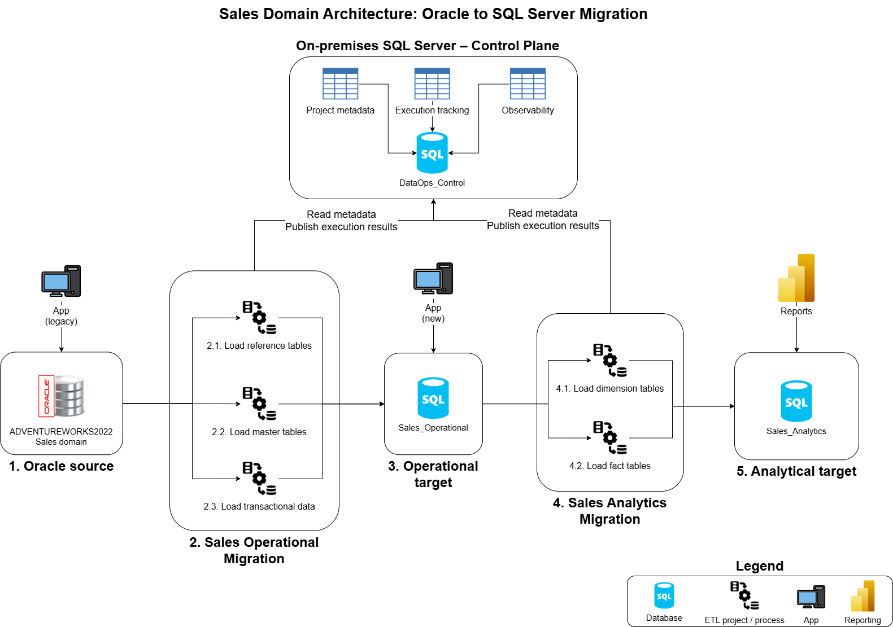

# Sales Domain Architecture: Oracle to SQL Server Migration

## Overview

This project presents a migration and modernization case study for moving a legacy Sales data domain from Oracle to SQL Server 2022.

The objective is to design and document a phased migration solution using professional data engineering practices, from problem framing and target architecture to implementation. The case study explains the migration problem, proposes a target solution, records the main technical decisions, and demonstrates key data engineering design concepts.

## Project Scope

| Area | In Scope |
|---|---|
| Source platform | Oracle XE 21c |
| Source system | Oracle-adapted AdventureWorks2022 Sales domain |
| Target platform | SQL Server 2022 |
| Data processing | Offline migration of operational and analytical Sales data |
| Data architecture | Separation between operational, analytical, and DataOps control databases |
| ETL | SSIS-based extraction, orchestration, and loading |
| Validation | Execution validation, reconciliation, and traceability |
| Security | Design-level access control, credential handling, and role separation |

## Out of Scope

| Area | Reason |
|---|---|
| Full enterprise migration | The scope is limited to the Sales domain and its supporting entities. |
| Full ERP replatforming | The project focuses on data migration and modernization, not complete ERP replacement. |
| Continuous synchronization | The migration is executed during an offline migration window. |
| Web application design | The new web platform is a dependency, but its detailed application design is outside the project scope. |
| Production infrastructure design | Infrastructure sizing, high availability, and deployment topology are not covered. |
| Live production deployment | The repository documents a proposed architecture and implementation design rather than a deployed production solution. |

## High-Level Architecture

## Technologies

| Category | Technology |
|---|---|
| Source system | Oracle XE 21c |
| Source model | Oracle-adapted AdventureWorks2022 |
| Target platform | SQL Server 2022 |
| Orchestration | SQL Server Integration Services (SSIS) |
| Processing | Transact-SQL stored procedures |
| Scheduling | SQL Server Agent |
| Development environment | Visual Studio 2026 |
| Control layer | `DataOps_Control` |

## Project Dependencies

This project depends on a supporting portfolio project that provides execution control capabilities

| Dependency | Purpose | Repository |
|---|---|---|
| `DataOps_Control` | Provides the metadata-driven execution control, validation, reconciliation, logging, and rerun control database used by the Fabric pipelines. | [Metadata-Driven Control Framework for Data Engineering Projects](https://github.com/WilderJoseth/data-engineering-projects/tree/main/on_premise/DataOps_Control) |

## Documentation

The solution design is supported by the following documents.

| Area | Document | Purpose |
|---|---|---|
| Source Data Profile | [01_source_data_profile.md](docs/01_source_data_profile.md) | Defines the Oracle source scope, characteristics, source model, and table inventory |
| Target Data Architecture | [02_target_data_architecture.md](docs/02_target_data_architecture.md) | Defines the target databases, schemas, data models, architecture decisions, and table standards |
| Data Flow Strategy | [03_data_flow_strategy.md](docs/03_data_flow_strategy.md) | Defines the end-to-end routes, SSIS orchestration, dependencies, and flow diagrams |
| Load Strategy | [04_load_strategy.md](docs/04_load_strategy.md) | Defines stored procedure patterns, table-level and batch-level loading, rerun, and recovery |
| Validation and Reconciliation | [05_validation_and_reconciliation_strategy.md](docs/05_validation_and_reconciliation_strategy.md) | Defines validation, reconciliation, error recording, traceability, and execution outcomes |
| Security and Access | [06_security_and_access_strategy.md](docs/06_security_and_access_strategy.md) | Defines access principles, schema restrictions, credential handling, and role categories |

## Project Status

| Area | Status |
|---|---|
| Project framing | Done |
| Architecture documentation | Done |
| Documentation restructuring | Done |
| SSIS implementation | In progress |
| Validation and reconciliation implementation | Planned |
| Security implementation | Planned |
| End-to-end testing | Planned |
