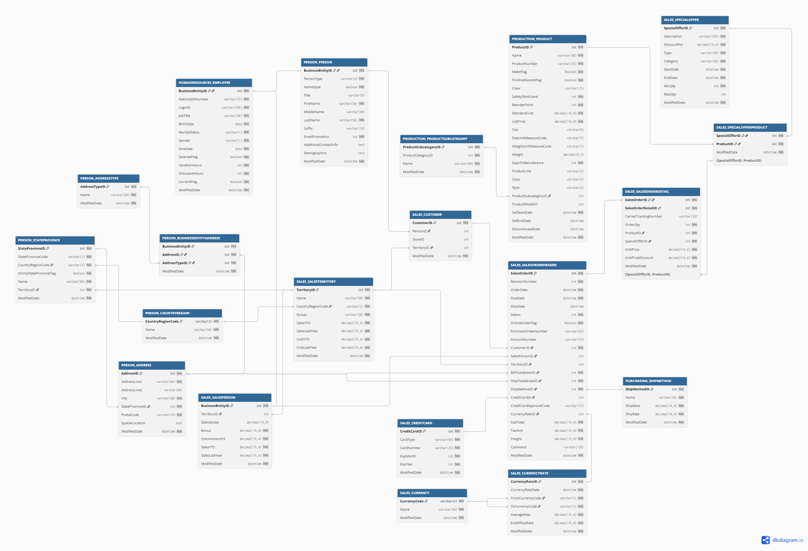

# Source Data Profile

## Purpose

This document describes the Oracle source platform, source schema, source object categories, estimated data volumes, growth assumptions, and LOB storage relevant to the Sales-domain migration.

## Source Platform Overview

The current Sales platform runs on an on-premise Oracle XE 21c instance. Although `ADVENTUREWORKS2022` is a multi-domain schema, this document includes only the source objects required for the Sales-domain migration.

| Source Schema | Current Responsibility | Data Model | Modernization Role |
|---|---|---|---|
| `ADVENTUREWORKS2022` | Supports the legacy Sales domain and its related operational data | Normalized model | Provides transactional and reporting data |

## Source Data Categories

The source data is grouped by business role.

| Data Category | Description | Source Schema | Expected Data Volume | Estimated Row Count |
|---|---|---|---|---|
| Reference / Lookup | Stores stable or low-change descriptive values | `ADVENTUREWORKS2022` | Low | 256,500 rows |
| Master / Core | Stores business entities | `ADVENTUREWORKS2022` | Medium to high | 80,095,000 rows |
| Transactional | Stores sales orders and sales order lines | `ADVENTUREWORKS2022` | Very high | 1,200,000,000 rows |
| Bridge / Associative | Stores relationships between business entities | `ADVENTUREWORKS2022` | Medium to high | 25,100,000 rows |

## Source Volume Summary

The following production-like estimates represent the 20 Sales-domain source tables included in the migration scope, not the complete `ADVENTUREWORKS2022` schema or actual measured mock-data storage. The source timeframe is February 2012 to March 2023.

| Source Schema | Selected Tables | Rows | Table Data Size | Index Count | Index Size | LOB Size | Source Object Footprint | Planning Range with 20–30% Buffer |
|---|---:|---:|---:|---:|---:|---:|---:|---:|
| `ADVENTUREWORKS2022` | 20 | ~1.305B | ~210.1 GB | 77 | ~276.4 GB | ~27.5 GB | ~513.9 GB | ~616.7–668.1 GB |

The source object footprint includes table data, indexes, and LOB storage. It excludes temp, undo, redo, archive logs, backups, free space, and other operational capacity that is not migrated as a source object.

## Source Data Model

The source model shows the selected Sales-domain tables included in the modernization scope.

## Source Tables

For target ingestion, only final persisted business tables are included in the source inventory. `SALES_SALESORDERDETAIL` is the largest table at approximately 1 billion rows, followed by `SALES_SALESORDERHEADER` at approximately 200 million rows.

| Data Category | Source Table | Estimated Monthly Growth | Estimated Current Rows | Estimated Current Data Size | Estimated Index Count | Estimated Current Index Size |
|---|---|---|---:|---:|---:|---:|
| Transactional | `SALES_SALESORDERDETAIL` | ~7.5M rows/month | 1,000,000,000 | 120.00 GB | 7 | 180.00 GB |
| Transactional | `SALES_SALESORDERHEADER` | ~1.5M rows/month | 200,000,000 | 55.00 GB | 8 | 65.00 GB |
| Master / Core | `SALES_CUSTOMER` | ~150K rows/month | 20,000,000 | 3.00 GB | 5 | 5.00 GB |
| Master / Core | `PERSON_PERSON` | ~150K rows/month | 20,020,000 | 14.00 GB | 6 | 8.00 GB |
| Master / Core | `HUMANRESOURCES_EMPLOYEE` | ~100 rows/month | 20,000 | 0.05 GB | 3 | 0.03 GB |
| Master / Core | `SALES_SALESPERSON` | Very low | 5,000 | 0.01 GB | 3 | 0.01 GB |
| Master / Core | `PERSON_ADDRESS` | ~185K rows/month | 25,000,000 | 12.50 GB | 6 | 10.00 GB |
| Master / Core | `PRODUCTION_PRODUCT` | Low | 50,000 | 0.10 GB | 5 | 0.12 GB |
| Master / Core | `SALES_CREDITCARD` | ~110K rows/month | 15,000,000 | 2.20 GB | 4 | 3.00 GB |
| Master / Core | `PURCHASING_SHIPMETHOD` | Static | 20 | 0.005 GB | 2 | 0.005 GB |
| Reference / Lookup | `PERSON_ADDRESSTYPE` | Static | 10 | 0.005 GB | 2 | 0.005 GB |
| Reference / Lookup | `PERSON_STATEPROVINCE` | Static / very low | 500 | 0.005 GB | 3 | 0.005 GB |
| Reference / Lookup | `PERSON_COUNTRYREGION` | Static | 250 | 0.005 GB | 2 | 0.005 GB |
| Reference / Lookup | `SALES_CURRENCYRATE` | ~1.5K rows/month | 250,000 | 0.10 GB | 4 | 0.12 GB |
| Reference / Lookup | `SALES_CURRENCY` | Static | 200 | 0.005 GB | 2 | 0.005 GB |
| Reference / Lookup | `SALES_SALESTERRITORY` | Static | 20 | 0.005 GB | 2 | 0.005 GB |
| Reference / Lookup | `SALES_SPECIALOFFER` | Low | 5,000 | 0.02 GB | 3 | 0.02 GB |
| Reference / Lookup | `PRODUCTION_PRODUCTSUBCATEGORY` | Static / very low | 500 | 0.005 GB | 2 | 0.005 GB |
| Bridge / Associative | `PERSON_BUSINESSENTITYADDRESS` | ~185K rows/month | 25,000,000 | 3.00 GB | 5 | 5.00 GB |
| Bridge / Associative | `SALES_SPECIALOFFERPRODUCT` | Low | 100,000 | 0.04 GB | 3 | 0.05 GB |

## LOB Assessment

LOB storage is documented separately because Oracle manages LOB segments and their supporting indexes independently from base tables and standard indexes. The estimated LOB size is included as a separate component in the Source Volume Summary.

| Source Table | LOB Column | Oracle LOB Type | Estimated LOB Size | Assessment |
|---|---|---|---:|---|
| `PERSON_PERSON` | `ADDITIONALCONTACTINFO` | `CLOB` | 6.00 GB | Stores optional additional contact payloads; the estimate reflects an assumed population rate. |
| `PERSON_PERSON` | `DEMOGRAPHICS` | `CLOB` | 12.00 GB | Stores XML- or text-like demographic payloads. |
| `PERSON_ADDRESS` | `SPATIALLOCATION` | `CLOB` | 9.50 GB | Stores the spatial-like payload represented as a CLOB in the Oracle simulation. |
