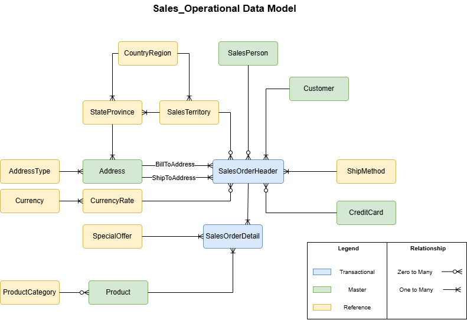
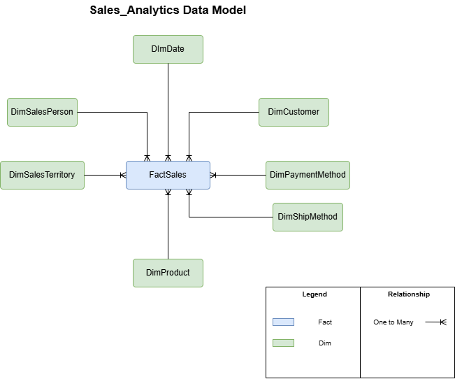

# Target Data Architecture

## Document Goal

This document describes the target databases, schemas, data models, architecture decisions, and table implementation standards for the Sales-domain migration.

## Target Databases

The target solution uses two databases with separate logical responsibilities:

| Database | Responsibility | Platform |
|---|---|---|
| `Sales_Operational` | Stores normalized operational data for the migrated Sales domain | SQL Server 2022 |
| `Sales_Analytics` | Stores reporting-ready dimensional data and historical Sales measures | SQL Server 2022 |

## Sales_Operational

| Schema | Purpose |
|---|---|
| `prod` | Stores final operational business tables |
| `staging` | Stores raw data extracted from Oracle before validation and transformation |
| `work` | Stores intermediate validated and transformed data used during loads |
| `control` | Stores database-specific helper objects used by ETL and integration with `DataOps_Control` |

### Staging Tables

Staging tables store raw source-aligned records from `ADVENTUREWORKS2022`.

| Data Category | Source Table | Target Schema | Target Table | Purpose |
|---|---|---|---|---|
| Transactional | `SALES_SALESORDERHEADER` | `staging` | `SalesOrderHeader` | Stores raw sales order header records |
| Transactional | `SALES_SALESORDERDETAIL` | `staging` | `SalesOrderDetail` | Stores raw sales order line records |
| Master / Core | `SALES_CUSTOMER` | `staging` | `Customer` | Stores raw customer records |
| Master / Core | `PERSON_PERSON` | `staging` | `Person` | Stores raw person records |
| Master / Core | `SALES_SALESPERSON` | `staging` | `SalesPerson` | Stores raw salesperson records |
| Master / Core | `HUMANRESOURCES_EMPLOYEE` | `staging` | `Employee` | Stores raw employee records |
| Master / Core | `PERSON_ADDRESS` | `staging` | `Address` | Stores raw address records |
| Master / Core | `PRODUCTION_PRODUCT` | `staging` | `Product` | Stores raw product records |
| Master / Core | `SALES_CREDITCARD` | `staging` | `CreditCard` | Stores raw payment-related source records |
| Reference / Lookup | `PERSON_COUNTRYREGION` | `staging` | `CountryRegion` | Stores raw country or region values |
| Reference / Lookup | `PERSON_STATEPROVINCE` | `staging` | `StateProvince` | Stores raw state or province values |
| Reference / Lookup | `SALES_SALESTERRITORY` | `staging` | `SalesTerritory` | Stores raw sales territory values |
| Reference / Lookup | `PERSON_ADDRESSTYPE` | `staging` | `AddressType` | Stores raw address type values |
| Reference / Lookup | `PURCHASING_SHIPMETHOD` | `staging` | `ShipMethod` | Stores raw shipping method reference values. |
| Reference / Lookup | `SALES_CURRENCY` | `staging` | `Currency` | Stores raw currency values |
| Reference / Lookup | `SALES_CURRENCYRATE` | `staging` | `CurrencyRate` | Stores raw currency exchange rate values |
| Reference / Lookup | `SALES_SPECIALOFFER` | `staging` | `SpecialOffer` | Stores raw promotion and discount values |
| Reference / Lookup | `PRODUCTION_PRODUCTSUBCATEGORY` | `staging` | `ProductSubCategory` | Stores raw product subcategory values as a simplified single-level product classification |
| Bridge / Associative | `PERSON_BUSINESSENTITYADDRESS` | `staging` | `BusinessEntityAddress` | Stores source relationships used to join people, customers, employees, and addresses during transformation |
| Bridge / Associative | `SALES_SPECIALOFFERPRODUCT` | `staging` | `SpecialOfferProduct` | Stores source relationships used to associate products with special offers during transformation |

### Work Tables

Work tables store curated operational data from Staging.

Bridge / associative tables are loaded only to `staging`. They support joins, traceability, and transformation logic from `staging` to `work`, but they are not migrated as final operational entities.

| Data Category | Source Schema | Source Table | Target Schema | Target Table | Purpose |
|---|---|---|---|---|---|
| Transactional | `staging` | `SalesOrderHeader` | `work` | `SalesOrderHeader` | Stores curated sales order header records |
| Transactional | `staging` | `SalesOrderDetail` | `work` | `SalesOrderDetail` | Stores curated sales order line records |
| Master / Core | `staging` | `Customer`, `Person` | `work` | `Customer` | Stores curated customer records |
| Master / Core | `staging` | `SalesPerson`, `Employee` | `work` | `SalesPerson` | Stores curated salesperson records |
| Master / Core | `staging` | `Address` | `work` | `Address` | Stores curated address records |
| Master / Core | `staging` | `Product` | `work` | `Product` | Stores curated product records |
| Master / Core | `staging` | `CreditCard` | `work` | `CreditCard` | Stores curated payment-related source records |
| Reference / Lookup | `staging` | `CountryRegion` | `work` | `CountryRegion` | Stores curated country or region values |
| Reference / Lookup | `staging` | `StateProvince` | `work` | `StateProvince` | Stores curated state or province values |
| Reference / Lookup | `staging` | `SalesTerritory` | `work` | `SalesTerritory` | Stores curated sales territory values |
| Reference / Lookup | `staging` | `AddressType` | `work` | `AddressType` | Stores curated address type values |
| Reference / Lookup | `staging` | `ShipMethod` | `work` | `ShipMethod` | Stores curated shipping method reference values |
| Reference / Lookup | `staging` | `Currency` | `work` | `Currency` | Stores curated currency values |
| Reference / Lookup | `staging` | `CurrencyRate` | `work` | `CurrencyRate` | Stores curated currency exchange rate values |
| Reference / Lookup | `staging` | `SpecialOffer` | `work` | `SpecialOffer` | Stores curated promotion and discount values |
| Reference / Lookup | `staging` | `ProductSubCategory` | `work` | `ProductCategory` | Stores curated product category values |

### Production Tables

Production tables store operational data from Work.

| Data Category | Source Schema | Source Table | Target Schema | Target Table | Purpose |
|---|---|---|---|---|---|
| Transactional | `work` | `SalesOrderHeader` | `prod` | `SalesOrderHeader` | Stores sales order header records |
| Transactional | `work` | `SalesOrderDetail` | `prod` | `SalesOrderDetail` | Stores sales order line records |
| Master / Core | `work` | `Customer`, `Person` | `prod` | `Customer` | Stores customer records |
| Master / Core | `work` | `SalesPerson`, `Employee` | `prod` | `SalesPerson` | Stores salesperson records |
| Master / Core | `work` | `Address` | `prod` | `Address` | Stores address records |
| Master / Core | `work` | `Product` | `prod` | `Product` | Stores product records |
| Master / Core | `work` | `CreditCard` | `prod` | `CreditCard` | Stores payment-related source records |
| Reference / Lookup | `work` | `CountryRegion` | `prod` | `CountryRegion` | Stores country or region values |
| Reference / Lookup | `work` | `StateProvince` | `prod` | `StateProvince` | Stores state or province values |
| Reference / Lookup | `work` | `SalesTerritory` | `prod` | `SalesTerritory` | Stores sales territory values |
| Reference / Lookup | `work` | `AddressType` | `prod` | `AddressType` | Stores address type values |
| Reference / Lookup | `work` | `ShipMethod` | `prod` | `ShipMethod` | Stores shipping method reference values |
| Reference / Lookup | `work` | `Currency` | `prod` | `Currency` | Stores currency values |
| Reference / Lookup | `work` | `CurrencyRate` | `prod` | `CurrencyRate` | Stores currency exchange rate values |
| Reference / Lookup | `work` | `SpecialOffer` | `prod` | `SpecialOffer` | Stores promotion and discount values |
| Reference / Lookup | `work` | `ProductCategory` | `prod` | `ProductCategory` | Stores product category values |

## Sales_Analytics

`Sales_Analytics` is populated exclusively from `Sales_Operational.prod`, not directly from Oracle.

| Schema | Purpose |
|---|---|
| `dim` | Stores analytical dimensions. |
| `fact` | Stores analytical fact tables. |
| `staging` | Stores data extracted from `Sales_Operational` before analytical validation and transformation. |
| `work` | Stores intermediate dimensional and fact processing data. |
| `control` | Stores database-specific helper objects used by ETL and integration with `DataOps_Control`. |

### Staging Tables

Staging tables store raw source-aligned records from `Sales_Operational`.

| Data Category | Source Schema | Source Table | Target Schema | Target Table | Purpose |
|---|---|---|---|---|---|
| Transactional | `prod` | `SalesOrderHeader` | `staging` | `SalesOrderHeader` | Stores raw sales order header records |
| Transactional | `prod` | `SalesOrderDetail` | `staging` | `SalesOrderDetail` | Stores raw sales order line records |
| Master / Core | `prod` | `Customer` | `staging` | `Customer` | Stores raw customer records |
| Master / Core | `prod` | `SalesPerson` | `staging` | `SalesPerson` | Stores raw salesperson records |
| Master / Core | `prod` | `Address` | `staging` | `Address` | Stores raw address records |
| Master / Core | `prod` | `Product` | `staging` | `Product` | Stores raw product records |
| Master / Core | `prod` | `CreditCard` | `staging` | `CreditCard` | Stores raw payment-related source records |
| Reference / Lookup | `prod` | `CountryRegion` | `staging` | `CountryRegion` | Stores raw country or region values |
| Reference / Lookup | `prod` | `StateProvince` | `staging` | `StateProvince` | Stores raw state or province values |
| Reference / Lookup | `prod` | `SalesTerritory` | `staging` | `SalesTerritory` | Stores raw sales territory values |
| Reference / Lookup | `prod` | `AddressType` | `staging` | `AddressType` | Stores raw address type values |
| Reference / Lookup | `prod` | `ShipMethod` | `staging` | `ShipMethod` | Stores raw shipping method reference values |
| Reference / Lookup | `prod` | `Currency` | `staging` | `Currency` | Stores raw currency values |
| Reference / Lookup | `prod` | `CurrencyRate` | `staging` | `CurrencyRate` | Stores raw currency exchange rate values |
| Reference / Lookup | `prod` | `SpecialOffer` | `staging` | `SpecialOffer` | Stores raw promotion and discount values |
| Reference / Lookup | `prod` | `ProductCategory` | `staging` | `ProductCategory` | Stores raw product category values |

### Work Tables

Work tables store curated operational data from Staging.

| Data Category | Source Schema | Source Table | Target Schema | Target Table | Purpose |
|---|---|---|---|---|---|
| Analytical Fact | `staging` | `SalesOrderHeader`, `SalesOrderDetail` | `work` | `FactSales` | Stores sales fact data |
| Analytical Dimension | | Internally generated date values | `work` | `DimDate` | Stores role-playing dates for order, due, and ship date analysis |
| Analytical Dimension | `staging` | `Customer` | `work` | `DimCustomer` | Stores customer dimension attributes |
| Analytical Dimension | `staging` | `SalesPerson` | `work` | `DimSalesPerson` | Stores salesperson dimension attributes |
| Analytical Dimension | `staging` | `SalesTerritory`, `CountryRegion`, `StateProvince` | `work` | `DimSalesTerritory` | Stores denormalized territory dimension attributes |
| Analytical Dimension | `staging` | `Product`, `ProductCategory` | `work` | `DimProduct` | Stores denormalized product and category dimension attributes |
| Analytical Dimension | `staging` | `CreditCard` | `work` | `DimPaymentMethod` | Stores payment method dimension attributes |
| Analytical Dimension | `staging` | `ShipMethod` | `work` | `DimShipMethod` | Stores ship method dimension attributes |

### Final Tables

Final tables store final reporting-ready facts and dimensions.

| Data Category | Source Schema | Source Table | Target Schema | Target Table | Purpose |
|---|---|---|---|---|---|
| Analytical Fact | `work` | `FactSales` | `fact` | `FactSales` | Stores final sales transaction measures for reporting |
| Analytical Dimension | `work` | `DimDate` | `dim` | `DimDate` | Stores role-playing dates for order, due, and ship date analysis |
| Analytical Dimension | `work` | `DimCustomer` | `dim` | `DimCustomer` | Stores final customer dimension attributes |
| Analytical Dimension | `work` | `DimSalesPerson` | `dim` | `DimSalesPerson` | Stores final salesperson dimension attributes |
| Analytical Dimension | `work` | `DimSalesTerritory` | `dim` | `DimSalesTerritory` | Stores final territory dimension attributes |
| Analytical Dimension | `work` | `DimProduct` | `dim` | `DimProduct` | Stores final product and category dimension attributes |
| Analytical Dimension | `work` | `DimPaymentMethod` | `dim` | `DimPaymentMethod` | Stores final payment method dimension attributes |
| Analytical Dimension | `work` | `DimShipMethod` | `dim` | `DimShipMethod` | Stores final ship method dimension attributes |

## Table Implementation Standards

### Data Type Mapping Guidelines

Oracle source types should be mapped to SQL Server target types based on business meaning, precision, and expected usage.

| Oracle source type | SQL Server target type | Mapping rule |
|---|---|---|
| `NUMBER(p, 0)` | `INT` or `BIGINT` | Use for whole-number identifiers and counters |
| `NUMBER(p, s)` | `DECIMAL(p, s)` | Use for monetary values, rates, and percentages |
| `VARCHAR2(n)` | `VARCHAR(n)` or `NVARCHAR(n)` | Use `NVARCHAR` when Unicode support is required |
| `CHAR(n)` | `CHAR(n)` | Use for stable fixed or short code values |
| `DATE` | `DATE` or `DATETIME2` | Use `DATE` for date-only attributes and `DATETIME2` when time must be preserved |
| `TIMESTAMP` | `DATETIME2` | Use when datetime precision is required |

### Audit Columns

Final business tables may include audit/technical columns when required.

| Column | Purpose | Type | Allow nulls | Default value |
|---|---|---|---|---|
| `created_at` | When the record was inserted. | DATETIME2 | No | SYSUTCDATETIME() |
| `created_by` | User or process that inserted the record. | VARCHAR(50) | No | USER_NAME() |
| `updated_at` | When the record was last updated. | DATETIME2 | Yes | |
| `updated_by` | User or process that last updated the record. | VARCHAR(50) | Yes | |
| `created_execution_step_id` | Execution step that inserted the record. | INT | No | |
| `last_updated_execution_step_id` | Execution step that last updated the record. | INT | Yes | |
| `is_active` | Indicates whether the record is active. | BIT | No | 1 |

### Key and Identifier Column Guidelines

- Final business tables should use a SQL Server-generated `IDENTITY` surrogate key.
- Surrogate keys should use the suffix `Key`, for example `CustomerKey`, `ProductKey`, or `SalesOrderHeaderKey`.
- Source business keys should be preserved with a `Source` prefix, for example `SourceCustomerID`, `SourceProductID`, or `SourceSalesOrderID`, for:
  - Source-to-target traceability
  - Reconciliation
  - Rerun logic
  - Historical audit
  - Integration with other source-derived objects

### Constraint Rules

- All tables should have a primary key constraint.
- Final business tables should use the surrogate key as the primary key.
- Avoid composite primary keys in final business tables unless there is a clear design reason.
- Foreign keys should be defined where they support target integrity and do not conflict with the migration/reload strategy.
- Primary key names follow `pk_[schema]_[table]_[column]`.
- Foreign key names follow `fk_[schema]_[table]_[column]`.
